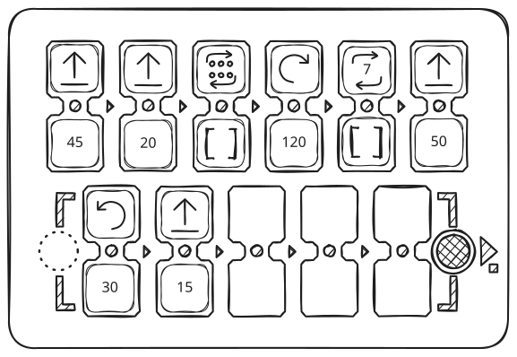
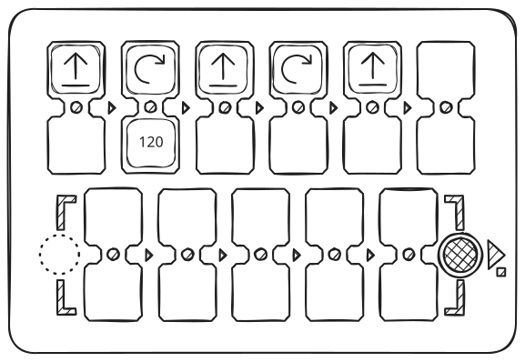
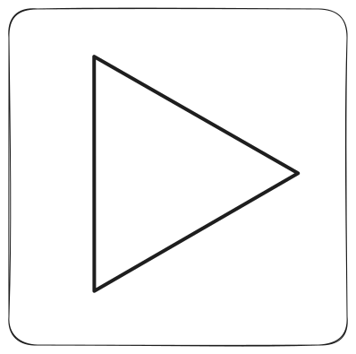
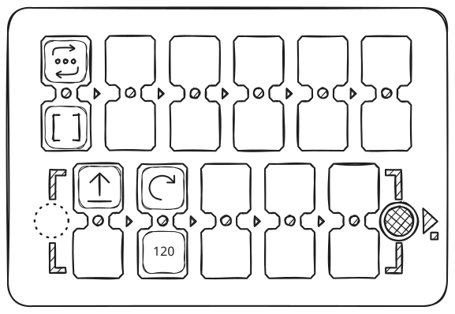
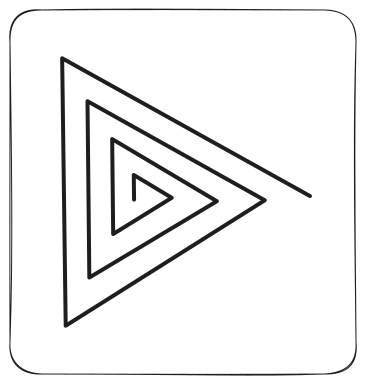
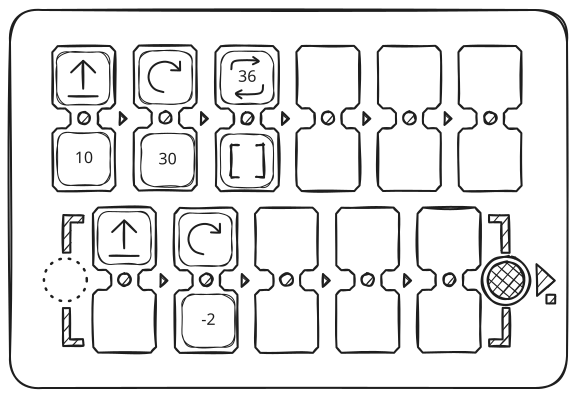
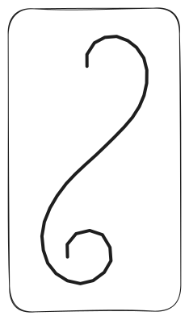
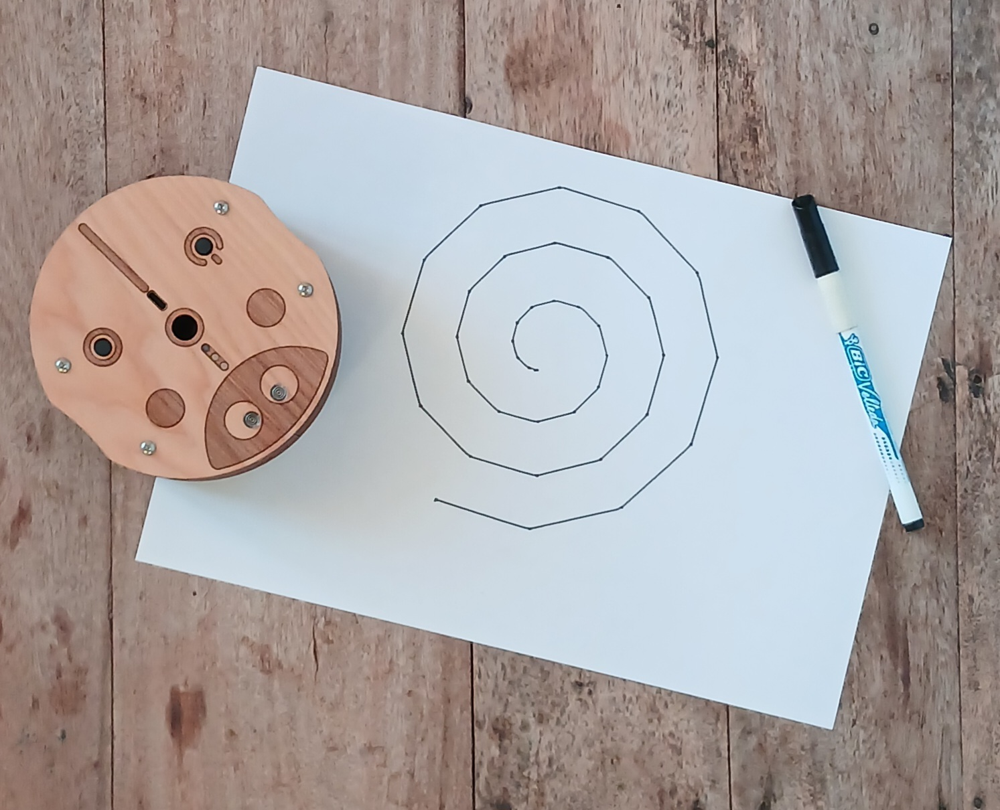

## Simple Ten-Pointed Star

| Code | Result |
| --- | --- |
|  |  |

## Regular Pentagon

| Code | Result |
| --- | --- |
|  |  |

## Simple Five-Pointed Star

| Code | Result |
| --- | --- |
|  |  |

## Mathematical Heart Drawing

| Code | Result |
| --- | --- |
|  |  |

## Triangle with Simple Program

| Code | Result |
| --- | --- |
|  |  |

## Triangle Using a Function

| Code | Result |
| --- | --- |
|  |  |

## Triangular Spiral

| Code | Result |
| --- | --- |
|  |  |

## Curve with Negative Angles

| Code | Result |
| --- | --- |
|  |  |

## Square Spiral

| Code | Result |
| --- | --- |
|  |  |

## ~5-Minute Timer

| Code | Result |
| --- | --- |
|  |  |

## Spiral

| Code | Result |
| --- | --- |
|  |  |

