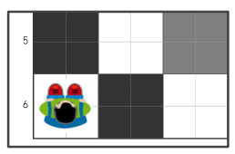
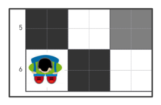
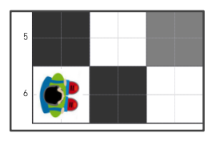

---
## Misión Verde

Vaya al punto verde siguiendo el siguiente programa:

---

Solución: Misión Verde. Vista superior — el «niño robot» mira hacia arriba.

---
## Misión Violeta

Llegue al punto violeta siguiendo el siguiente programa:

---

Solución: Misión Violeta. Vista superior — el «niño robot» mira hacia abajo.

---
## Misión Azul

Llegue al punto azul cumpliendo el siguiente programa.

---

Solución: Misión Azul. Vista superior — el «niño robot» mira hacia la derecha.

