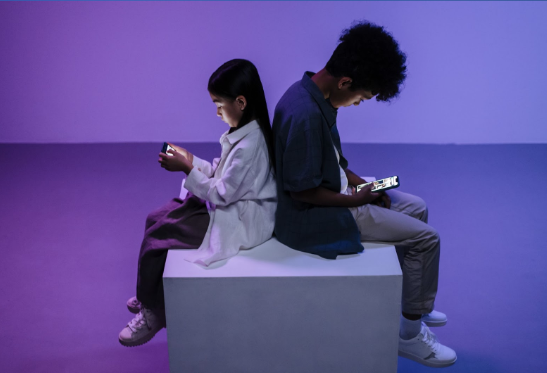

*Panel de control, bloques de programación, robot y resultados de la ejecución del código.*

## Relevancia

**Los niños modernos** muestran interés por los videojuegos y los dispositivos electrónicos desde temprana edad, dominándolos rápidamente.

Los padres son conscientes de la importancia de las tecnologías de la información para el desarrollo exitoso de sus hijos, pero al mismo tiempo buscan mantener un equilibrio entre el aprendizaje y la salud de los niños.

Las investigaciones muestran que la interacción temprana y frecuente con pantallas puede reducir las capacidades cognitivas y el rendimiento académico.

*Fuente: Programa para la Evaluación Internacional de Alumnos (PISA), [Resultados 2022 (Volumen I)](https://www.oecd-ilibrary.org/education/pisa-2022-results-volume-i_53f23881-en)*

El uso de dispositivos con pantalla por parte de niños pequeños a menudo conduce a:
- dificultades psicológicas,
- adicción a los videojuegos,
- deterioro de la visión y la salud física.

## Objetivos y Propósitos

Esta **herramienta** educativa ayuda a los niños desde los 4 años a aprender programación, lógica y matemáticas **sin pantallas**.

Con PrimaSTEM se aprenden:
- los números,
- la orientación espacial,
- los algoritmos,
- el pensamiento lógico,
- los fundamentos de la programación,
- las operaciones aritméticas y las progresiones,
- los conceptos geométricos.

**Ventajas:**
- versatilidad de aplicación,
- formato interesante y visual,
- aprendizaje sin pantallas,
- adecuado para niños en edad preescolar y escolar temprana,
- materiales naturales.

> 🎯 **Objetivo principal** — desarrollar habilidades cognitivas a través de una comprensión tangible y visual de los fundamentos de la programación y el significado del resultado de la ejecución de un programa.

## ¿Cómo Funciona?

1. Encienda el robot y el panel de control.
2. Usando las fichas de comando, cree un programa de movimiento colocándolas en las casillas del panel.
3. Presione el botón "Ejecutar" y el robot ejecutará el programa.

---
**Video de presentación:** [youtu.be/Ztq_I1WBiVo](https://youtu.be/Ztq_I1WBiVo)

  <iframe
    src="https://www.youtube.com/embed/Ztq_I1WBiVo?si=a54tevy8tUEQMOva"
    style={{
      position: 'absolute',
      top: 0,
      left: 0,
      width: '100%',
      height: '100%',
    }}
    frameBorder="0"
    allow="accelerometer; autoplay; clipboard-write; encrypted-media; gyroscope; picture-in-picture"
    allowFullScreen
  />

> 📺  Más tutoriales y ejemplos en nuestro canal [YouTube PrimaSTEM](https://www.youtube.com/@primastem)

## ¿Para Quién Es?

PrimaSTEM está diseñado para niños y parece un juego, pero es una herramienta flexible para educadores y padres. Puede utilizarse para enseñar diversas materias: matemáticas, programación, física, historia, geografía. Todo está limitado únicamente por la imaginación y la habilidad del profesor o los padres.

El niño adquiere una base matemática y algorítmica, lo que constituye una excelente preparación para la escuela y la primera experiencia con lenguajes de programación (Scratch, Logo o Minecraft).

*Ejemplo de resultado: una espiral dibujada mediante la modificación dinámica de una variable en un bucle.*
