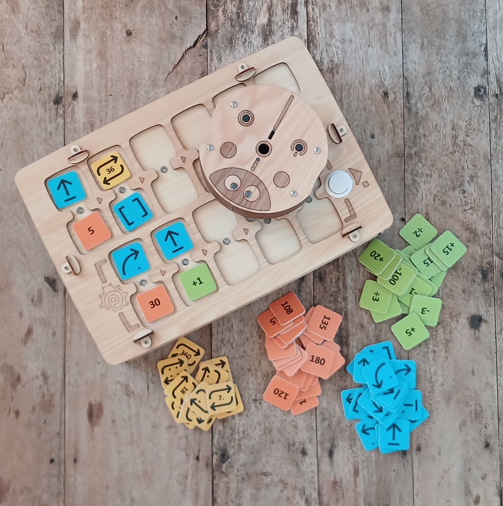
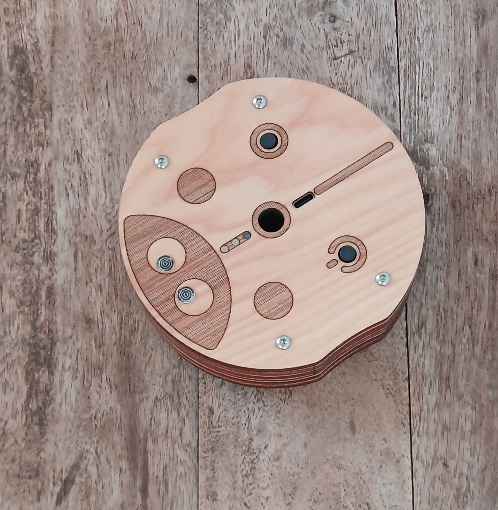
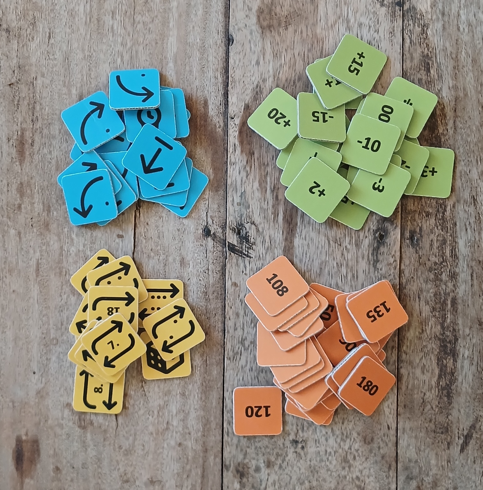
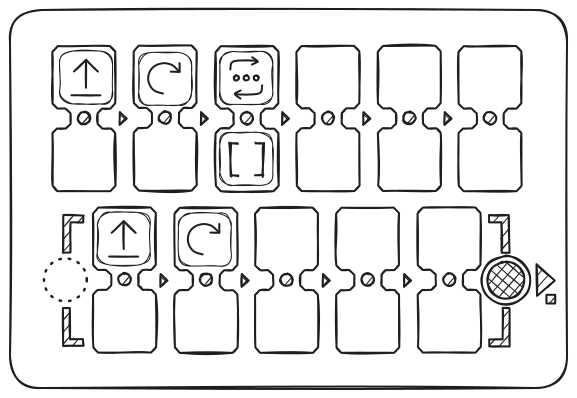

## Características Técnicas y Contenido del Paquete

- Robot de juego
- Mando a distancia para robot
- Fichas de comandos, valores y operaciones aritméticas para crear programas

> El contenido y el aspecto pueden variar ligeramente. Verifique al comprar.

### Robot de Juego

Dimensiones: D=125 мм, H=44 мм.

El robot está equipado con un botón de encendido, LEDs, un altavoz, un botón de función y un puerto USB-C para cargar la batería.

Un marcador de hasta 10 мм de diámetro puede instalarse en el centro del robot para dibujar figuras simples durante el movimiento.

El aspecto puede variar ligeramente según la configuración, pero la funcionalidad principal se mantiene.

### Mando a Distancia

Dimensiones: L=317 мм, W=217 мм, H=62 мм.

El mando contiene 11 ranuras dobles para insertar fichas de comandos y valores: 6 para el programa principal (parte superior), 5 para el subprograma (parte inferior).
El mando tiene dos botones: a la izquierda — encendido, a la derecha — "Ejecutar / Detener" para iniciar y detener el programa.

Después de colocar las fichas de comandos y valores en las ranuras, pulse "Ejecutar": el robot ejecutará el programa. Los comandos activos se iluminan con LEDs entre las ranuras.

Si una ficha está mal colocada, el mando lo señala con un LED rojo, pero el programa continúa (por ejemplo, al colocar una ficha de valor sin comando).

El mando está equipado con un puerto USB-C para carga y un altavoz para reproducción de sonido.

### Fichas - Instrucciones

Dimensiones: LxW=33 мм.

El conjunto incluye fichas para crear programas.
Cada ficha es un comando con un significado claro y una instrucción. La secuencia de bloques determina el comportamiento del robot.

Las fichas se dividen en **comandos**, **valores** y **aritméticas**.

#### Fichas de Comandos

Bloques básicos para componer el programa de control:

- **Adelante** — movimiento hacia adelante (15 см por defecto)
- **Derecha** — giro de 90° en sentido horario
- **Izquierda** — giro de 90° en sentido antihorario
- **Atrás** — movimiento hacia atrás (15 см por defecto)
- **Función** — ejecución del subprograma de la parte inferior del mando
- **Movimiento Aleatorio** — una de las acciones para mover el robot: Adelante, Izquierda, Derecha o Atrás (en "paso por defecto")
- **Fichas de Repetición (Bucles)** - Fichas con números del 2 al 6 (según la cantidad de puntos) y pictogramas de repetición con el número dentro. La ficha con un dado significa un número aleatorio de repeticiones del 1 al 6.

> También se utilizan fichas de valores numéricos y aritmética para ampliar la programación: por ejemplo, repetir un comando o cambiar el ángulo/distancia de movimiento.

#### Fichas de Valores

Fichas de ángulos y distancias: 30°, 36°, 45°, así como múltiplos (60°, 72°, etc.).
Ángulos en grados, distancias en milímetros.
Por defecto — 90° y 100 мм (15 см).

#### Fichas de Operaciones Aritméticas

Modifican los parámetros de los comandos de movimiento:

- Suma (+)
- Resta (−)
- Multiplicación (*)
- División (/)
- Raíz Cuadrada (√)
- Potencia (^)

## Conexión entre el Mando y el Robot

Se recomienda encender primero el robot, luego el mando.

Coloque el robot sobre una superficie plana antes de conectar: después del emparejamiento, los LEDs se vuelven blancos. Si no hay conexión, parpadean en rojo.

Verifique la conexión: coloque la ficha "Adelante" y pulse "Ejecutar".

Si no hay conexión, reinicie ambos dispositivos o cárguelos. Puede haber pérdida temporal de conexión cerca de fuentes de campo electromagnético fuerte (teléfono móvil, punto WiFi).

> **Después de actualizar el software de los dispositivos**, puede ser necesario emparejarlos: encienda el robot, luego el mando, pulse y mantenga el botón "Ejecutar" en el mando durante 10–15 segundos, hasta que suene una señal acústica.

## ¿Cómo Funciona?

Para programar el movimiento, coloque en las ranuras del mando las fichas de comandos (por ejemplo, "Adelante", "Izquierda", "Función", etc.).
Puede establecer valores de comandos y cantidad de repeticiones, así como valores de ángulos, distancias y operaciones aritméticas.

Para la instalación conjunta de un comando y un valor (repetición), las ranuras están unidas por "puentes" con indicadores.

  *A continuación se muestra un programa que usa un bucle como ejemplo para repetir una sección de código similar. El programa crea una ruta de movimiento del robot en cuadrado:*

Los comandos se colocan primero en la parte superior del mando (6 ranuras) y se ejecutan de izquierda a derecha. Se ignoran las ranuras vacías o errores (por ejemplo, dos comandos en un bloque o un valor sin comando).

La secuencia de bloques determina el movimiento del robot.

Pulse "Ejecutar" para iniciar el programa.

Por defecto:
- "Adelante" — 15 см.
- "Izquierda/Derecha" — 90°.
- Los bucles (repeticiones) repiten el comando varias veces.
- "Función" llama al subprograma de la parte inferior del mando (5 ranuras).
- Puede llamar a un subprograma varias veces mediante un bucle añadiendo una ficha de repetición a "Función" (ejemplo mostrado arriba).

### Funciones Importantes:

- **Interrumpir** la ejecución del programa pulsando "Ejecutar" de nuevo durante el movimiento.
- El mando recuerda el último **valor establecido** (distancia/ángulo) para el comando de movimiento hasta el apagado: por ejemplo, si "Adelante" = "200", todos los siguientes comandos "Adelante" se ejecutan con este valor.
- Los valores después de aritmética también se guardan.
- Cambiar la "**distancia por defecto**" se puede hacer con una ficha de servicio: por ejemplo, para 12,5 см, coloque la ficha "Distancia por defecto" con valor 125. El valor se guarda después del apagado.
- El mando y el robot **se apagan automáticamente** después de 10 minutos de inactividad.
- Si el robot no se usa durante 1–3 minutos, realiza pequeños movimientos para señalar que está activo y listo.
- El **sonido de parpadeo de ojos** del robot se puede activar y desactivar con una pulsación simple del botón del robot.
- El **sonido del mando** se puede activar y desactivar manteniendo el botón "Ejecutar" durante 5 segundos.
- **Después de una actualización de software**, puede ser necesaria la calibración del movimiento del robot.
- **Reinicio de software del robot** es posible manteniendo el botón durante 10 segundos.
- **Emparejamiento del mando y el robot** puede ser necesario después de actualizar el software de los dispositivos, se establece manteniendo el botón "Ejecutar" en el mando durante 10-15 segundos.

### Calibración del Robot:

- Marque en la superficie de la mesa la orientación exacta del robot.
- Con cualquier programa, logre que el robot gire 8 veces en el ángulo por defecto - 90 grados en sentido horario (por ejemplo, ejecute un giro a la derecha 8 veces), el robot debe dar dos vueltas completas de 360 grados = 90*8.
- Luego evalúe el ángulo de desviación desde la posición inicial del robot y ejecute el comando "Calibración" con el valor necesario para normalizar: si el robot se detiene antes de la marca inicial, añada la operación aritmética "+ ángulo" (por ejemplo +10), si el robot se detiene después de la marca, añada "- ángulo" (por ejemplo -5).
- La calibración puede realizarse varias veces para obtener un mejor resultado.
- ¡Atención! El reinicio de calibración del robot se realiza pulsando el botón de control durante más de 10 segundos.

<Accordion icon="rectangle-terminal" title="Calibración de la primera versión del dispositivo (MVP) con robot de 10 см de diámetro">
1. Para calibrar el giroscopio, coloque el robot sobre una superficie horizontal, inserte la ficha "Calibración" en el mando y pulse "Ejecutar".
2. Para calibrar la distancia de movimiento, mida la ruta real con el comando "Adelante", coloque "Calibración" y la ficha con el valor necesario, luego "Ejecutar". Puede escribir el valor en cualquier ficha NFC digital usando un teléfono móvil con NFC como texto en forma de nXXX (por ejemplo, n095 para 95 мм). Después de esto, la distancia de movimiento del robot será precisa.*
</Accordion>

### Programación de Fichas NFC

Puede modificar o **crear sus propias fichas** - comandos, valores digitales u operaciones aritméticas usando un teléfono con NFC y un programa de lectura-escritura de etiquetas, por ejemplo "NFC Tools". Puede escribir un valor en una etiqueta NFC digital en blanco - ficha usando un teléfono móvil con NFC como texto simple en forma de 4 caracteres.

## ¡Importante!

> El conjunto **no está destinado a niños menores de 4 años** y contiene piezas pequeñas — **¡riesgo de asfixia**! ¡Úselo **solo bajo supervisión** de adultos!

El dispositivo contiene baterías Li-ion. **Cargue solo bajo supervisión** de adultos usando USB 5V estándar y cable USB-C.

La carga del mando y el robot (1 hora) es suficiente para 1–2 lecciones; una carga completa (2–3 horas) — para 3 lecciones de 30–45 minutos. Con el tiempo, la capacidad de las baterías puede disminuir, es posible su reemplazo por nuevas 16340 Li-ion.

Si el conjunto no se usa durante mucho tiempo, cargue las baterías **una vez cada 2-3 meses**. Con descarga profunda, las baterías pueden fallar y requerir reemplazo.

**No abra el dispositivo** usted mismo — en caso de avería o necesidad de reemplazar baterías, contacte al vendedor o a centros especializados en reparación de electrónica.

Almacene y use el conjunto en un lugar seco a una temperatura de +10…+30°C, humedad 45–60%. Evite la luz solar directa, la humedad y el polvo.

Evite golpes y vibraciones. Transporte y almacene el dispositivo en su embalaje original a una temperatura de +5…+35°C, protegiendo de daños mecánicos y humedad.

p.s.: PrimaSTEM es una herramienta práctica para aprender programación, desarrollando el pensamiento creativo y la lógica.
La información detallada sobre la funcionalidad se encuentra en la **Guía del Profesor**.

