## Guide pour mener des séances avec des enfants à partir de 4 ans

PrimaSTEM aide les enfants à maîtriser étape par étape la pensée logique, les bases de la programmation et des mathématiques. Ce guide vous aidera à mener des séances avec des enfants à partir de 4 ans.

### Comment fonctionne l'appareil

Le but de l'appareil est de programmer les mouvements d'un petit robot coccinelle à l'aide de jetons de commande placés sur un pupitre de commande.

- Commande **« Avancer »** — mouvement tout droit
- Commande **« Gauche »** — tourner à gauche
- Commande **« Droite »** — tourner à droite
- Jeton **« [ ] » (Fonction)** — remplace une séquence de commandes
- **« Répétition »** — répète une commande ou une fonction plusieurs fois

Vous placez les commandes sur le pupitre, créant ainsi un programme de mouvement du robot. Lorsque le programme est prêt, appuyez sur le bouton — et le robot exécutera les instructions !

### Sommaire du guide

- Pourquoi mener des séances de robotique et de programmation ?
- Conseils pour l'organisation des séances dans différents contextes
- Activités et objectifs d'apprentissage
- Instructions d'utilisation détaillées
- Description des activités
- Annexes
- À propos du projet et des auteurs

### Valeur pédagogique

- Programmation sans écran — avec les mains
- Compréhension que les machines fonctionnent selon des algorithmes
- Planification des actions à l'avance
- Développement de la pensée logique
- Introduction à la programmation séquentielle et aux fonctions
- Notion de « bug » (erreur dans le code) et compétences en débogage
- Étude visuelle des nombres, de l'arithmétique et de la géométrie

## De quoi se compose PrimaSTEM

### Contenu de la boîte :

- Robot coccinelle
- Pupitre de commande
- Jetons de commande *
- Guide d'activités *

(*) La composition peut varier selon la configuration

## Pourquoi mener des séances de programmation et de mathématiques ?

Le code, la programmation et l'automatisation font désormais partie de notre vie quotidienne.

Ces dernières années, l'homme a appris à créer des machines qui font des choses dont elles étaient incapables auparavant : comprendre, parler, entendre, voir, répondre, écrire.

Les exemples sont nombreux : voitures autonomes, robots assistants pour les personnes âgées, robots livreurs et autres.

### Pourquoi la programmation et la robotique ?

Apprendre à programmer, ce n'est pas seulement apprendre à écrire du code. Apprendre à programmer, c'est apprendre à comprendre les machines qui nous entourent. C'est la capacité de transformer de petites ou de grandes idées en projets réels. C'est prendre des tâches complexes et les décomposer en étapes simples. C'est un travail collaboratif pour résoudre nos problèmes.

### Nés à l'ère numérique

Aujourd'hui, il peut sembler que les enfants et les jeunes maîtrisent bien les technologies parce qu'ils utilisent activement les loisirs numériques.

Mais qu'en est-il de prendre ces outils en main pour la créativité ou l'expression de soi ? Que se passe-t-il lorsqu'ils sont confrontés à un problème technique ?

## Conseils d'utilisation selon le contexte

Les activités ont été conçues pour divers objectifs et contextes éducatifs. Le guide présente des activités numérotées.
Ci-dessous, nous recommandons des activités en fonction de vos conditions.

### Public cible

- Enfants de 4 à 8 ans.
- Grandes sections de maternelle, CP et CE1 d'école primaire.

### Activités recommandées pour le périscolaire

1-2-x-4-5-6-7-8-9-10-x-x

### Activités recommandées pour l'école

x-2-3-4-5-6-7-8-9-x-11-12

### Activité périscolaire

Pour travailler avec PrimaSTEM, il est souhaitable de former un groupe de 12 enfants maximum pour que chacun puisse participer activement.

Nous recommandons d'utiliser un appareil pour 2-3 élèves pour l'apprentissage en équipe et le développement des compétences sociales.

### Activité scolaire

En classe, pour travailler avec PrimaSTEM, il est idéal de former de petits groupes de 4-6 enfants avec un enseignant.
Pendant ce temps, les autres élèves peuvent travailler sur une autre tâche avec un assistant d'éducation ou, par exemple, s'entraîner à dessiner le chemin du robot selon le programme (pour les élèves de CP-CE1).
Dans les deux cas, il est préférable de mener les séances avec PrimaSTEM dans une salle polyvalente, directement au sol ou en déplaçant les tables et les chaises pour libérer de l'espace.

**Attention** : N'oubliez pas de charger les batteries du pupitre et du robot à l'avance.

## Numéros d'activités et leurs objectifs d'apprentissage

| Objectifs d'apprentissage               | 1   | 2   | 3   | 4   | 5   | 6   | 7   | 8   | 9   | 10  | 11  | 12  |
| --------------------------------------- | --- | --- | --- | --- | --- | --- | --- | --- | --- | --- | --- | --- |
| Compréhension des concepts d'algorithme et de programme |     |     | X   | X   | X   | X   | X   | X   | X   | X   | X   | X   |
| Décomposition d'un itinéraire en étapes | X   |     | X   | X   | X   | X   | X   |     | X   |     | X   | X   |
| Prévision des déplacements              |     | X   |     | X   | X   | X   | X   | X   | X   | X   | X   | X   |
| Résolution de problème, débogage de programme | X   |     |     |     |     | X   | X   | X   | X   | X   | X   | X   |
| Travail en équipe, coopération          |     | X   |     |     | X   | X   | X   |     | X   |     | X   | X   |

## Instructions d'utilisation

### Sommaire des instructions

- Découverte du matériel
- Programmation d'une fonction
- Cartes utilisées
- Explications techniques

## Découverte du matériel

### Le robot

Un petit robot coccinelle en bois avec deux yeux.

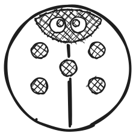

Il possède trois points d'appui : deux roues et un support à l'arrière qui lui permettent de garder l'équilibre.

### Commandes de base

| Commande | Dessin                              | Description                                                                                     |
| ------- | ----------------------------------- | -------------------------------------------------------------------------------------------- |
| Tout droit |   | Le robot avance d'une case — un pas logique (par défaut égal à 15 cm)              |
| À gauche  |      | Le robot tourne de 90° à gauche                                                           |
| À droite |     | Le robot tourne de 90° à droite                                                          |
| En arrière |      | Le robot recule d'une case — un pas logique par défaut                                |
| Fonction |  | Le robot exécute la séquence de commandes située dans la ligne de fonction                    |
| Répétition № | 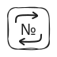  | Le robot répète la commande installée dans la cellule jumelée un certain nombre de fois — №      |

### Pupitre de commande à distance

Le pupitre permet de contrôler le robot en plaçant des blocs de commande (jetons) dans les cellules disponibles (D).

Les 6 cellules jumelées supérieures (A), reliées par une ligne d'exécution (E), constituent la séquence principale du programme. Le programme commence par la cellule située à gauche (D) et se termine au-dessus du bouton START (B), qui permet d'envoyer les instructions au robot et de lancer le programme.

Les 5 cellules inférieures (C) permettent de programmer une séquence de mouvements exécutée par le bloc « [ ] » — la « fonction ». Chaque cellule jumelée est associée à une LED (F) qui s'allume lors de l'installation d'un jeton et clignote lors de l'exécution de l'instruction en cours.

#### Création d'une séquence

Lorsque vous insérez un jeton dans l'une des cellules et qu'il est correctement placé, la LED s'allume en vert.
Lors de l'ajout d'une commande de répétition à une commande de mouvement dans une cellule jumelée, la LED s'allume en bleu.
En cas d'installation incorrecte des jetons (par exemple, deux jetons de commande de mouvement dans une cellule jumelée), une LED rouge s'allume. Dans ce cas, la commande erronée sera ignorée lors de l'exécution du programme.

### Batterie et bouton de mise en marche

Le robot et le pupitre de commande à distance sont alimentés par des batteries intégrées. Ils se chargent via un port USB-C. Le bouton de mise en marche (ON/OFF) se trouve sur le dessus du robot et sur le devant du pupitre à gauche.

Lors de la mise en marche du robot ou du pupitre, un court signal sonore retentit.
Lorsque le pupitre est allumé, la LED sur le panneau avant est verte. Lorsque le robot est allumé, la LED près du connecteur USB-C est verte.

### Communication sans fil

Le robot et le pupitre de commande à distance communiquent par liaison sans fil Bluetooth avec une portée d'environ 5 m. Le système sans fil fonctionne en arrière-plan, sans configuration, après la première connexion du robot au pupitre.

> Le pupitre peut être configuré pour fonctionner avec un autre robot (appairage des appareils).
> 1. Allumez le robot non appairé au pupitre.
> 2. Allumez le pupitre.
> 3. Maintenez le bouton START du pupitre enfoncé pendant 10 secondes jusqu'au signal sonore et lumineux.

### Création et exécution du programme

La séquence de mouvements (« programme ») commence à gauche sur le pupitre et suit la séquence gravée de flèches « > » — la ligne d'exécution reliant horizontalement les cellules jumelées.

Si un jeton est ajouté après une cellule vide, l'instruction correspondante sera exécutée après avoir sauté la cellule vide.

Si un jeton incorrect est placé (par exemple, « Répétition » sans commande dans une cellule jumelée) ou une combinaison de jetons de mouvement dans une cellule jumelée (par exemple, deux jetons de commande dans une seule cellule jumelée), alors la LED s'allumera en rouge et cette partie du programme sera ignorée lors de l'exécution.

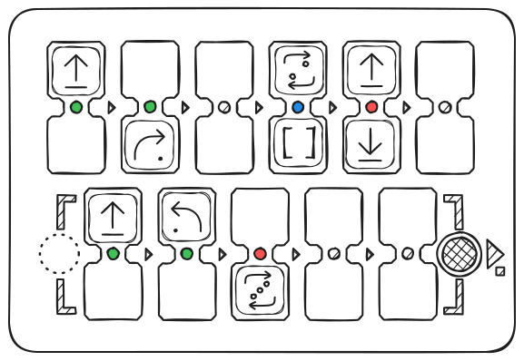

Une fois la séquence établie, appuyez sur le bouton « START » pour lancer le programme.

Lorsque le robot exécute les instructions, les LED du pupitre s'éteignent successivement. Lorsqu'une commande est en cours d'exécution, la LED correspondante clignote.

## Programmation d'une fonction

### Création d'une fonction

Le bloc « [ ] », également appelé bloc « Fonction », est utilisé pour remplacer une séquence de commandes.

Le bloc « Fonction » permet d'exécuter des séquences plus complexes et de passer à des tâches plus difficiles. Pour créer une fonction, insérez une séquence de mouvements dans le champ prévu à cet effet — 5 cellules jumelées dans la partie inférieure du pupitre. Cette séquence est exécutée de gauche à droite chaque fois qu'un bloc « Fonction » est rencontré dans la séquence principale (en haut).

Dans l'exemple ci-dessous, le bloc « Fonction » remplace un mouvement tout droit suivi d'un virage à droite. Le programme principal appelle la « Fonction » 2 fois, puis répète la « Fonction » encore 2 fois à l'aide du jeton « Répéter 2 ».

Résultat du mouvement :

## Cartes utilisées

### Les cartes

Pour les premières séances — apprentissage des algorithmes, de la programmation et des nombres — le robot doit se déplacer sur une carte quadrillée. Il est recommandé d'utiliser des cartes avec des cases de 15 cm : c'est la distance parcourue par le robot en un pas par défaut.

Vous pouvez utiliser n'importe quelle carte conçue pour n'importe quel robot avec n'importe quelle taille de cases (adaptée au robot).

> Il est possible de modifier la distance du pas par défaut de 15 cm pour toute autre distance selon votre carte — 10 cm, 12,5 cm ou 20 cm. Pour cela, utilisez la commande spéciale de réglage « Pas » + nombre en mm (pour 10 cm utilisez 100, pour 12,5 cm — 125, pour 20 cm — 200).

Si vous n'avez pas de carte, fabriquez-la vous-même : pour créer une carte, vous pouvez utiliser du ruban adhésif en papier fin et une surface plane de table ou de sol, une feuille de papier Whatman (tissu de bannière épais) et un marqueur.

Une carte en damier ou une carte vierge quadrillée est utilisée pour s'entraîner à se déplacer d'un point à un autre sans être distrait par les couleurs.

Pour raconter de petites histoires sur les déplacements du robot, vous pouvez utiliser une carte en couleur. Par exemple : « La coccinelle sort de sa maison et va à la montagne en traversant la forêt ». Vous pouvez proposer à la classe de créer une nouvelle carte pour raconter de nouvelles histoires sur les voyages de la coccinelle.

#### Exemples de cartes :

Carte en damier

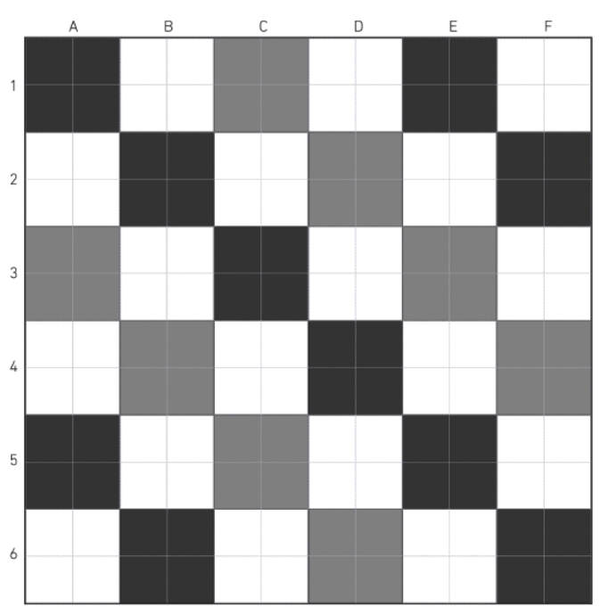

Carte en couleur

## Explications techniques

### D'un point de vue technique

Le pupitre de commande et le robot utilisent des microcontrôleurs pour le pilotage, fonctionnent sur batteries Li-Ion et se connectent par canal radio à l'aide d'un protocole de communication standard — Bluetooth.

La carte électronique du robot est responsable de tout son comportement : elle pilote deux moteurs à courant continu 5V, deux LED multicolores, reproduit des sons, communique avec le pupitre de commande à distance, etc.

La carte électronique du pupitre de commande à distance identifie les jetons insérés dans les cellules, reproduit des sons et pilote 11 LED multicolores associées à chaque cellule jumelée.

Lorsqu'un jeton est inséré dans l'une des cellules du pupitre, il est identifié à l'aide d'une puce-autocollant NFC. Chaque jeton contient un code correspondant à une commande de pilotage.

Après l'identification des jetons sur le pupitre et le lancement du programme, les commandes sont envoyées au robot par liaison sans fil pour exécution.

### Vous pouvez créer vos propres jetons de commande !

Vous pouvez créer des jetons de commande supplémentaires (par exemple, « Répéter 12 » ou des jetons de mouvement supplémentaires) en utilisant des jetons « vierges » avec des autocollants NFC et un téléphone compatible NFC. La plupart des types à 13,56 MHz sont supportés.

Une instruction vidéo est disponible sur notre chaîne YouTube — https://www.youtube.com/@primastem

---

## Activités

### Description détaillée des activités

- **Activité 1** — Se déplacer sur un damier d'un point A à un point B
- **Activité 2** — Découverte de PrimaSTEM
- **Activité 3** — Comprendre la notion d'orientation et d'algorithme par l'incarnation dans le robot
- **Activité 4** — Prévoir les mouvements du robot selon une séquence de mouvements
- **Activité 5** — Comprendre le fonctionnement des séquences d'instructions dans un programme aléatoire
- **Activité 6** — Utiliser le pupitre et les commandes de mouvement pour amener le robot à la montagne
- **Activité 7** — Découverte de la commande « fonction »
- **Activité 8** — Utiliser des planches et des aimants pour amener le robot à l'objectif
- **Activité 9** — Débogage d'un programme avec une erreur
- **Activité 10** — Réfléchir au débogage de séquences avec 1 erreur sur papier
- **Activités 11 et 12** — Prévoir les mouvements du robot (avec le bloc « fonction »)

---

## Activité 1 : Se déplacer sur un damier d'un point A à un point B

- **individuel**
- **15 min**
- **sur papier**
- **documents à imprimer**

### Objectif

> Concevoir un déplacement par cases d'un point A à un point B sur une carte.

L'exercice dure 10 minutes avec une mise en commun.

### À imprimer

Pour cette séance, vous aurez besoin d'imprimer un exemplaire par élève de la fiche « [Annexe 1 — Se déplacer sur la carte](attachment-1) ».

### EXERCICE

Les enfants doivent tracer sur la grille le chemin que doit parcourir la souris pour atteindre le fromage. Vous pouvez commencer par l'exercice de gauche, plus simple, puis continuer avec celui de droite.

#### Déplacement par cases

La souris se déplace par les cases de la grille (remarque : on ne peut pas se déplacer en diagonale). Ici, il faut comprendre que le chemin de la souris est divisé en étapes : elle se déplace d'une case à la fois. On dit qu'elle se déplace pas à pas.

Dans l'exemple ci-dessus, seul le chemin bleu est correct. Le court chemin rouge est erroné car il inclut une diagonale. Le long chemin rouge est erroné car il ne mène pas au point souhaité.

### Discussion en groupe...

Par exemple, dans l'exemple ci-dessus, tous les chemins tracés sont corrects car ils permettent tous à la souris d'atteindre le fromage.

Montrez aux enfants que tout le monde ne pense pas au même chemin, mais que plusieurs chemins peuvent être corrects.

#### Certains chemins sont plus longs que d'autres

Si l'on compte le nombre de cases que doit parcourir la souris pour arriver à la case avec le fromage, on obtient :
- 3 cases pour l'itinéraire vert
- 3 cases pour l'itinéraire gris
- 3 cases pour l'itinéraire bleu
- 13 cases pour l'itinéraire jaune

#### Le chemin le plus court

En fin de compte, même si tous ces chemins sont corrects, la souris choisira le plus court.

Demandez aux enfants de répondre à cette question : « Pourquoi la souris a-t-elle choisi le chemin le plus court ? »

Plusieurs réponses sont possibles : la souris veut économiser son énergie, elle est très fatiguée et veut marcher le moins possible... Ou la souris est pressée, elle a très faim et veut atteindre le fromage le plus vite possible.

**Note pour l'animateur :** C'est la même chose avec les robots. Nous préférerons toujours le chemin le plus court par souci d'efficacité.

#### Plusieurs chemins sont possibles

Une fois l'exercice terminé, demandez aux élèves de montrer le chemin qu'ils ont tracé. Comme il existe toujours plusieurs scénarios possibles, il est probable que les élèves proposent des réponses différentes mais toutes correctes.

---

## Activité 2 : Découverte de PrimaSTEM

- **15 min**
- **en groupe**
- **démonstration**
- **pratique**

### Objectifs

> Comprendre les possibilités de mouvement du robot
> Apprendre que le pupitre commande le robot
> Comprendre les jetons de commande

Pour cette séance, formez de petits groupes d'élèves. Asseyez-vous autour d'une table basse ou au sol. Sortez la carte quadrillée, le pupitre, le robot et les jetons. Présentez à tour de rôle PrimaSTEM à tous les élèves et groupes.

### Présentation

Présentez chaque élément sur la table et introduisez le vocabulaire dont les enfants auront besoin.

D'abord la **carte** : c'est comme la grille avec laquelle ils ont travaillé lors de l'activité 1, mais en plus grand.

Puis le **robot coccinelle** : il peut rouler.

On le commande à l'aide du **pupitre**, selon les jetons que l'on pose dans les cellules.

Les **jetons** sont des instructions : ils permettent de dire au robot d'avancer, de tourner à gauche ou à droite.

### 1ère étape : démonstration

Une fois que vous avez expliqué le vocabulaire, effectuez la manipulation vous-même et montrez aux enfants ce qui se passe quand vous posez un jeton dans le pupitre.

| Image                                              | Description                                                                    |
| -------------------------------------------------- | --------------------------------------------------------------------------- |
|  | Le jeton de commande **« Avancer »** fait avancer le robot d'une case |

Placez le robot sur l'une des cases de la carte. Insérez le jeton dans la première cellule du programme, comme sur le schéma ci-dessous, puis appuyez sur le bouton blanc — START.

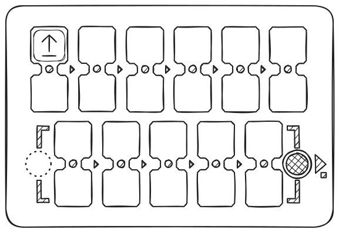

Le robot avancera d'une case.

### 2ème étape : passez les commandes

| Image                                           | Description                                                                                                                                                                                |
| ----------------------------------------------- | --------------------------------------------------------------------------------------------------------------------------------------------------------------------------------------- |
|  | Le jeton avec une flèche tournant en arc de cercle autour du centre — **« Gauche »** fait tourner le robot à gauche, dans le sens inverse des aiguilles d'une montre. Le pas de rotation par défaut est de 90 degrés. |

Retirez le jeton « Avancer » du pupitre et donnez le jeton « Gauche ». Cette fois, vous pouvez laisser l'enfant insérer le jeton dans la première cellule du programme, puis appuyer sur le bouton blanc — START. Le robot restera sur place et fera un quart de tour à gauche.

| Image                                            | Description                                                     |
| ------------------------------------------------ | ------------------------------------------------------------ |
|  | Le jeton **« Droite »** fait tourner le robot à droite. |

Demandez à un autre enfant de retirer le jeton « Gauche » du pupitre et de mettre à sa place le jeton « Droite », puis d'appuyer sur le bouton blanc — START. Le robot restera sur place et fera un quart de tour à droite.

Ensuite, laissez les enfants manipuler à tour de rôle en ne leur donnant que 3 jetons : **« Avancer »**, **« Gauche »** et **« Droite »**.

Ils peuvent recommencer l'exécution du programme qu'ils ont créé en appuyant à nouveau sur le bouton START une fois que le robot a fini son mouvement.

Laissez-les vérifier que les jetons peuvent être placés n'importe où (sauf deux commandes dans une cellule jumelée) et sont exécutés l'un après l'autre — de gauche à droite.

> Le programme peut être arrêté en appuyant à nouveau sur le bouton START/STOP pendant l'exécution par le robot.

---

## Activité 3 : Comprendre la notion d'orientation et d'algorithme par l'incarnation dans le robot

- **45 min**
- **En groupe**
- **Jeu**
- **Carte**

### Objectifs

> Prendre en compte l'orientation du robot au début du programme
> Prévoir les mouvements du robot selon le programme

### À imprimer

Pour cette séance, vous aurez besoin d'imprimer un exemplaire par élève des fiches « [Annexe 2 — Cartes de missions](attachment-2) ».

### Principe du jeu

Jeu de rôle dans un espace libre où les enfants incarnent le robot sur un terrain noir et blanc.

### Règles du jeu

Un élève joue le rôle du robot sur la carte (ou au sol avec un motif carré — dessin, carrelage ou ruban adhésif fin collé au sol), et les autres élèves le programment à l'aide de cartes de missions.

Aucune indication n'est donnée sur la direction dans laquelle se trouve l'enfant-robot.
Déterminez quelle direction du robot est la bonne pour accomplir la mission.

1. L'« enfant-robot » se place sur la case rouge 1, il doit atteindre la case verte 2.
2. L'« enfant-robot » se place sur la case rouge 1, il doit atteindre la case violette 3.
3. L'« enfant-robot » se place sur la case rouge 1, il doit atteindre la case bleue 4.

> Pour assurer la pérennité du matériel de la carte, demandez à l'enfant de retirer ses chaussures.

### Fin du jeu

L'enfant comprend maintenant que la position et l'orientation du robot doivent être prises en compte lors de la programmation d'un déplacement.

Le robot réagit à une commande de déplacement selon la façon dont il est tourné, orienté. Il doit soit aller tout droit, soit tourner à gauche, soit tourner à droite, **MAIS il se déplacera selon son orientation initiale.**

---

## Activité 4 : Prévoir les mouvements du robot selon une séquence de mouvements

- **45 min**
- **individuel**
- **sur papier**
- **documents à imprimer**

### Objectifs

> Prendre en compte l'orientation du robot au début
> Comprendre les instructions du programme
> Prévoir les mouvements du robot selon le programme

### À imprimer

Pour cette séance, vous aurez besoin d'imprimer un exemplaire par élève des fiches « [Annexe 3 — Tracer le chemin pour une séquence donnée](attachment-3) ».

On donne aux enfants une fiche avec un programme composé d'une séquence d'instructions. Les enfants doivent tracer le chemin que parcourra le robot pour cette séquence de mouvements.

Avec ce programme, le robot avancera trois fois tout droit :

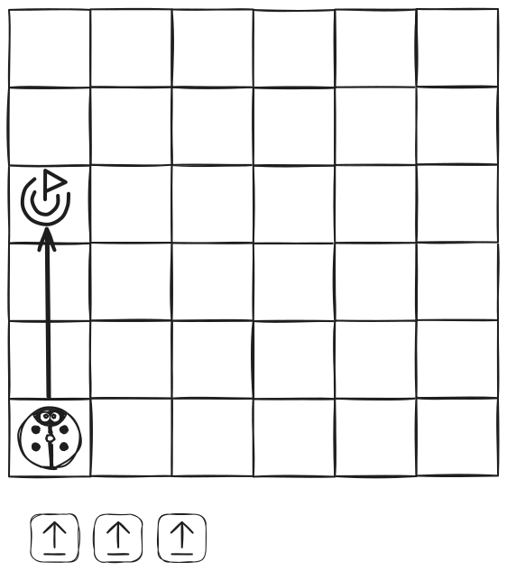

Ici, c'est le même programme, le robot avancera aussi trois fois tout droit.
Seulement cette fois, il n'est pas orienté de la même façon au début : il regarde vers la droite. Il avancera donc trois fois vers la droite :

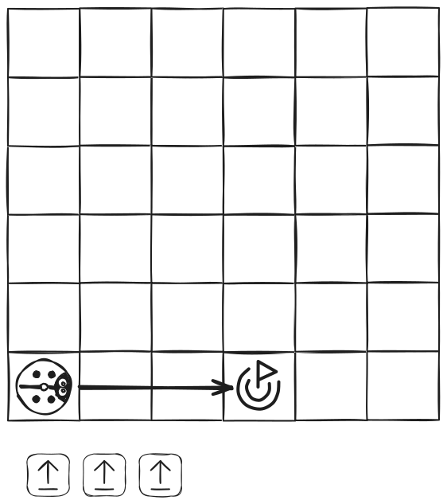

Avec ce programme, nous introduisons la rotation du robot. Cette fois, le robot commence par tourner à droite, puis avance de deux cases :

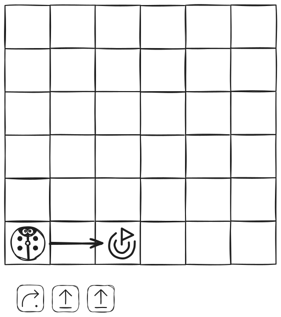

Et enfin, un exercice plus complexe avec deux changements de direction pour le robot. Il commence par avancer d'une case tout droit, puis tourne à droite, avance d'une case, puis tourne à gauche et avance de deux cases :

### Note pour l'animateur

Cet exercice sur papier peut s'avérer difficile.
Si certains enfants ont du mal à comprendre les rotations du robot et les séquences de mouvements, prenez le coffret de jeu PrimaSTEM et demandez-leur de reproduire sur le pupitre les programmes qui sont sur les fiches.
En manipulant et en observant, on comprend mieux !

---

## Activité 5 : Comprendre le fonctionnement des séquences d'instructions dans un programme aléatoire

- **45 min**
- **en groupe**
- **jeu**

### Objectifs

> Établir un lien entre les instructions et les mouvements effectués par le robot
> Visualiser les limites de la carte
> Être capable de reporter des instructions-commandes sur le « pupitre de commande »

### Déroulement du jeu

1. Pour commencer, placez le robot sur la carte, dans n'importe quelle case (case recommandée — au bord de la carte), dans la direction souhaitée.
2. Lancez le dé pour commencer. Déplacez le robot manuellement et notez (dessinez par le signe de commande « Avancer » — une flèche) le programme pour le déplacement sur papier ou sur une ardoise. Si le robot sort des limites de la carte, relancez le dé.

3. Répétez l'opération pour obtenir une séquence de 2 programmes de mouvement et ne pas laisser le robot sortir de la carte, en relançant le dé si nécessaire.

Au final : vous devez obtenir sur une feuille de papier 2 programmes de commandes « Avancer » qui, après une exécution séquentielle, déplaceront le robot du nombre de cases nécessaire vers le bord de la carte.

Exemple :

**Reproduisez les programmes notés dans la réalité à l'aide de PrimaSTEM.**

---

## Activité 6 : Utiliser le pupitre de commande et les commandes de mouvement pour amener le robot à la montagne

- **45 min**
- **en groupe**
- **pratique**

### Objectifs

> Décomposer un itinéraire en étapes
> Réaliser un programme avec un objectif précis

Pour cette séance, vous aurez besoin de :
- pupitre de commande
- certains jetons de commande de mouvement : 4 « Avancer », 4 « Gauche » et 4 « Droite » par groupe, laissez les autres jetons de côté.
- carte et robot

Divisez les enfants en groupes de 3 ou 4 enfants et distribuez-leur un pupitre de commande et un jeu de jetons.

### 1ère étape : réflexion

Le robot coccinelle est à la maison et nous voulons l'amener à la montagne. Ici, il faudra écrire sur le tableau le programme qui lui permettra d'y arriver.

> Si vous n'avez pas la bonne carte, dessinez les points de destination nécessaires de façon schématique sur du papier, éventuellement avec les enfants, et fixez-les sur la carte avec du ruban adhésif.

Commencez par demander aux enfants par quelles cases ils veulent faire passer le robot pour atteindre la montagne. Encore une fois, les possibilités sont nombreuses et nous préférerons les itinéraires les plus courts par souci d'économie d'énergie et de temps.

Une fois le chemin défini, interrogez les enfants sur les mouvements que le robot devra faire, case par case.

Doit-il aller tout droit, tourner à gauche, tourner à droite ?
Montrez-leur chaque mouvement que chaque commande produira sur le robot en le déplaçant sur la carte avec les mains.

### 2ème étape : programmation

Demandez aux enfants d'écrire, dans l'ordre, les mouvements (le programme) que doit faire le robot pour atteindre l'objectif sur le pupitre de commande à l'aide des jetons de commande.

**Voici le résultat attendu du programme :**

### 3ème étape : vérification

Comme pour tout programmeur qui se respecte, il convient de vérifier si le programme fonctionne. Demandez aux enfants de reproduire leur programme sur le pupitre et de le lancer.

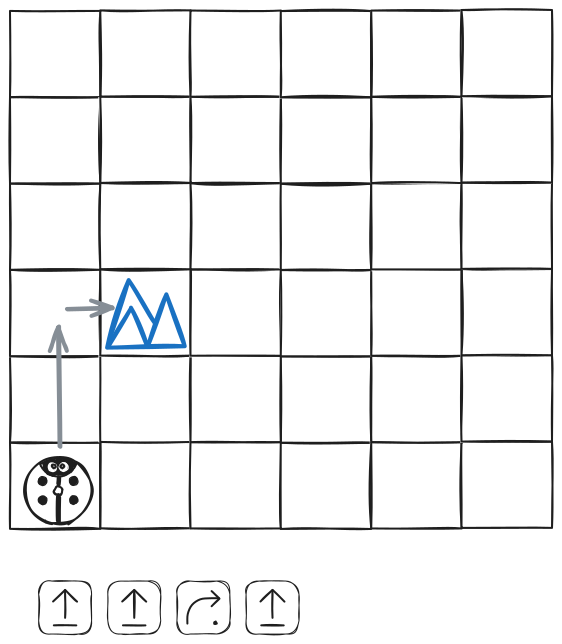

Le robot arrive-t-il à la montagne ? Si non, pourquoi ? Laissez les enfants essayer de corriger leurs erreurs dans le programme s'il y en a.

---

## Activité 7 : Découverte de la commande « fonction »

- **15 min**
- **en groupe**
- **démonstration**

### Objectifs

> Comprendre que la commande « fonction » peut remplacer d'autres commandes-instructions
> Examiner la notion de répétition d'une séquence d'instructions

Pour cette séance, formez de petits groupes d'élèves. Asseyez-vous autour d'une table basse ou au sol. Sortez la carte de terrain, le pupitre, le robot et les jetons de commande. À tour de rôle, les groupes d'élèves découvrent la commande-bloc « Fonction ».

### 1ère étape : démonstration

Montrez aux enfants le jeton de commande « Fonction ».

Il sert à remplacer plusieurs commandes de mouvement : « Avancer », « Gauche », « Droite » ou « Arrière ». Il permet aussi de répéter plusieurs fois un même petit fragment de programme.

Commencez par une démonstration. Créez un programme comme sur l'illustration ci-dessous.

Quand on utilise la commande « Fonction », tout se passe comme si à la place du jeton « Fonction » nous avions mis ce qui se trouve à l'intérieur du cadre [-----], dans la partie inférieure du pupitre de commande.
Dans notre exemple, le robot avancera deux fois tout droit.

### 2ème étape : devinettes !

Maintenant, ajoutez un bloc avec la commande « Droite » à la fin de votre programme principal, comme sur l'illustration ci-dessous.

Avant de lancer le programme, demandez aux enfants ce qui va se passer. Tout se passe comme si le programme était composé de deux blocs rouges « Avancer », puis d'un bloc « Droite ». Le robot avancera de deux cases et fera un virage à droite (un quart de tour).

Et pour le final : **la boucle** !
Reproduisez le programme avec quatre blocs « Fonction », comme sur l'illustration ci-dessous.

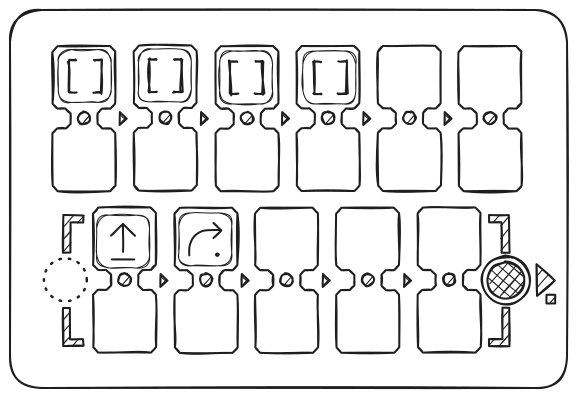

Avant de lancer le programme, demandez aux enfants ce qui va se passer, puis lancez le programme pour vérifier.

**Le robot effectue une boucle** :

**Note pour l'animateur :** Quand vous commencez à découvrir la notion de bloc « fonction », il est très utile de regarder les LED qui clignotent pendant l'exécution du programme. On peut ainsi suivre l'instruction en cours d'exécution et voir comment le robot se déplace simultanément.

---

## Activité 8 : Utiliser la fonction pour tracer un itinéraire vers un objectif

- **45 min**
- **en groupe**
- **pratique**

### Objectifs

> Décomposer un itinéraire en étapes.
> Réaliser un programme avec un objectif précis.
> Utiliser le bloc « fonction » dans le programme.

Pour cette séance, vous aurez besoin de :
- jetons ou cartes faites maison avec les dessins des commandes : 4 « avancer », 4 « gauche », 4 « droite » et 4 « fonction » par groupe.
- carte et robot, sans pupitre.

S'il y a beaucoup d'enfants, divisez-les en groupes de 3 ou 4 enfants et distribuez les cartes avec les dessins des commandes ou les jetons du coffret (exactement 4+4+4+4).

### 1ère étape : réflexion

> Adaptez la consigne si vous avez une carte avec d'autres images ou sans — il est nécessaire de désigner 2 points (Départ et Arrivée) à une distance de 4 cases avec un angle de 90 degrés.

Le robot se trouve au drapeau et nous voulons l'amener à la case nuit, représentée par des nuages. Il faudra écrire un programme (disposer un algorithme à partir de jetons ou de dessins de commandes sur la table) en utilisant le bloc « Fonction ».

Commencez par demander aux enfants par quelles cases ils veulent faire passer le robot pour atteindre la montagne (case environ à mi-chemin). Les possibilités sont nombreuses et cette fois nous préférerons les itinéraires où les séquences d'instructions se répètent afin d'utiliser la commande « Fonction ».

Une fois le chemin défini, interrogez les enfants sur les mouvements que le robot devra faire, case par case, et modélisez l'exécution du programme en déplaçant le robot avec les mains.

### 2ème étape : « ça ne marche pas ! Mais si... »

Demandez-leur de disposer avec des cartes (jetons) sur la table, dans l'ordre, les mouvements que doit faire le robot.

Soyez strict sur le nombre de commandes-jetons distribués à chaque groupe : 4 « avancer », 4 « gauche », 4 « droite » et 4 « fonction ».

Et voilà ! Nous n'avons pas assez de jetons pour écrire le programme ! Il manque des commandes « Avancer » ! C'est la panique numérique ! :)

Rappelez-leur l'utilité de la commande « Fonction » : avec cette commande, on peut remplacer plusieurs autres commandes-jetons.

Par exemple, on peut remplacer plusieurs commandes « Avancer » pour faire avancer le robot plusieurs fois.

Guidez les enfants dans la création d'un programme avec un bloc « Fonction », comme sur l'illustration ci-dessous.

Exemple d'itinéraire et son programme :

### 3ème étape : vérification

Aidez les enfants à reproduire leur programme sur le pupitre de commande pour vérification, comme sur l'illustration :

Le robot arrive-t-il à la case « Nuit » ? Si non, pourquoi ?
Laissez les enfants essayer de corriger leurs erreurs dans le programme s'il y en a.

---

## Activité 9 : Débogage d'un programme avec une erreur

- **20 min**
- **en groupe**
- **pratique**

### Objectifs

> Trouver une erreur dans un programme en observant son exécution.
> Corriger une erreur dans un programme.

Pour cette séance, formez de petits groupes d'élèves. Asseyez-vous autour d'une table basse ou au sol. Préparez le terrain quadrillé, le pupitre, le robot et les jetons.
À tour de rôle, demandez aux groupes d'élèves de déboguer le programme.

Nous aimerions que le robot atteigne la montagne (chemin gris).

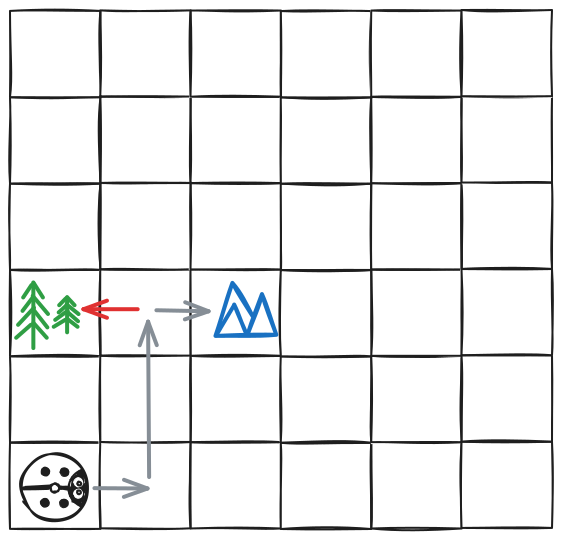

Montrez aux enfants la séquence de mouvements sur le pupitre qui contient une erreur :

Avec ce programme, le robot se rend dans la forêt. En testant le programme, les enfants doivent essayer de trouver l'erreur et de la corriger.

Exemple d'un programme correct et corrigé :

---

## Activité 10 : Réfléchir au débogage d'une séquence avec une erreur sur papier

- **20 min**
- **individuel**
- **sur papier**
- **documents à imprimer**

### Objectifs

> Prévoir les mouvements du robot pour trouver une erreur dans un programme.
> Comprendre comment corriger une erreur dans un programme.

On donne aux enfants une fiche avec un programme composé d'une séquence d'instructions pour passer d'un point A à un point B. Le programme contient une erreur, les enfants doivent trouver cette erreur et essayer de la corriger.

### À imprimer

Pour cette séance, vous aurez besoin d'imprimer un exemplaire par élève des fiches « [Annexe 4 — Trouver et corriger l'erreur dans le programme](attachment-4) ».

### 1ère étape : lire le programme

Commencez par demander aux enfants de tracer le déplacement du robot avec ce programme. Sur la grille, le chemin que nous aimerions que le robot parcoure et le point d'arrivée souhaité sont tracés en bleu.

### 2ème étape : identifier l'erreur

Une fois le chemin tracé, on voit que le robot ne va pas à l'arrivée (noire) ! Il arrive sur le drapeau rouge.
Demandez aux enfants où le robot s'est trompé. Ici, il faut trouver la case qui contient l'erreur, entourée en rouge dans la correction.

Il existe 3 types d'erreurs :
- on s'est trompé de commande
- on a oublié une commande
- on a ajouté une commande en trop

### 3ème étape : corriger l'erreur

Et enfin, demandez aux enfants de corriger l'erreur en écrivant le programme de mouvement jusqu'au drapeau noir.

**Remarque :** Cet exercice sur papier peut s'avérer difficile. Si certains enfants ont du mal à voir où sont les erreurs, prenez PrimaSTEM et demandez-leur de reproduire les programmes qui sont sur les fiches et de lancer le programme. Vous pouvez, par exemple, leur demander de dire « Oh non ! » quand le robot se trompe sur son chemin pour fixer l'erreur.

#### Exemple 1
Dans cet exemple, on s'est trompé d'instruction à la fin.

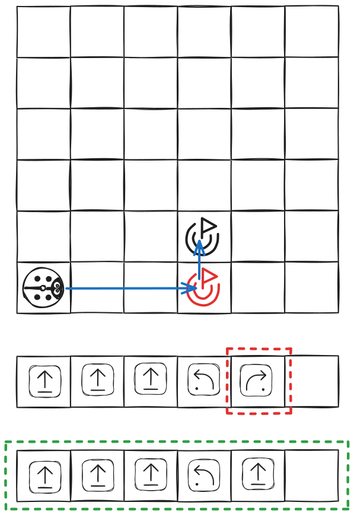

#### Exemple 2
Dans cet exemple, on a ajouté une instruction en trop au début.

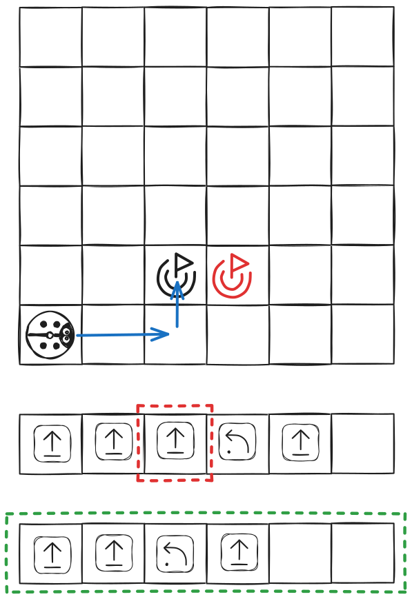

#### Exemple 3
Dans cet exemple, on a oublié une instruction au début.

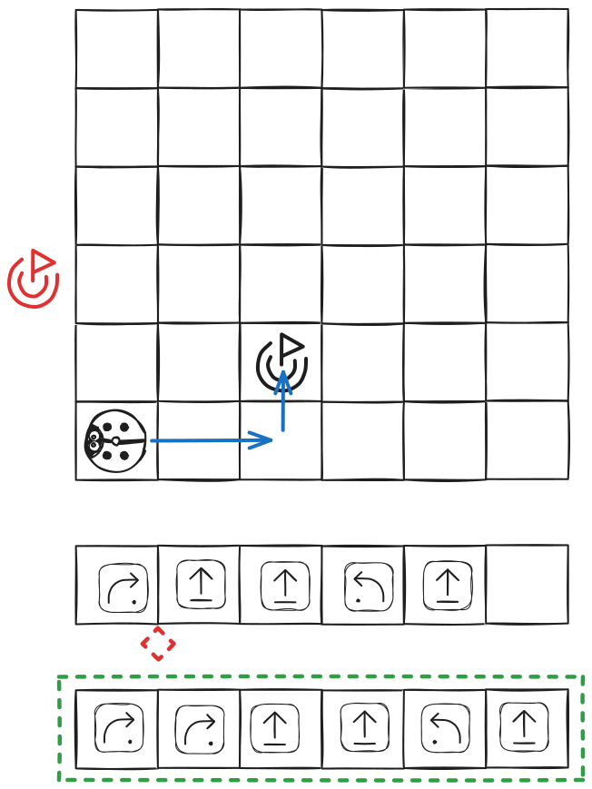

---

## Activité 11 : Prévoir les mouvements de PrimaSTEM

- **45 min**
- **en groupe**
- **pratique**

### Objectifs

> Prévoir les déplacements du robot en regardant un programme sans « fonction »

Pour cette séance, prenez le coffret de jeu PrimaSTEM sans les commandes « Fonction ». Tous les enfants peuvent participer au jeu en même temps, mais un seul enfant à la fois manipule.

### 1. Silence, on programme...

À tour de rôle, les enfants placent le robot dans un coin de la carte, puis composent un programme avec un maximum de 5 instructions sur le pupitre.

Une fois le programme terminé, demandez aux enfants d'attendre avant d'appuyer sur le bouton.

### 2. On fait les paris !

Demandez aux autres enfants de deviner si le robot va sortir des limites de la carte.

### 3. On vérifie

Une fois que nous avons fait nos paris, nous lançons le programme pour vérifier ce qui se passe.
Puis nous remettons le robot dans le coin, et l'enfant suivant commence son programme.

---

## Activité 12

### Objectifs

> Prévoir les déplacements du robot en regardant un programme avec une « fonction »

Reproduisez l'activité 11 en ajoutant les commandes « fonction » au jeu.

Cette fois, ajoutez les blocs « Fonction » pour intégrer la programmation de fonction. Tous les enfants peuvent participer au jeu en même temps, mais un seul enfant à la fois manipule.

---

## À propos du projet, auteurs

### Qui sommes-nous ?

PrimaSTEM est une entreprise qui a créé et produit l'appareil original du même nom pour l'apprentissage de la programmation et des mathématiques sans écran pour les enfants dès 4 ans. Nous sommes situés dans le sud de la France.

Les supports créés sont ouverts et visent à développer la créativité des enfants et des adultes qui les accompagnent.

Pour en savoir plus sur l'appareil PrimaSTEM, visitez le site de ressources documentaires disponible en 10 langues : https://docs.primastem.com

### Des questions ? Contactez-nous !

N'hésitez pas à nous contacter : primastem@gmail.com

Notre site internet avec des informations et des liens vers les réseaux sociaux : https://primastem.com

### Auteurs

**Adaptation, texte, illustrations :** Andrei Chanov, 2026.

**Auteurs du concept** : Julie Borgeot / Dorie Bruyas de Fréquence écoles

#### Licence de ce guide

Ce travail est sous licence CC BY-SA 4.0. Pour voir une copie de cette licence, visitez https://creativecommons.org/licenses/by-sa/4.0/

**Creative Commons Attribution-ShareAlike 4.0 International**

Cette licence oblige les réutilisateurs à créditer le créateur. Elle permet aux réutilisateurs de distribuer, remixer, adapter et s'appuyer sur le matériel sur n'importe quel support ou format, même à des fins commerciales. Si d'autres remixent, adaptent ou s'appuient sur le matériel, ils doivent licencier le matériel modifié selon des termes identiques.

---

## Annexes

## Annexe 1 — Se déplacer sur la carte

Lien de l'annexe — [Annexe 1 — Se déplacer sur la carte](attachment-1)

## Annexe 2 — Cartes de missions

Lien de l'annexe — [Annexe 2 — Cartes de missions](attachment-2)

## Annexe 3 — Tracer le chemin pour une séquence donnée

Lien de l'annexe — [Annexe 3 — Tracer le chemin pour une séquence donnée](attachment-3)

## Annexe 4 — Trouver et corriger l'erreur dans le programme

Lien de l'annexe — [Annexe 4 — Trouver et corriger l'erreur dans le programme](attachment-4)

