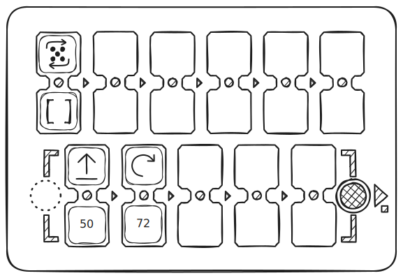
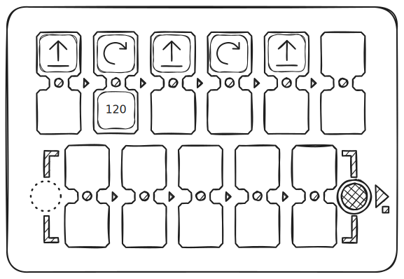
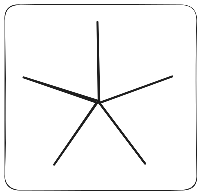
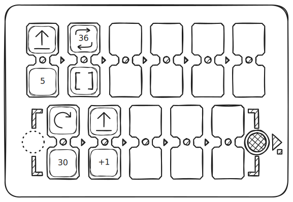

# Exemples de dessins mathématiques

## Étoile simple à dix branches

| Code | Résultat |
| --- | --- |
|  |  |

## Pentagone régulier

| Code | Résultat |
| --- | --- |
|  |  |

## Étoile simple à cinq branches

| Code | Résultat |
| --- | --- |
|  |  |

## Dessin mathématique d’un cœur

| Code | Résultat |
| --- | --- |
|  |  |

## Triangle avec un programme simple

| Code | Résultat |
| --- | --- |
|  |  |

## Triangle utilisant une fonction

| Code | Résultat |
| --- | --- |
|  |  |

## Spirale triangulaire

| Code | Résultat |
| --- | --- |
|  |  |

## Courbe avec angles négatifs

| Code | Résultat |
| --- | --- |
|  |  |

## Spirale carrée

| Code | Résultat |
| --- | --- |
|  |  |

## Minuterie ~5 minutes

| Code | Résultat |
| --- | --- |
|  |  |

## Spirale

| Code | Résultat |
| --- | --- |
|  |  |

