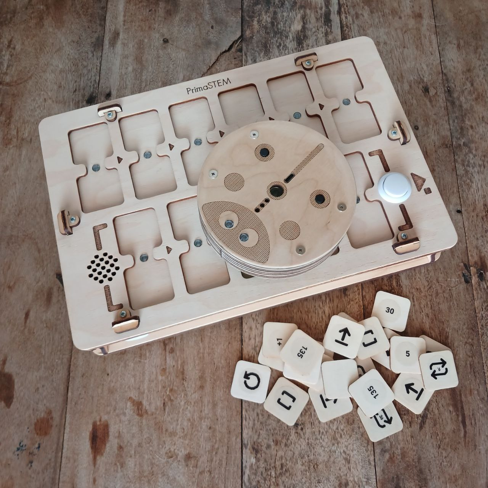
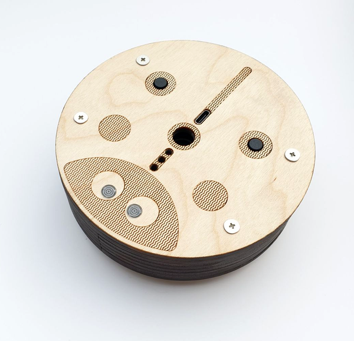
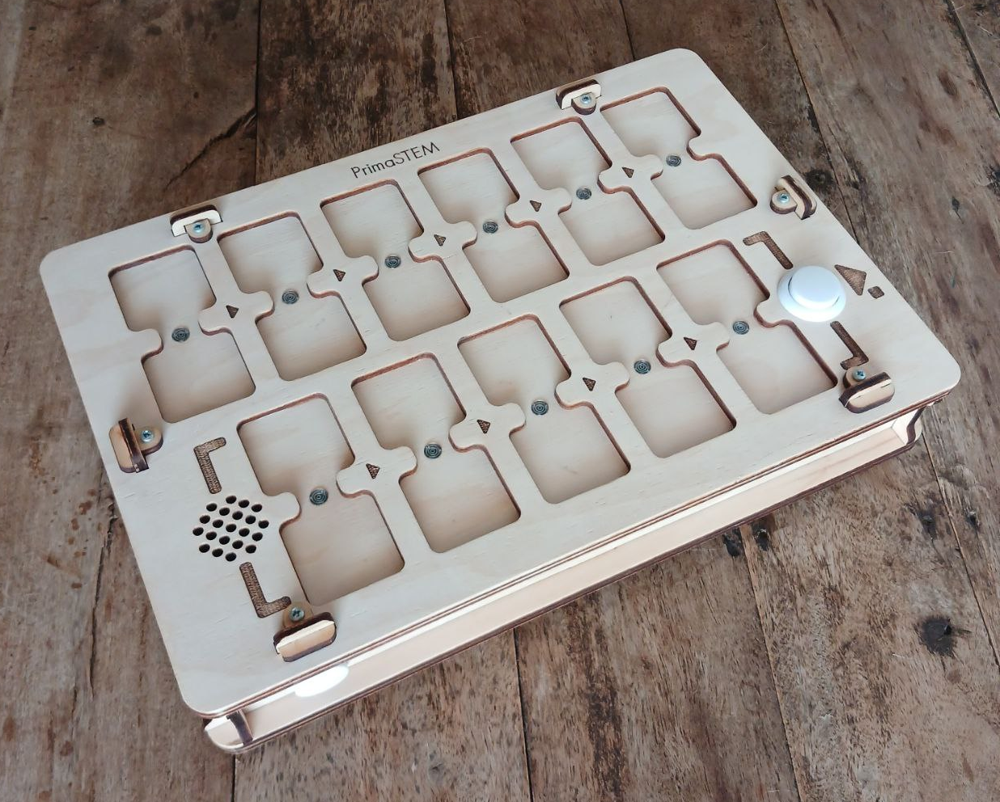
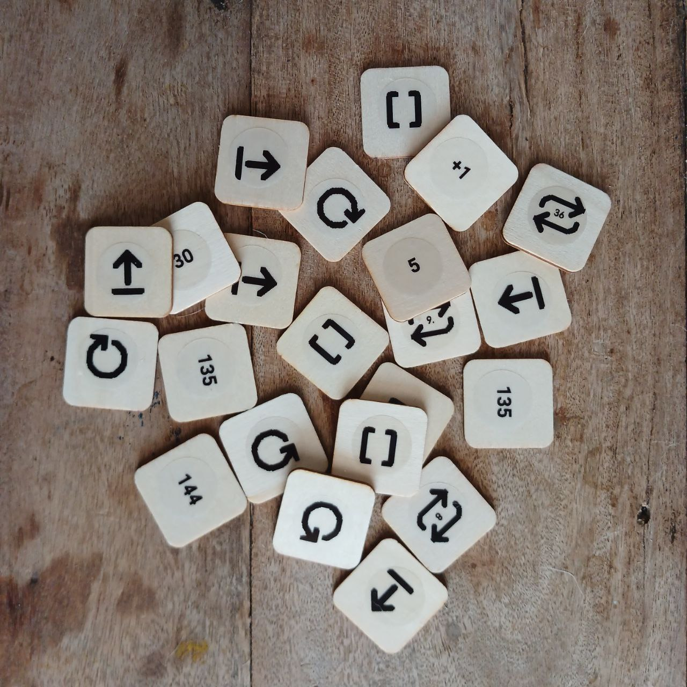
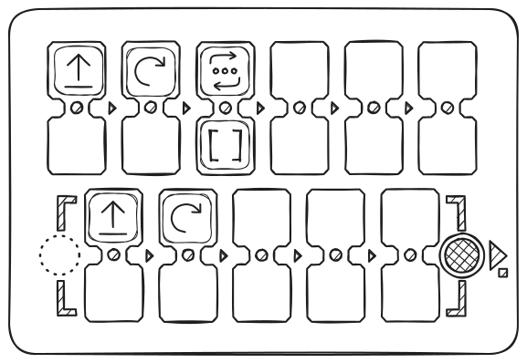

# Description et mode d’emploi

**PrimaSTEM** est un kit destiné à l'apprentissage de la logique, de la programmation et des mathématiques pour les enfants de 4 à 12 ans.

## Caractéristiques techniques et composition

- Robot éducatif
- Télécommande pour contrôler le robot
- Jetons-commandes, jetons-valeurs et opérateurs arithmétiques pour la programmation
- Tapis de jeu (selon la configuration)

> La composition et l’apparence peuvent légèrement varier. Veuillez vérifier lors de l’achat.

### Robot éducatif

Dimensions : D=125 mm, H=45 mm.

Le robot possède un bouton d’alimentation, des LED, un haut-parleur, un bouton fonctionnel et un port USB-C pour recharger la batterie intégrée.

Un emplacement central permet d’insérer un marqueur (jusqu’à 10 mm de diamètre) pour dessiner des figures simples lors des déplacements du robot.

L’aspect peut varier selon le kit, mais la fonctionnalité de base reste inchangée.

### Télécommande

Dimensions : L=310 mm, l=210 mm, H=52 mm.

La télécommande dispose de 11 emplacements doubles pour insérer les jetons : 6 pour le programme principal (ligne supérieure), 5 pour la sous-programme (ligne inférieure). Deux boutons sont présents : à gauche pour l’alimentation, à droite pour « Exécuter/Arrêter » le programme.

Après insertion des jetons, appuyez sur « Exécuter » : le robot exécutera la séquence programmée. Les LED entre les emplacements indiquent les étapes actives.

Si un jeton est mal inséré, la télécommande signale une erreur par une LED rouge, mais l’exécution se poursuit (par exemple, si un jeton-valeur est placé sans commande).

La télécommande possède un port USB-C pour la recharge et un haut-parleur.

### Jetons - instructions

Dimensions : LxL(D)=30 mm.

Le kit comporte des jetons pour composer des programmes.
 Chaque jeton correspond à une commande claire ou une valeur. L’ordre des jetons détermine le comportement du robot.

Les jetons sont répartis en **commandes**, **valeurs** et **opérations arithmétiques**.

#### Jetons-commandes

Principaux blocs pour la programmation du robot :

- **Avancer** : déplace le robot vers l’avant (10 cm par défaut)
- **Droite** : tourne à droite de 90°
- **Gauche** : tourne à gauche de 90°
- **Reculer** : recule de 10 cm (par défaut)
- **Fonction** : exécute la sous-programme (ligne inférieure de la télécommande)
- **Mouvement aléatoire** : choisit aléatoirement Avancer, Droite ou Gauche (distance standard)
- **Jetons de boucles (répétitions)** : jetons numérotés de 2 à 6 points, avec des pictogrammes de boucle et le chiffre. Le jeton avec un dé indique un nombre aléatoire de répétitions de 1 à 6.

> Les jetons de valeurs numériques et d’opérations arithmétiques permettent d’élargir les possibilités de programmation, par exemple pour répéter des commandes ou changer distance/angle.

#### Jetons-valeurs

Jetons d’angles et de distances : 30°, 36°, 45°, ainsi que d’autres multiples (60°, 72°, etc.).
 Les angles sont exprimés en degrés, les distances en millimètres.
 Par défaut : 90° et 100 mm (10 cm).

#### Jetons d’opérations arithmétiques

Ils modifient les paramètres des commandes de mouvement :

- Addition (+)
- Soustraction (−)
- Multiplication (*)
- Division (/)
- Racine (√)
- Puissance (^)

## Connexion de la télécommande et du robot

Il est recommandé d’allumer d’abord le robot, puis la télécommande.

Placez le robot sur une surface plane avant la connexion : les LED deviennent blanches après l'appairage. Si la liaison n’est pas établie, elles clignotent en rouge.

Vérifiez la connexion : insérez le jeton « Avancer » et appuyez sur « Exécuter ».

En cas d’absence de connexion, redémarrez les deux appareils ou rechargez-les. Des interférences temporaires sont possibles à proximité de sources électromagnétiques puissantes (téléphone portable, point d’accès Wi-Fi).

> **Après une mise à jour logicielle**, l’appairage peut être nécessaire : allumez le robot puis la télécommande, puis maintenez le bouton « Exécuter » pendant 10–15 secondes jusqu’au signal sonore.

## Comment ça marche ?

Pour programmer un déplacement, insérez les jetons-commandes (par exemple, « Avancer », « Gauche », « Fonction », etc.) dans les emplacements de la télécommande. Vous pouvez également insérer des valeurs de commande, nombres de répétitions, angles, distances et opérations arithmétiques.

Les emplacements doubles permettent d’associer une commande à une valeur ou un répétiteur, avec des indicateurs lumineux.

*Exemple ci-dessous : un programme utilisant une boucle pour répéter le même code, permettant au robot de parcourir un carré :*

Les commandes sont insérées prioritairement en haut (ligne principale, 6 emplacements), et sont exécutées de gauche à droite. Les emplacements vides ou erreurs (par exemple, deux commandes dans un bloc ou une valeur sans commande) sont ignorés.

L’ordre des jetons détermine la trajectoire du robot.

Appuyez sur « Exécuter » pour démarrer le programme.

Par défaut :

- « Avancer » : 10 cm.
- « Gauche/Droite » : 90°.
- Les boucles (répétitions) permettent de réaliser plusieurs fois une commande.
- « Fonction » appelle la sous-programme (ligne inférieure, 5 emplacements).
- Vous pouvez appeler une sous-programme dans une boucle en ajoutant un jeton « répétition » à « Fonction » (voir exemple ci-dessus).

**Fonctions importantes :**

- **Arrêter** l’exécution du programme : appuyez à nouveau sur « Exécuter » pendant le mouvement.
- La télécommande mémorise la **dernière valeur** (distance/angle) pour chaque commande jusqu’à extinction : par exemple, si « Avancer » = "200", toutes les commandes suivantes « Avancer » seront exécutées avec cette valeur.
    - Cela est utile si le tapis de jeu a une taille différente de 10 cm.
    - Les valeurs modifiées par une opération arithmétique restent enregistrées.
- Pour changer la **distance par défaut**, utilisez le jeton correspondant : par exemple, pour une avancée de 12,5 cm, insérez le jeton « Distance par défaut » avec la valeur 125. Ce paramètre est conservé après extinction.
- **Après mise à jour logicielle**, calibrez le gyroscope et la distance de déplacement :
    - a. Gyroscope : placez le robot sur une surface horizontale, insérez le jeton « Calibration » dans la télécommande et appuyez sur « Exécuter ».
    - b. **Pour calibrer la distance**, mesurez la trajectoire réelle du robot avec « Avancer », insérez « Calibration » et le jeton-valeur cible, puis « Exécuter ». Une valeur personnalisée peut être inscrite sur n’importe quel jeton NFC numérique à l’aide d’un smartphone compatible NFC, sous la forme nXXX (par ex., n095 pour 95 mm). Le robot adoptera cette nouvelle longueur de pas.
- La télécommande et le robot **s'éteignent automatiquement** après 10 minutes d’inactivité.
- Si le robot n’est pas utilisé pendant 1–3 minutes, il effectue de petits mouvements pour indiquer qu’il est prêt à fonctionner.

Vous pouvez modifier ou **créer vos propres puces** (commandes, nombres ou arithmétiques) avec un téléphone NFC et n'importe quelle application d'écriture de tags NFC, comme « NFC Tools ». Enregistrez un texte de 4 caractères (par exemple, n100 pour 100 mm) sur une puce NFC vierge. Contactez-nous pour obtenir des instructions.

Plus d’informations sur les fonctionnalités dans le **Guide de l’enseignant**.

Consultez le **Guide de l'enseignant** pour plus de détails sur les fonctionnalités.

## Important !

> Le kit **n'est pas destiné aux enfants de moins de 4 ans** et contient de petites pièces - **risque d’étouffement** ! À utiliser **uniquement sous la surveillance d’adultes** !

L’appareil contient des batteries Li-ion. **Rechargez uniquement sous surveillance adulte avec un chargeur USB 5V standard et un câble USB-C.**

La recharge du robot ou de la télécommande (1h) suffit pour 1–2 leçons ; une charge complète (2–3h) pour 3 leçons de 30–45 min. Avec le temps, la capacité des batteries peut diminuer ; il est possible de les remplacer (piles 16340 Li-ion).

En cas de non-utilisation prolongée, rechargez les batteries **tous les 3–4 mois**. En cas de décharge profonde, les batteries peuvent être irrémédiablement endommagées et devront être remplacées.

**N’ouvrez pas l’appareil vous-même** - pour tout problème ou remplacement des batteries, contactez le vendeur.

Stockez et utilisez l’appareil dans un lieu sec à +10…+30°C, humidité 45–60%. Évitez l’exposition directe au soleil, à l’humidité ou à la poussière.

Protégez l’appareil contre les chocs et vibrations. Transportez-le et rangez-le dans son emballage d’origine à +5…+40°C, en évitant les chocs et l’humidité.
