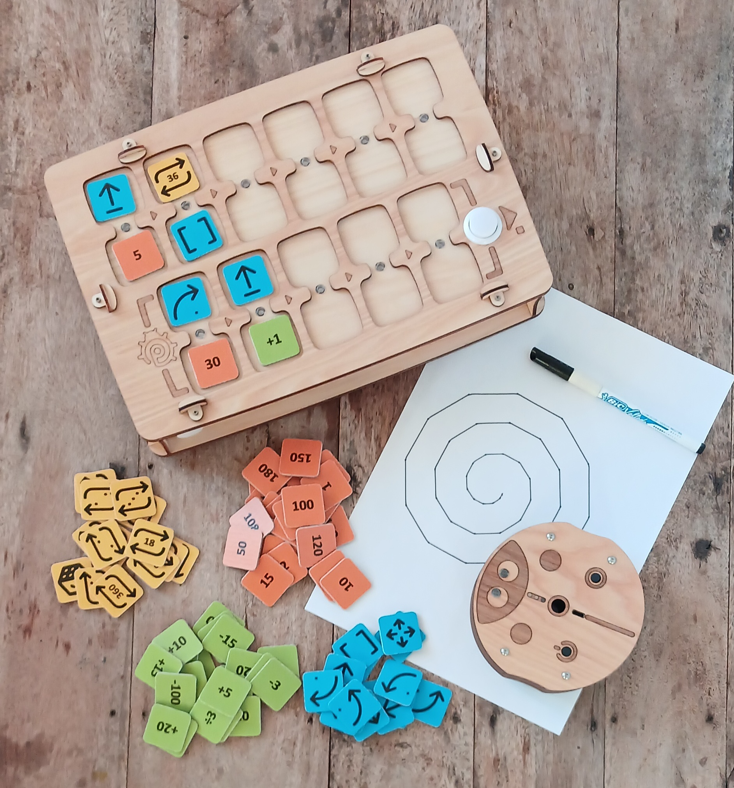
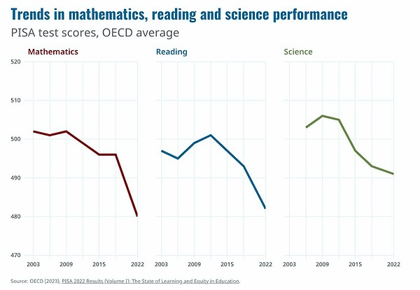

*コントロールパネル、プログラミングブロック、ロボット、コード実行の結果。*

## 重要性

**現代の子どもたち**は、幼い頃からビデオゲームや電子機器に興味を示し、すぐに使いこなせるようになります。

保護者は、お子様の健全な成長にとって情報技術が重要であることを認識していますが、同時に学習と子どもの健康のバランスを保つことも目指しています。

研究によると、早期かつ頻繁な画面との接触は、認知能力や学業成績を低下させる可能性があることが示されています。

*出典：国際学習到達度調査（PISA）、[2022 Results (Volume I)](https://www.oecd-ilibrary.org/education/pisa-2022-results-volume-i_53f23881-en)*

幼児による画面デバイスの使用は、しばしば以下の問題を引き起こします：
- 心理的な困難、
- ゲーム依存症、
- 視力や身体的健康の悪化。

## 目標と課題

この教育**ツール**は、4 歳からのお子様が**画面を使わずに**プログラミング、論理、数学を学ぶのを支援します。

PrimaSTEM で学べる内容：
- 数、
- 空間認識、
- アルゴリズム、
- 論理的思考、
- プログラミングの基礎、
- 算術演算と数列、
- 幾何学的概念。

**利点：**
- 多様な用途、
- 楽しく視覚的な形式、
- 画面を使わない学習、
- 未就学児から低学年の子どもに適している、
- 天然素材。

> 🎯 **主な目標** — プログラミングの基礎とプログラム実行結果の意味を、触れて視覚的に理解することを通じて、認知スキルを発達させること。

## 仕組み

1. ロボットとコントロールパネルの電源を入れます。
2. 命令チップを使って、パネルのマスに配置して移動プログラムを作成します。
3. 「実行」ボタンを押すと、ロボットがプログラムを実行します。

---
**ビデオプレゼンテーション：** [youtu.be/Ztq_I1WBiVo](https://youtu.be/Ztq_I1WBiVo)

  <iframe
    src="https://www.youtube.com/embed/Ztq_I1WBiVo?si=a54tevy8tUEQMOva"
    style={{
      position: 'absolute',
      top: 0,
      left: 0,
      width: '100%',
      height: '100%',
    }}
    frameBorder="0"
    allow="accelerometer; autoplay; clipboard-write; encrypted-media; gyroscope; picture-in-picture"
    allowFullScreen
  />

> 📺  [YouTube PrimaSTEM](https://www.youtube.com/@primastem) チャンネルでさらに多くのチュートリアルと例をご覧いただけます

## 対象者

PrimaSTEM は子ども向けに設計されており、ゲームのように見えますが、教育者や保護者にとって柔軟なツールです。数学、プログラミング、物理、歴史、地理など、さまざまな科目の指導に活用できます。すべては教師や保護者の想像力とスキル次第です。

子どもは数学的・アルゴリズム的な基礎を身につけ、それが学校への素晴らしい準備となり、プログラミング言語（Scratch、Logo、Minecraft など）との初めての体験につながります。

*実行例：ループ内で変数を動的に変更して描画された螺旋。*