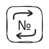
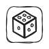

## 🧭 移動

| コマンド | チップ | NFC Code |
| --- | --- | --- |
| 前進 |  | `cfor` |
| 左 |  | `clef` |
| 右 |  | `crig` |
| 後退 |  | `cbac` |
| ランダム移動 |  | `crnd` |

## 🔁 繰り返しと制御

| コマンド | チップ | NFC Code |
| --- | --- | --- |
| リピート 2–999 |  | `r002`–`r999` |
| ランダムな回数リピート（1〜6） |  | `rrnd` |
| 関数 |  | `cfun` |
| 一時停止（数値 = 秒。数値なしで1秒、最大60秒） |  | `cwat` |

## 🔢 数字

| 値 | NFC Code |
| --- | --- |
| 数字 1–999 | `n001`–`n999` |

## 🧮 数学演算

| 演算 | NFC Code |
| --- | --- |
| +1 to +999 | `a001`–`a999` |
| −1 to −999 | `s001`–`s999` |
| ×N | `m002`–`m999` |
| ÷N | `d002`–`d999` |
| X^N | `e002`–`e999` |
| X の平方根 | `sqrt` |
| 階乗 | `fact` |

演算は−5000から5000までの範囲で計算し、割り算は小数なしです。答えが出ない場合（5000超、0での割り算、負の数の平方根、6より大きい階乗）は、セルが赤く点滅し、数値は前のままです。

## ⚙️ 設定

| コマンド | NFC Code |
| --- | --- |
| キャリブレーション。数値なし：ロボットがモーターとジャイロスコープを調整します。約2分かかり、最初の30秒は触らないでください。`+N` または `−N` のチップと組み合わせると：16回の回転で確認したあとの回転補正。普通の数値では動作しません（セルが赤） | `ccal` |
| デフォルトステップ長の設定（1〜999 mm。数値なしで150 mmに戻る） | `clen` |

## 🔧 上級

| コマンド | NFC Code |
| --- | --- |
| オーディオサンプル（[オーディオファイル](/jp/sounds_reference) 参照） | `xNNN` |
| サウンド：ロボットがN番の音を鳴らす（`csou` + 数値N） | `csou` |
| リモコンとロボットの音量：0〜100、100を超えると最大 | `clvl` |

## NFC タグへのデータの書き込み方

独自のトークンを作成できます — NFC タグにテキストコードを書き込むだけです。任意の数値（0〜999）、任意の繰り返し、任意の算術演算用の数値を使用できます。

NFC タグにテキストデータを書き込むには、Google Play ストアを開き、スマートフォンに**RFID NFC Reader**または**NFC Tools**アプリをインストールします。

NFC タグの書き込み手順はこちら — [youtu.be/UbKaQxZs8JA](https://youtu.be/UbKaQxZs8JA)

  <iframe
    src="https://www.youtube.com/embed/UbKaQxZs8JA?si=WT8wWYBe_Ql7TovQ"
    style={{
    position: 'absolute',
    top: 0,
    left: 0,
    width: '100%',
    height: '100%',
  }}
    frameBorder="0"
    allow="accelerometer; autoplay; clipboard-write; encrypted-media; gyroscope; picture-in-picture"
    allowFullScreen
  />

