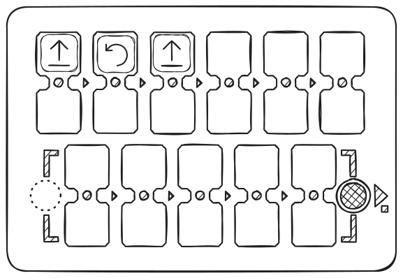

PrimaSTEM は、4〜12 歳の子供向けの教育ツールで、コンピューター、タブレット、携帯電話を使わずにプログラミングを学ぶのに役立ちます。論理力、プログラミングスキル、数学を発達させます。

PrimaSTEM を使った授業は、子供たちにとってプログラミングをシンプルで視覚的に理解しやすいものにします。幼い子供たちでさえ、プロセスを直感的に理解でき、触覚を通じて学べます - プログラミング、論理、数学の基礎がゲーム形式で習得できます。

PrimaSTEM で遊ぶことで、重要なスキルの発達が促進されます：論理的思考、アルゴリズム、プログラミング、数学、幾何学、そして創造性や社会情緒的発達です。PrimaSTEM キットは、[Scratch](https://en.wikipedia.org/wiki/Scratch_(programming_language)) や [LOGO](https://en.wikipedia.org/wiki/Logo_(programming_language)) などのブロックベースのプログラミング言語を学ぶ前の準備段階です。

## 教育キットの概要

### PrimaSTEM はどこで使えますか？

以下の教育プログラムで効果的に使用できます：

- 就学前教育センター
- モンテッソーリ教育法の幼稚園
- 小学校
- ホームスクーリング
- 特別発達センター
- 放課後グループ
- 初心者向けプログラミングクラブ
- 子供向け教育キャンプ

### 始めるために何を知る必要がありますか？

キットを使用前に、教師と保護者の方は [ユーザーマニュアル](usermanual) とこのガイドに目を通すことをお勧めします。特別なプログラミングスキルは不要です - 教材には教育を始めるために必要な基礎が含まれています。

## 研究とキットの価値

PrimaSTEM は、[Seymour Papert](https://en.wikipedia.org/wiki/Seymour_Papert) によって作成されたプログラミング言語 [LOGO](https://en.wikipedia.org/wiki/Logo_(programming_language)) とモンテッソーリ教育法からインスピレーションを受けています。LOGO とタートルロボットは、子供たちにとってプログラミングを視覚的でアクセスしやすいものにしました。

PrimaSTEM のコマンドチップは、このアプローチを実装しています。学習は、画面やテキストを必要としないシンプルな触覚コントロールを通じて直感的になります。

ロボットを観察することで、子供たちは各コマンドを理解し、実際にアルゴリズムを習得していきます。

ロボットには重要な特性があります：方向性を持っているため、子供は自分自身をロボットと同一視でき、プログラムの基本的な動作原理をより簡単に理解できます。

すべてのコマンドはシンプルで明確です：ロボットがどの方向に移動すべきかを示します。ロボットに「行動」や「思考」を教えることで、子供たちは自分の行動や思考について考えるようになり、プログラミングの学習プロセスがより効果的になります。

PrimaSTEM チップは、プログラミング言語の視覚的で簡略化された表現です。学習の初期段階では、テキストや数字はなく、基本的なコマンドのみです。

### なぜ木製ですか？

🌱 コントローラーとロボットは木製です。実践により、子供たちは木製のおもちゃで遊ぶことを好むことが示されています - 安全で耐久性があり、個別の使用履歴を作り出せます。

## PrimaSTEM でのプログラミングの概念

物理的な PrimaSTEM チップは、実際のプログラミング言語の命令に相当し、重要な概念を実演します。

### アルゴリズム

**アルゴリズム**は、プログラムを構成する正確なコマンド（チップ）のシーケンスです。

### キュー

PrimaSTEM コントローラーのコマンドは、左から右へ厳密に実行され、実行キューを視覚的に示します。

### エラー修正（デバッグ）

エラーは簡単に修正できます：チップを交換するだけです。このアプローチは、プログラムを独立してデバッグするスキルを発達させます。

### 関数

関数（サブルーチン）は、コントローラーの下部にあるコマンドのセットで、メインプログラムから「**関数**」チップによって呼び出されます。

## 他の教科での応用

PrimaSTEM は、他のスキルの習得にも役立ちます：

- **コミュニケーション**：グループプレイは協力を促進します。
- **運動能力**：チップを操作することで協調性が向上します。
- **社会性**：子供たちは自信と協力的な問題解決を学びます。
- **数学**：基本的な数学概念を習得します。
- **論理**：子供たちはシーケンスを構築し、結果を予測することを学びます。

> チップのチェーンを構築することで、子供は触覚的、視覚的、精神的にプログラミングを習得します。「実行」ボタンを押した後、ロボットが移動し、結果を子供の期待と比較します。この包括的な体験が学習を加速します。

## ロボットとコントローラーの概要

### ロボット

子供たちに、ロボットはプログラミングできる友達だと説明してください。説明：ロボットには自分の考えはなく、指示のみを実行します - 電源を入れる必要がある家電製品のように。

### コントローラー

コントローラーがロボットにコマンドを伝達することを説明してください。コマンドチップをインストールし、ロボットをプログラミングする方法を示してください。

> メインプログラムはコントローラーの上段（6 セル）に構築します。下段（5 セル）は関数サブルーチン用で、「**関数**」コマンドで使用します。

### コマンドチップ

チップはコントローラーに挿入するロボット用のコマンドです。「実行」を押すと、ロボットがシーケンスを実行します。各チップは個別のコマンドで、子供たちに計算思考とプログラム設計を教えます。各コマンドがアクティブ化されたときにロボットが何をするかを子供たちが理解することが重要です。これにより、プログラム設計とロボットの動作予測を学べます。子供たちに説明してください：チップを失ったり壊したりしないでください。ないとロボットが動かせません。

## 1 - 最初のプログラム

### 因果関係

主な目標は、子供たちにコマンドとアクションのつながりを示すことです。子供に「前進」チップをコントローラーの最初のセルに挿入させ、「実行」を押させます。子供はチップとアクションの対応を確認する必要があります。

### 明確な指示

子供が各チップを認識できるようになるまで、各方向（**前進**、**左**回転、**右**回転）で手順を繰り返します。

### 最初のタスク

ゲームボードを展開するか、テープまたはマーカーで 15x15 cm のグリッドを作成します。ロボットを開始セルに配置します。子供に 1 セル前進するプログラムを作成するように依頼します。間違ったチップを選んだ場合は、ロボットを戻し、新しいオプションについて考えるよう提案します。

## 2 - プログラムとデバッグ

### イベントキュー

ロボットの 2 セル前にターゲットを配置します。

子供に、ターゲットに到達するための 2 つのチップのプログラムを作成させます。

### 3 つのチップのシーケンス

今回は、ターゲットは 1 セル前、1 セル右です。

子供に正しいコマンドシーケンスを自分で選ばせます。

間違ったチップを選んでも心配しないでください。ロボットを元の位置に戻し、子供に自分の選択について考えさせ、新しいオプションを試させます。

### デバッグ - エラーの発見

ロボットの 1 マス前、1 マス左に到着点を設定します。

今回は、シーケンスに意図的に間違った回転を挿入して、問題を解決するプログラムを作成します。

子供にプログラム内の間違ったコマンドを予測させ、間違った結果を独立して予測させ、その後「**実行**」ボタンを押して仮定を確認させます。

子供が、推論または検証によって、提示されたシーケンスが正しくないことを確認した後、間違ったコマンドを正しいコマンドに変更させ、プログラムをデバッグさせます。

## 3 - 関数付きプログラム

### 「関数」コマンド

基本的なコマンドを習得したら、**関数**コマンドチップを導入します。これは、メインプログラムから呼び出せる繰り返し可能なコマンドのセットです。

> 仕組みを説明するには、タワーの比喩を使用できます（関数チップの下に他のコマンドが次々と積み重ねられている）：1 つのチップ内により多くの命令を配置できることを説明します。

例を示します：まず 2 つの「前進」チップを上段のセルに配置し、プログラムを実行します - ロボットは 2 セル進みます。

次に、同じ 2 つの「前進」を関数（下段）に配置し、メインプログラムで「関数」を使用します。結果は同じですが、プログラムの一部がサブルーチンに隠されています。

次に、シーケンスを作成します：**前進 - 前進 - 右 - 前進 - 前進**。

子供たちに繰り返しの部分を見つけて、関数に「隠す」ように依頼します。最終的なシーケンス：メイン部分 - **関数 - 右 - 関数**、下段 - **前進 - 前進**。

### 関数を使用したタスクの解決

子供に 3 つの「**前進**」チップと 2 つの「**関数**」チップを渡します。

タスク - 5 セル前進します。

子供に、このタスクを解決するために複数回のアクションに関数を使用する必要があることを理解させます。

シーケンスが正しくない場合は、ロボットを元の位置に戻し、子供にタスクの正しい解決策について考えさせ、新しいオプションを試させます。

## 4 - ランダム性

### 「ランダム方向」コマンド

ランダム性の概念を導入するには、4 つの方向チップ：「**前進**」、「**左**」、「**右**」、「**後退**」を取り、不透明な箱または袋に入れて混ぜ、子供たちに目をつぶって 1 つのチップを引き、グループに見せてから戻すように依頼します。この例を使って、4 つの状態からのランダム性とは何かを子供たちに説明します。

次に、子供たちに「**ランダム移動**」コマンドチップを見せます。

このチップは、袋からランダムなチップを引き出すのと同じことをすると説明します：ロボットが進む方向をランダムに選択し、1 つの論理ステップ（1 セル）移動します。つまり、ロボットは 1 セル、前、右、左、または後に移動できます。

「**ランダム移動**」チップを上段のセルに配置し、プログラムを数回実行します - ロボットは毎回異なる方向に移動します。

子供たちと遊びます：コマンドを実行する前に、ロボットがどこに進むか当てさせます。

これは**ランダム性**であり、常に正しく方向を当てることはできないことを強調します。

子供たちと一緒に「**ランダム移動**」チップを使用した小さなゲームを作ってみてください。

## 5 - ループ（コマンドの繰り返し）

### 数値ループの概要

子供たちに値チップを見せ、数字を知っているか、ボードゲーム用のサイコロを見たことがあるか、そのようなゲームで遊んだことがあるか尋ねます。

2 つの「前進」チップを上段のセルに配置して実行します - ロボットは 2 セル進みます。

次に、「前進」を 1 つ残し、その下に「ループ 2」チップを配置します。結果は同じです：アクションが 2 回繰り返されます。

4 つの「**前進**」コマンドをインストールし、結果を確認してから、子供たちに値チップ - **ループ** - を使用して、ロボットの移動を 4 セル分繰り返させます。

「**前進**」チップとループ値 4 を使用するシンプルなタスク解決方法と、他のオプションも可能です：例えば「**前進**」にループ番号 3、そしてもう 1 つの「**前進**」コマンド。

### 関数呼び出しループ

子供たちと一緒に、「関数」コマンドに値付きループを適用してみてください：例えば、ループ値 5 の「関数」コマンドと、コントローラー下部の「**前進**」、「**右**」、「**前進**」、「**左**」コマンドの関数シーケンスを使用して、ロボットをジグザグに歩かせます。

まず、関数を使用して「階段」移動のプログラム - 「前進」、「右」、「前進」、「左」 - を作成し、実行します。

次に、関数にループ番号 5 を追加し、関数を数回繰り返すことで、ロボットは右 - 上に階段状に移動します。

ロボットは右斜め上に階段状に移動し、途中で 5 つの階段を作ります。

## 6 - ランダム数

### ランダム数の概念

チップの中には「ランダムループ数」（サイコロの画像）があります。1 から 6 までのランダムな値を選択します。袋からループチップを引き出すゲームをします。

ランダム数の概念を導入するには、4 つのループチップ：「**2**」、「**3**」、「**4**」、「**5**」を取り、不透明な箱または袋に入れて混ぜ、子供たちに目をつぶって 1 つのチップを引き、値を言って見せてから戻すように依頼します。ゲームをします：より大きな値を引いた人の勝ち。この例を使って、4 つの状態からのランダム性とは何かを子供たちに説明します。

次に、子供たちに「**ランダムループ数**」値チップを見せます。このチップは、袋からランダムな値チップを引き出すのと同じことをすると説明します：ゲームのサイコロのように、6 つの数（1 から 6）から 1 つをランダムに選択し、ロボットに送信してアクションを繰り返します。

「**前進**」チップをコントローラーの上段のセルに、「**ランダムループ数**」チップをその下に配置します。子供たちに「**実行**」ボタンを押させます。ロボットを元の場所に戻します。このタスクを数回繰り返します。

遊びます：どのロボットがより遠くまで進むか。

子供たちの注意を、ロボットがランダムな数のセル（1 から 6）を移動することに向けさせます。これはランダム性であり、ロボットがどれだけ進むかを事前に知ることはできないことを強調します。

## 7 - 数：距離と角度

### 数の概要

コマンドの数値を設定しない場合（ダブルセル内のコマンドの上または下）、ロボットはデフォルトの移動パラメーターを使用します：パラメーターなしの場合、ロボットは 15 cm 前進し、90°回転します。これらの値は値チップを使用して変更できます。

例：「**前進**」コマンドに値**200**を追加し、ロボットがどの距離を移動するか確認します。「**回転**」コマンドに値**180**を追加し、変更を評価します。

> **重要：** コントローラーは、移動および回転コマンドに設定された最後の値を保存します。新しい値なしでコマンドを使用した場合、コントローラーがオフになるまで最後に保存された値が適用されます。新しい値を設定すると、デフォルト値が変更されます。デフォルト値（150 mm = 15 cm および 90°）は、明示的に設定するか、コントローラーを再起動することで復元できます。

パラメーターを変更することで、より複雑な軌道と移動シナリオを作成できます。例は [数学的描画ページ](mathdrawings) を参照してください。

## 8 – 算術

### 算術演算

数値の算術演算により、移動コマンド（前進、後退、左、右）のプログラム内の値を動的に変更でき、ロボットの制御をより柔軟にします。

算術演算を追加すると、コントローラーは移動コマンドの保存された数値を変更し、新しい値をロボットに送信します。

例：

「前進 200」- ロボットは 20 cm 移動します、「前進 +100」- さらに 30 cm。合計距離：50 cm。

ループ内でこのような演算を使用すると、プログレッションを作成できます。

> 算術演算の結果が負の数になった場合、ロボットは逆のアクションを実行します：前進する代わりに後退します；左に回転する代わりに右に回転します。

利用可能：加算（+）、減算（−）、乗算（*）、除算（/）、平方根（√）、累乗（^）。

パターンの例は [数学的描画ページ](mathdrawings) に示されています。

---

## 子供たちと一緒に遊び、学びましょう！

あなたは自分の生徒を最もよく知っています。PrimaSTEM は、ゲームベースの学習のためのユニバーサルツールです。プログラミング、論理、その他の教科を教えるために使用してください。すべてはあなたの想像力次第です！

p/s：PrimaSTEM をご使用いただき、関心をお寄せいただきありがとうございます！フィードバックをお待ちしています。[お問い合わせ](contacts) に、あなたの経験と印象についてお書きください。

