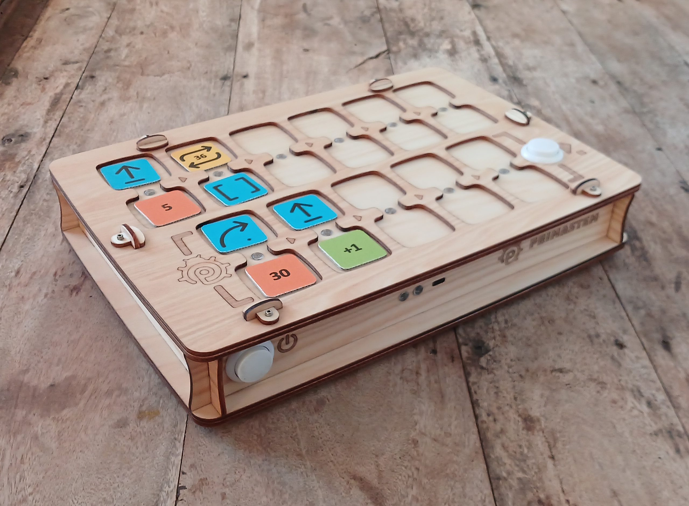

## 技術仕様とパッケージ内容

- おもちゃロボット
- ロボット用リモコン
- プログラム作成用のコマンド、値、演算チップ

> パッケージ内容と外観は若干異なる場合があります。購入時にご確認ください。

### おもちゃロボット

寸法：D=125 мм、H=44 мм。

ロボットには、電源ボタン、LED、スピーカー、機能ボタン、バッテリー充電用 USB-C ポートが装備されています。

ロボットの中央には、移動中に簡単な図形を描画するための直径最大 10 ммのマーカーを取り付けることができます。

外観は構成によって若干異なる場合がありますが、主要な機能は変わりません。

### リモコン

寸法：L=317 мм、W=217 мм、H=62 мм。

リモコンには、コマンドチップと値チップを挿入するための 11 個のデュアルスロットがあります：6 個はメインプログラム用（上部）、5 個はサブルーチン用（下部）。
リモコンには 2 つのボタンがあります：左側 — 電源、右側 — プログラムの開始と停止用の「実行 / 停止」。

コマンドチップと値チップをスロットに配置した後、「実行」を押します：ロボットがプログラムを実行します。アクティブなコマンドは、スロット間の LED で照らされます。

チップが正しく挿入されていない場合、リモコンは赤色 LED で信号を送りますが、プログラムは続行されます（たとえば、コマンドなしで値チップを挿入した場合など）。

リモコンには、充電用 USB-C ポートと音声出力用スピーカーが装備されています。

### 命令チップ

寸法：LxW=33 мм。

セットには、プログラム作成用のチップが含まれています。
各チップは、明確な意味と命令を持つコマンドです。ブロックの順序がロボットの動作を決定します。

チップは**コマンド**、**値**、**演算**に分類されます。

#### コマンドチップ

制御プログラムを構成するための基本ブロック：

- **前進** — 前方への移動（デフォルトで 15 см）
- **右** — 時計回りに 90°回転
- **左** — 反時計回りに 90°回転
- **後退** — 後方への移動（デフォルトで 15 см）
- **関数** — リモコン下部からサブルーチンを実行
- **ランダム移動** — ロボットを移動させるアクションの 1 つ：前進、左、右、または後退（「デフォルトステップ」で）
- **繰り返しチップ（ループ）** - 2 から 6 までの数字（点の数による）と内部に数字が入った繰り返しピクトグラムを持つチップ。サイコロのチップは 1 から 6 までのランダムな繰り返し回数を意味します。

> プログラミングを拡張するために、数値チップと演算チップも使用されます：たとえば、コマンドの繰り返しや移動角度/距離の変更など。

#### 値チップ

角度と距離のチップ：30°、36°、45°、および倍数（60°、72°など）。
角度は度、距離はミリメートル単位です。
デフォルト — 90°および 100 мм（15 см）。

#### 演算チップ

移動コマンドのパラメータを変更します：

- 加算 (+)
- 減算 (−)
- 乗算 (*)
- 除算 (/)
- 平方根 (√)
- 累乗 (^)

## リモコンとロボットの接続

まずロボットをオンにして、次にリモコンをオンにすることをお勧めします。

接続する前にロボットを平らな面に置きます：ペアリング後、LED は白色になります。接続がない場合、赤色に点滅します。

接続を確認します：「前進」チップを挿入して「実行」を押します。

接続がない場合、両方のデバイスを再起動するか充電してください。強い電磁場源（携帯電話、WiFi ポイント）の近くでは、一時的に接続が失われる可能性があります。

> **デバイスのソフトウェアを更新した後**、ペアリングが必要になる場合があります：ロボットをオンにし、次にリモコンをオンにして、リモコンの「実行」ボタンを 10～15 秒間押し続け、音声信号が鳴るまで待ちます。

## 仕組みについて

移動をプログラムするには、リモコンのスロットにコマンドチップを挿入します（例：「前進」、「左」、「関数」など）。
コマンド値と繰り返し回数、および角度、距離、演算の値を設定できます。

コマンドと値（繰り返し）を一緒に挿入するために、スロットはインジケーター付きの「ブリッジ」で接続されています。

  *以下は、類似のコードセクションを繰り返すループの例を使用したプログラムです。このプログラムは、ロボットの正方形の移動ルートを作成します：*

コマンドはまずリモコンの上部（6 スロット）に挿入され、左から右へ実行されます。空のスロットまたはエラーは無視されます（例：1 つのブロックに 2 つのコマンド、またはコマンドなしの値）。

ブロックの順序がロボットの移動を決定します。

「実行」を押してプログラムを開始します。

デフォルト：
- 「前進」 — 15 см。
- 「左/右」 — 90°。
- ループ（繰り返し）はコマンドを数回繰り返します。
- 「関数」はリモコンの下部からサブルーチンを呼び出します（5 スロット）。
- 「関数」に繰り返しチップを追加して、ループを介してサブルーチンを数回呼び出すことができます（上記の例を参照）。

### 重要な機能：

- 移動中に再度「実行」を押して、プログラムの実行を**中断**できます。
- リモコンは、電源オフになるまで移動コマンドの最後の**設定値**（距離/角度）を記憶します：たとえば、「前進」=「200」の場合、その後のすべての「前進」コマンドはこの値で実行されます。
- 演算後の値も保存されます。
- 「**デフォルト距離**」はサービスチップで変更できます：たとえば、12.5 смの場合、「デフォルト距離」チップに値 125 を設定します。値は電源オフ後も保存されます。
- リモコンとロボットは、10 分間操作がないと**自動的に電源が切れます**。
- ロボットが 1～3 分間使用されない場合、動作中および準備完了を信号するために小さな移動を行います。
- ロボットの**まばたき音**は、ロボットのボタンを 1 回押すことでオン/オフできます。
- **リモコンの音声**は、「実行」ボタンを 5 秒間押し続けることでオン/オフできます。
- **ソフトウェア更新後**、ロボットの移動のキャリブレーションが必要になる場合があります。
- **ロボットのソフトウェアリセット**は、ボタンを 10 秒間押し続けることで可能です。
- **リモコンとロボットのペアリング**は、デバイスのソフトウェア更新後に必要になる場合があり、リモコンの「実行」ボタンを 10～15 秒間押し続けることで設定されます。

### ロボットのキャリブレーション：

- テーブル面上にロボットの正確な方向をマークします。
- 任意のプログラムを使用して、ロボットをデフォルト角度（時計回りに 90 度）で 8 回回転させる必要があります（例：右回転を 8 回実行）、ロボットは 360 度の完全な回転を 2 回行う必要があります = 90*8。
- 次に、ロボットの初期位置からの偏差角度を評価し、正規化に必要な値で「キャリブレーション」コマンドを実行します：ロボットが初期マークの前に停止した場合、演算「+ 角度」を追加します（例：+10）、ロボットがマークの後に停止した場合、「- 角度」を追加します（例：-5）。
- キャリブレーションは、最良の結果を得るために数回実行できます。
- 注意！ロボットのキャリブレーションのリセットは、コントロールボタンを 10 秒以上押し続けることで実行されます。

<Accordion icon="rectangle-terminal" title="直径 10 смのロボットを備えた最初のデバイスバージョン（MVP）のキャリブレーション">
1. ジャイロスコープをキャリブレーションするには、ロボットを水平面に置き、「キャリブレーション」チップをリモコンに挿入して「実行」を押します。
2. 移動距離をキャリブレーションするには、「前進」コマンドで実際の経路を測定し、「キャリブレーション」と必要な値のチップを挿入して「実行」します。値は、NFC 対応携帯電話を使用して、nXXX 形式のテキスト（例：95 ммの場合は n095）として任意のデジタル NFC チップに書き込むことができます。これにより、ロボットの移動距離が正確になります。*
</Accordion>

### NFC チップのプログラミング

NFC 対応携帯電話とタグの読み書きプログラム（例：「NFC Tools」）を使用して、**独自のチップを作成または変更**できます — コマンド、デジタル値、または演算。値は、NFC 対応携帯電話を使用して、4 文字の単純なテキスト形式で空のデジタル NFC タグ - チップに書き込むことができます。

## 重要！

> このキットは**4 歳未満のお子様には適していません**。小さな部品が含まれており — **窒息の危険**があります！**大人の監督の下でのみ**使用してください！

デバイスには Li-ion バッテリーが搭載されています。**標準の USB 5V と USB-C ケーブルを使用して、大人の監督の下でのみ充電してください**。

リモコンとロボットの充電（1 時間）は 1～2 回のレッスンに十分です。完全充電（2～3 時間）は 30～45 分のレッスンを 3 回行えます。時間が経つにつれてバッテリー容量が低下する可能性があり、新しい 16340 Li-ion バッテリーへの交換が可能です。

セットを長期間使用しない場合は、バッテリーを**2～3 か月に 1 回**充電してください。過放電すると、バッテリーが故障し、交換が必要になる可能性があります。

**デバイスを自分で分解しないでください** — 故障やバッテリー交換の必要がある場合は、販売店または電子機器修理の専門業者に連絡してください。

セットは、温度 +10…+30°C、湿度 45～60%の乾燥した場所で保管および使用してください。直射日光、湿気、ほこりを避けてください。

衝撃や振動を避けてください。デバイスは、元の梱包箱で、温度 +5…+35°C で、機械的損傷や湿気から保護して輸送および保管してください。

p.s.：PrimaSTEM は、創造的思考と論理を発達させるプログラミング学習のための実用的なツールです。
機能に関する詳細情報は、**教師用ガイド**に記載されています。
