PrimaSTEM is een educatief hulpmiddel voor kinderen van 4-12 jaar dat helpt programmeren te leren zonder computers, tablets of telefoons. Het ontwikkelt logica, programmeervaardigheden en wiskunde.

Lessen met PrimaSTEM maken programmeren eenvoudig en visueel voor kinderen. Zelfs jonge kinderen vinden het proces begrijpelijk en tastbaar - de basis van programmeren, logica en wiskunde worden onder de knie gekregen in de vorm van een spel.

Spelen met PrimaSTEM bevordert de ontwikkeling van sleutelvaardigheden: logisch denken, algoritmiek, programmeren, wiskunde, meetkunde, evenals creatieve en sociaal-emotionele ontwikkeling. De PrimaSTEM-set is een voorbereidende stap voordat kennis wordt gemaakt met blokgebaseerde programmeertalen zoals [Scratch](https://en.wikipedia.org/wiki/Scratch_(programming_language)) of [LOGO](https://en.wikipedia.org/wiki/Logo_(programming_language)).

## Kennismaking met de educatieve set

### Waar kan PrimaSTEM worden gebruikt?

Gebruik is effectief in de volgende onderwijsprogramma's:

- Voorschoolse educatiecentra
- Kleuterscholen met Montessori-methodiek
- Basisschool
- Thuisonderwijs
- Speciale ontwikkelingscentra
- Buitenschoolse opvanggroepen
- Programmeerclubs voor beginners
- Educatieve kampen voor kinderen

### Wat moet je weten om te beginnen?

Voordat je met de set werkt, raden we leraren en ouders aan de [gebruikershandleiding](usermanual) en deze gids te raadplegen. Er zijn geen speciale programmeervaardigheden vereist - de materialen bieden de nodige basis om te beginnen met onderwijzen.

## Onderzoek en waarde van de set

PrimaSTEM is geïnspireerd door de programmeertaal [LOGO](https://en.wikipedia.org/wiki/Logo_(programming_language)), gemaakt door [Seymour Papert](https://en.wikipedia.org/wiki/Seymour_Papert), en de Montessori-pedagogiek. LOGO en de schildpaddrobot maakten programmeren visueel en toegankelijk voor kinderen.

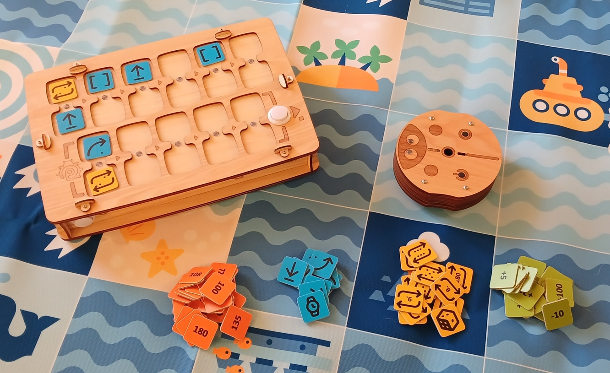

PrimaSTEM-commandochips implementeren deze aanpak. Leren wordt intuïtief door eenvoudige tastbare bediening, zonder schermen of tekst.

Door de robot te observeren, leren kinderen elke commando te begrijpen en algoritmen in de praktijk onder de knie te krijgen.

De robot heeft een belangrijke eigenschap: hij heeft een richting, waardoor het kind zich ermee kan identificeren en de basislogica van hoe programma's werken gemakkelijker kan begrijpen.

Alle commando's zijn eenvoudig en duidelijk: ze geven aan in welke exacte richting de robot moet bewegen. De robot leren "handelen" of "denken" laat kinderen nadenken over hun eigen acties en gedachten, waardoor het leerproces van programmeren effectiever wordt.

PrimaSTEM-chips zijn een visuele en vereenvoudigde weergave van programmeertalen. Aan het begin van het leren zijn er geen teksten of cijfers - alleen basiscommando's.

### Waarom hout?

🌱 De controller en robot zijn gemaakt van hout. De praktijk heeft aangetoond dat kinderen liever spelen met houten speelgoed - ze zijn veilig, duurzaam en creëren een individuele gebruiksgeschiedenis.

## Programmeerconcept met PrimaSTEM

Fysieke PrimaSTEM-chips zijn analoog aan instructies in echte programmeertalen en demonstreren belangrijke concepten.

### Algoritmen

**Algoritmen** zijn een reeks precieze commando's (chips) die een programma vormen.

### Wachtrij

Commando's op de PrimaSTEM-controller worden strikt van links naar rechts uitgevoerd, wat de uitvoeringswachtrij visueel demonstreert.

### Foutcorrectie (debuggen)

Een fout is gemakkelijk te verhelpen: vervang gewoon de chip. Deze aanpak ontwikkelt de vaardigheid van onafhankelijk programma debuggen.

### Functie

Een functie (subroutine) is een reeks commando's in het onderste deel van de controller, aangeroepen vanuit het hoofdprogramma met de "**Functie**"-chip.

## Toepassing in andere vakken

PrimaSTEM helpt bij het beheersen van andere vaardigheden:

- **Communicatie**: Groepsspelen bevordert samenwerking.
- **Motoriek**: Werken met chips verbetert coördinatie.
- **Sociale vaardigheden**: Kinderen leren zelfvertrouwen en samenwerkende probleemoplossing.
- **Wiskunde**: Basis wiskundige concepten worden onder de knie gekregen.
- **Logica**: Kinderen leren sequenties bouwen en resultaten voorspellen.

> Door een keten van chips te bouwen, beheerst het kind programmeren tastbaar, visueel en mentaal. Na het indrukken van de "Uitvoeren"-knop beweegt de robot en wordt het resultaat vergeleken met de verwachting van het kind. Deze uitgebreide ervaring versnelt het leren.

## Kennismaking met de robot en controller

### De robot

Vertel kinderen dat de robot hun vriend is die ze kunnen programmeren. Leg uit: hij heeft geen eigen gedachten en voert alleen hun instructies uit - zoals een huishoudelijk apparaat dat moet worden ingeschakeld.

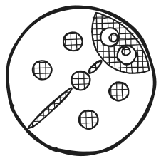

### De controller

Leg uit dat de controller commando's naar de robot verzendt. Laat zien hoe je commandochips installeert en de robot programmeert.

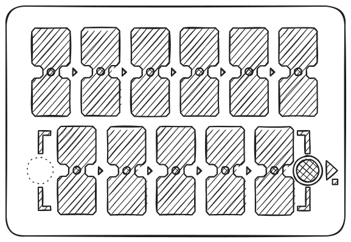

> Het hoofdprogramma wordt gebouwd in de bovenste rij van de controller (6 cellen). De onderste rij (5 cellen) is bestemd voor de functiesubroutine en wordt gebruikt met het "**Functie**"-commando.

### Commandochips

Chips zijn commando's voor de robot die in de controller worden geplaatst. Na het indrukken van "Uitvoeren" voert de robot de sequentie uit. Elke chip is een apart commando dat kinderen computationeel denken en programma-ontwerp leert. Het is belangrijk dat kinderen begrijpen wat de robot doet wanneer elk commando wordt geactiveerd. Dit leert hen programma-ontwerp en het voorspellen van robotacties. Leg kinderen uit: chips mogen niet verloren gaan of beschadigd raken, zonder hen kan de robot niet bewegen.

## 1 - Eerste programma

### Oorzaak en gevolg

Het hoofddoel is om kinderen het verband tussen commando en actie te tonen. Laat het kind de "Vooruit"-chip in de eerste cel van de controller plaatsen en op "Uitvoeren" drukken. Het kind moet de overeenkomst tussen de chip en de actie zien.

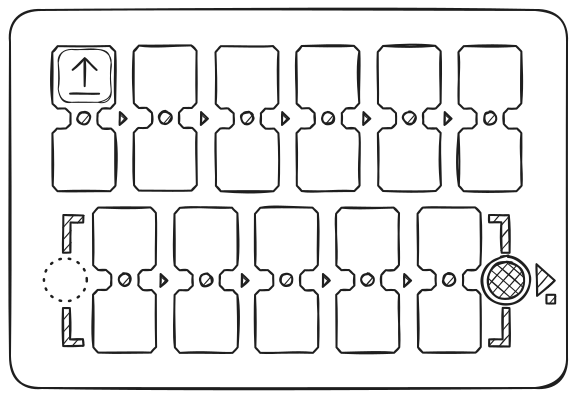

### Eenduidige instructies

Herhaal de stappen met elke richting (**vooruit**, draai **links**, draai **rechts**) totdat het kind elke chip kan herkennen.

### Eerste taak

Vouw het speelbord uit of maak een 15x15 cm raster met tape of een marker. Plaats de robot op de startcel. Vraag het kind een programma te maken om één cel vooruit te bewegen. Als de verkeerde chip werd gekozen, breng de robot terug en stel voor na te denken over een nieuwe optie.

## 2 - Programma en debuggen

### Gebeurteniswachtrij

Plaats een doel twee cellen voor de robot.

Laat het kind een programma van twee chips maken om het doel te bereiken.

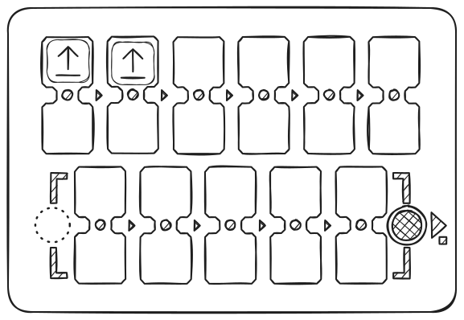

### Sequentie van drie chips

Deze keer is het doel één cel vooruit en één cel naar rechts.

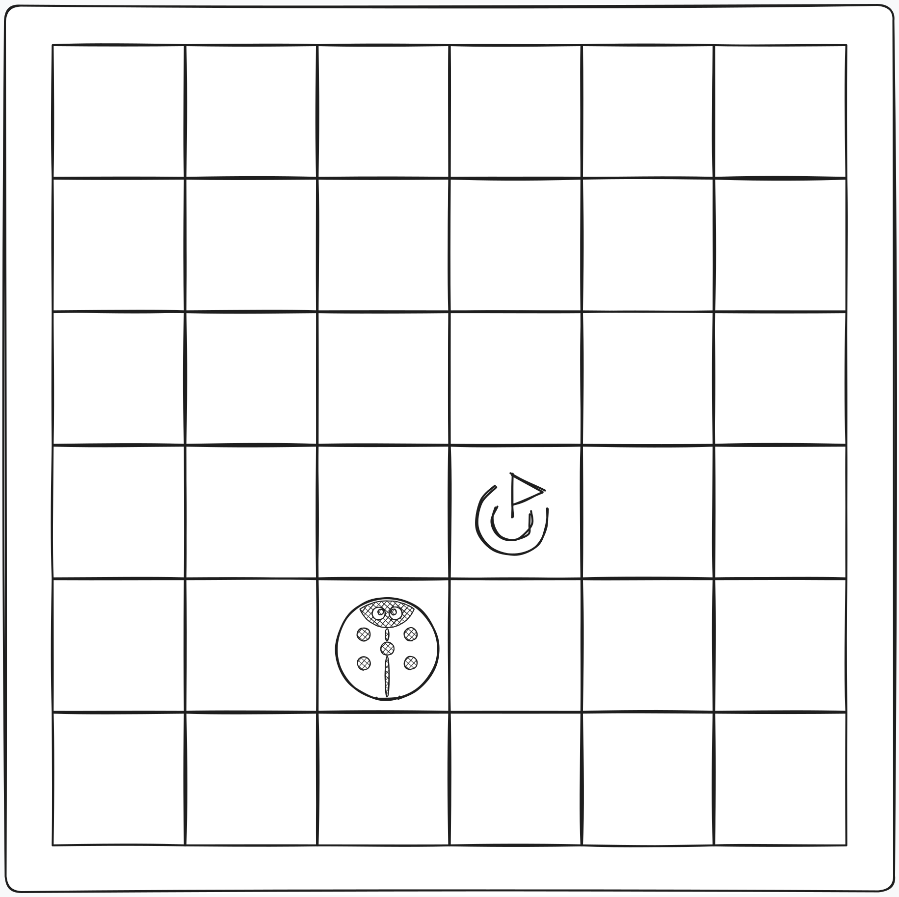

Laat het kind zelf de juiste commandosequentie kiezen.

Maak je geen zorgen als de verkeerde chip werd gekozen. Breng de robot gewoon terug naar zijn oorspronkelijke positie en vraag het kind na te denken over zijn keuze en nieuwe opties te proberen.

### Debuggen - de fout vinden

Plaats het aankomstpunt één vakje voor de robot en één vakje links ervan.

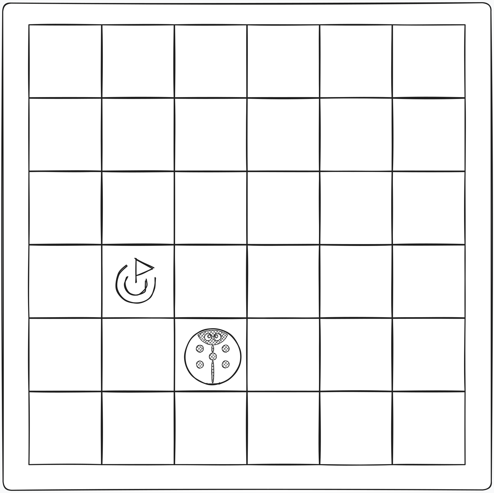

Maak deze keer een programma om het probleem op te lossen door opzettelijk een verkeerde draai in de sequentie te plaatsen.

Vraag het kind het verkeerde commando in het programma te voorspellen en onafhankelijk het verkeerde resultaat te voorspellen, en laat hen vervolgens op de "**Uitvoeren**"-knop drukken om hun aanname te bevestigen.

Nadat het kind heeft bevestigd dat de gepresenteerde sequentie onjuist was, hetzij door redenering, hetzij door verificatie, laat hen het verkeerde commando veranderen in het juiste, en debug zo het programma.

## 3 - Programma met functie

### "Functie"-commando

Wanneer de basiscommando's zijn beheerst, introduceer de **Functie**-commandochip. Dit is een herhaalbare reeks commando's die kan worden aangeroepen vanuit het hoofdprogramma.

> Om uit te leggen hoe dit werkt, kun je de torenmetafoor gebruiken (onder de functietrapel zijn andere commando's op elkaar gestapeld), wat uitlegt dat meer instructies in één chip kunnen worden geplaatst.

Laat een voorbeeld zien: plaats eerst twee "Vooruit"-chips in de bovenste cellen en voer het programma uit - de robot rijdt twee cellen.

Plaats nu dezelfde twee "Vooruit"-chips in de functie (onderste rij) en gebruik "Functie" in het hoofdprogramma. Het resultaat zal hetzelfde zijn, maar nu is een deel van het programma verborgen in een subroutine.

Maak vervolgens de sequentie: **Vooruit - Vooruit - Rechts - Vooruit - Vooruit**.

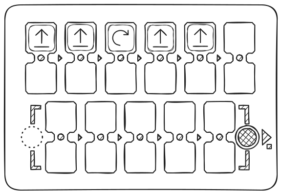

Vraag kinderen de herhalende delen te vinden en ze te "verbergen" in de functie. De uiteindelijke sequentie: in het hoofddeel - **Functie - Rechts - Functie**, onderaan - **Vooruit - Vooruit**.

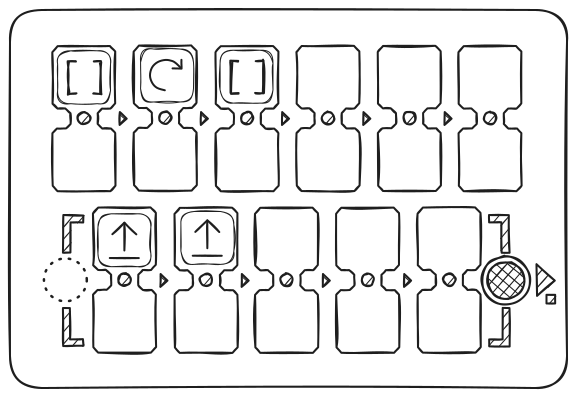

### Taken oplossen met functie

Geef het kind 3 "**Vooruit**"-chips en 2 "**Functie**"-chips.

De taak - rijd 5 cellen vooruit.

Laat het kind begrijpen dat het de functie moet gebruiken voor herhaalde actie om deze taak op te lossen.

Als de sequentie onjuist is, breng de robot gewoon terug naar zijn oorspronkelijke positie en vraag het kind na te denken over de juiste oplossing van de taak en nieuwe opties te proberen.

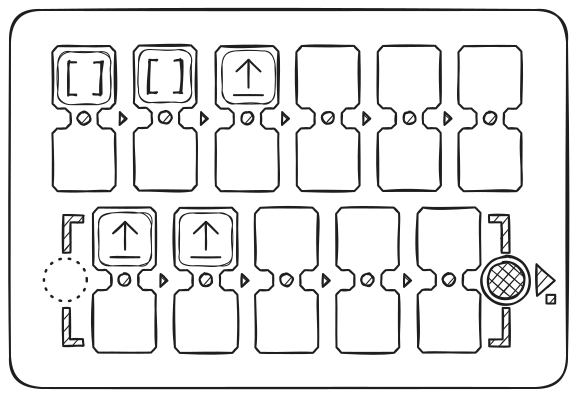

## 4 - Willekeurigheid

### "Willekeurige richting"-commando

Om het concept van willekeurigheid te introduceren, neem 4 richtingschips: "**Vooruit**", "**Links**", "**Rechts**" en "**Achteruit**", plaats ze in een ondoorzichtige doos of zak, meng ze en vraag kinderen om er 1 te trekken zonder te kijken en deze aan de groep te tonen, en vervolgens terug te leggen. Leg kinderen uit wat willekeurigheid uit vier toestanden is met dit voorbeeld.

Toon kinderen vervolgens de "**Willekeurige beweging**"-commandochip.

Leg uit dat deze chip bijna hetzelfde doet als wat ze eerder deden door willekeurige chips uit de zak te trekken: hij kiest willekeurig een richting waarin de robot zal gaan en beweegt hem vervolgens 1 logische stap - één cel. Dat wil zeggen, de robot kan 1 cel vooruit, rechts, links of achteruit bewegen.

Plaats de "**Willekeurige beweging**"-chip in de bovenste cel en voer het programma meerdere keren uit - de robot beweegt elke keer anders.

Speel met kinderen: laat ze raden waar de robot naartoe gaat voordat je het commando uitvoert.

Benadruk dat dit **willekeurigheid** is en je niet altijd de richting correct kunt raden.

Probeer een klein spel te maken met de "**Willekeurige beweging**"-chip samen met kinderen.

## 5 - Lussen (commando-herhalingen)

### Kennismaking met numerieke lussen

Toon kinderen de waardechips, vraag of ze cijfers kennen, of ze een dobbelsteen voor bordspellen hebben gezien, of ze zulke spellen hebben gespeeld.

Plaats twee "Vooruit"-chips in de bovenste cellen en voer uit - de robot rijdt twee cellen.

Laat nu één "Vooruit" staan en plaats de "lus 2"-chip eronder. Het resultaat zal hetzelfde zijn: de actie wordt twee keer herhaald.

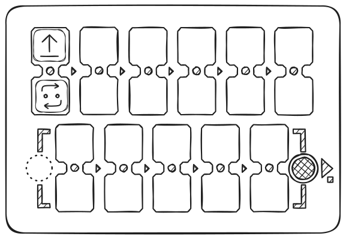

Installeer 4 "**Vooruit**"-commando's, kijk naar het resultaat, en vraag kinderen dan waardechips te gebruiken - **lussen** - om de beweging van de robot voor 4 cellen te herhalen.

Zowel eenvoudige taakoplossingen met installatie van de "**Vooruit**"-chip en luswaarde 4 zijn mogelijk, evenals andere opties: bijvoorbeeld "**Vooruit**" met lusnummer 3 en nog een "**Vooruit**"-commando.

### Functieaanroeplus

Probeer met kinderen een lus met waarden toe te passen op het "Functie"-commando: bijvoorbeeld de robot in zigzag laten lopen met het "Functie"-commando met een luswaarde van 5 en de functiesequentie in het onderste deel van de controller met de commando's "**Vooruit**", "**Rechts**", "**Vooruit**", "**Links**".

Maak eerst met de functie een programma voor "trap"-beweging - "vooruit", "rechts", "vooruit", "links" en voer het uit.

Voeg vervolgens een lus met nummer 5 toe aan de functie, waardoor de functie meerdere keren wordt herhaald, de robot beweegt in trappen naar rechts - omhoog.

De robot rijdt trapsgewijs diagonaal naar rechts en omhoog en maakt onderweg 5 trappen.

## 6 - Willekeurige getallen

### Concept van willekeurig getal

Onder de chips bevindt zich "Willekeurig lusnummer" (met een dobbelsteenafbeelding). Het kiest een willekeurige waarde van 1 tot 6. Speel een spel met het trekken van luschips uit een zak.

Om het concept van een willekeurig getal te introduceren, neem 4 luschips: "**2**", "**3**", "**4**" en "**5**", plaats ze in een ondoorzichtige doos of zak, meng ze en vraag kinderen om er 1 te trekken zonder te kijken en deze te tonen, de waarden te noemen, en vervolgens terug te leggen. Speel een spel: wie trekt de hogere waarde. Leg kinderen uit wat willekeurigheid uit vier toestanden is met dit voorbeeld.

Toon kinderen vervolgens de "**Willekeurig lusnummer**"-waardechip. Leg uit dat deze chip bijna hetzelfde doet als wat ze eerder deden, door willekeurige waardechips uit de zak te trekken: hij kiest willekeurig 1 van 6 getallen (van 1 tot 6), zoals een dobbelsteen, om naar de robot te verzenden en acties te herhalen.

Plaats de "**Vooruit**"-chip in de bovenste cel van de controller en de "**Willekeurig lusnummer**"-chip eronder. Vraag kinderen op de "**Uitvoeren**"-knop te drukken. Breng de robot terug naar zijn oorspronkelijke plek. Herhaal deze taak meerdere keren.

Speel: wiens robot het verst rijdt.

Vestig de aandacht van kinderen op het feit dat de robot een willekeurig aantal cellen beweegt: van 1 tot 6. Benadruk dat dit willekeurigheid is en je van tevoren niet kunt weten hoe ver de robot rijdt.

## 7 - Getallen: afstanden en hoeken

### Kennismaking met getallen

Zonder numerieke waarden voor commando's te installeren (boven of onder het commando in de dubbele cel), gebruikt de robot standaard bewegingsparameters: zonder parameters beweegt de robot 15 cm vooruit en draait 90°. Deze waarden kunnen worden gewijzigd met waardechips.

Voorbeeld: Voeg de waarde **200** toe aan het "**Vooruit**"-commando en kijk hoe ver de robot rijdt. Voeg de waarde **180** toe aan het "**draaien**"-commando en evalueer de wijzigingen.

> **Belangrijk:** De controller slaat de laatste waarde op die is ingesteld voor bewegings- en draaicommando's. Als een commando wordt gebruikt zonder nieuwe waarde, geldt de laatst opgeslagen waarde totdat de controller wordt uitgeschakeld. Het instellen van een nieuwe waarde verandert de standaardwaarde. Standaardwaarden (150 mm = 15 cm en 90°) kunnen worden hersteld door ze expliciet in te stellen of de controller opnieuw op te starten.

Het wijzigen van parameters maakt het mogelijk om meer complexe trajecten en bewegingsscenario's te creëren. Zie voorbeelden op de [pagina met wiskundige tekeningen](mathdrawings).

## 8 – Rekenkunde

### Rekenkundige bewerkingen

Rekenkundige bewerkingen met getallen maken het mogelijk waarden in het programma voor bewegingscommando's (Vooruit, Achteruit, Links, Rechts) dynamisch te wijzigen, waardoor robotbesturing flexibeler wordt.

Bij het toevoegen van een rekenkundige bewerking verandert de controller het opgeslagen getal voor het bewegingscommando en verzendt de nieuwe waarde naar de robot.

Voorbeeld:

"Vooruit 200" — de robot beweegt 20 cm, "Vooruit +100" — nog 30 cm. Totale afstand: 50 cm.

Het gebruik van dergelijke bewerkingen in een lus maakt het mogelijk progressies te creëren.

> Als het resultaat van een rekenkundige bewerking negatief wordt, voert de robot de omgekeerde actie uit: in plaats van vooruit te bewegen, beweegt hij achteruit; in plaats van naar links te draaien, draait hij naar rechts.

Beschikbaar: optellen (+), aftrekken (−), vermenigvuldigen (*), delen (/), wortel (√), machtsverheffing (^).

Patroonvoorbeelden worden getoond op de [pagina met wiskundige tekeningen](mathdrawings).

---

## Speel en leer samen met kinderen!

Je kent je leerlingen het beste. PrimaSTEM is een universeel hulpmiddel voor spelgebaseerd leren. Gebruik het om programmeren, logica en andere vakken te onderwijzen. Alles hangt af van je fantasie!

p/s: Bedankt voor het gebruik van PrimaSTEM en voor je getoonde interesse! We wachten op je feedback, [schrijf ons](contacts) over je ervaring en indrukken.

