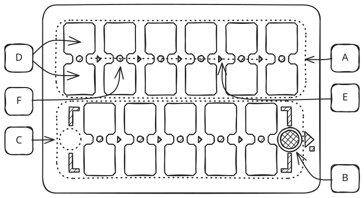
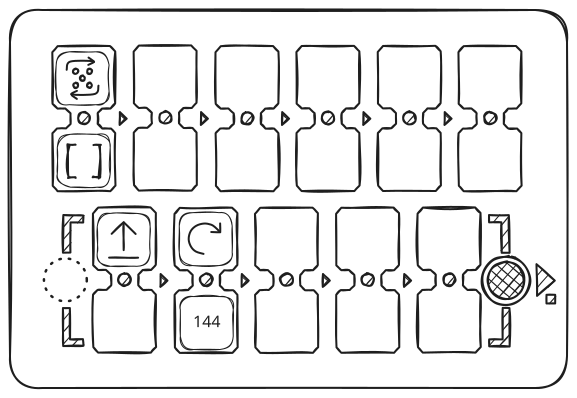
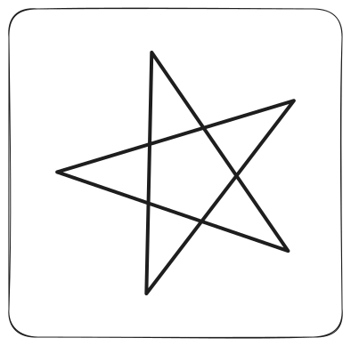

PrimaSTEM er et skjermfritt læringssett for programmering, logikk og matematikk, for barn fra 4 til 10+ år. Denne siden forklarer kort **hvordan enheten fungerer**.

<Note>
**Har du ikke enheten ennå? Prøv den i nettleseren.** Åpne **[nettsimulatoren](https://simulator.primastem.com)** — en fungerende kopi av kontrollpanelet og roboten. Legg ut brikker, trykk på **▶ Start** og se roboten kjøre mens du leser denne veiledningen.
</Note>

## 1. Hva er i esken

<CardGroup cols={3}>
  <Card title="Robot" icon="bug">
    Marihøne-robot i tre på to hjul. Tusjholder på toppen. Høyttaler, USB-C, Bluetooth.
  </Card>
  <Card title="Kontrollpanel" icon="grid-3x3">
    Panel med parede spor for programmet. Flerfargede indikatorer, ▶ Start/Stopp-knapp, høyttaler, USB-C, Bluetooth.
  </Card>
  <Card title="Kodebrikker" icon="square-stack">
    Pappkvadrater med NFC-klistremerker — hver = én kommando i robotens program.
  </Card>
</CardGroup>

## 2. Slå på

<Steps>
  <Step title="Slå på roboten først, så kontrollpanelet" icon="power">
    Hver gir en kort lyd; det grønne strømlyset på hver enhet = på.
  </Step>
  <Step title="Tilkoblet = hvit" icon="check">
    Tilgjengelige spor på kontrollpanelet lyser **hvitt**, robotens øyne blinker **hvitt**. Klart.
  </Step>
  <Step title="Begge blå = paring nødvendig" icon="bluetooth">
    Hold **▶ Start** på panelet i **mer enn 10 sekunder** — enhetene parer seg og roboten starter på nytt.
  </Step>
</Steps>

**Prøv dette først:** legg et **Fremover**-kort i første spor (i en av cellene i paret). Trykk **▶ Start**. Roboten kjører 15 cm fremover og stopper. *Det er allerede et program — én kommando.*

## 3. Hvordan et program fungerer

Panelet har **to rader med parede spor**. Du plasserer brikker i sporene som lyser hvitt — det blir programmet. Trykk **▶ Start** — roboten utfører det.

<Frame caption="Skjema for kontrollpanelet — bokstavene A–F forklares under">
  
</Frame>

| Merke | Hva det er |
| :---: | --- |
| **A** | **Hovedprogram** — 6 parede spor, kjøres fra venstre til høyre |
| **B** | **▶ Start / Stopp** — start; trykk igjen mens roboten beveger seg = stopp |
| **C** | **Funksjon** — 5 parede spor, kalles av «Funksjon»-brikken |
| **D** | Én **celle** i et par |
| **E** | **Utførelseslinje** som forbinder de parede cellene |
| **F** | **Flerfarget LED** på hver celle |

**Par = to logisk koblede celler.** Rekkefølgen topp/bunn spiller ingen rolle — kommandoen kan legges i hvilken som helst av de to cellene, gjentakelse/tall/regning i den andre. Hvis den andre cellen er tom, brukes standardverdier: steg 15 cm og sving 90° — nok for små barn.

LED-farger under utførelse:

| ⚪ Hvit | 🟢 Grønn | 🔵 Blå | 🔴 Rød |
| :---: | :---: | :---: | :---: |
| Venter (spor ledig) | Kommando satt | Kommando + tall / gjentakelse / regning | Feil — hoppes over |

Tomme spor og røde par hoppes over. LED-ene blinker på cellen som kjøres akkurat nå.

## 4. Brikker — etter gruppe

| Gruppe | Hva brikkene gjør |
| --- | --- |
| **Bevegelse** | Fremover · Bakover · Venstre · Høyre |
| **Gjentakelse** | To piler i sirkel + inni prikker 2–6 (som på en terning, for de små) eller med tall. I par med en kommando — gjentar den. |
| **Tall** | `1`–`999`. Bestemmer bevegelsesavstand i mm eller dreievinkel i grader. |
| **Regning** | `+N` `−N` `×N` `÷N` `√` `^N` — én brikke = operasjon + tall. Endrer den lagrede verdien for bevegelse eller dreining. Et negativt resultat reverserer retningen! |
| **Funksjon** | Kaller den nederste raden som underprogram. Med gjentakelse-brikke — kjøres angitt antall ganger. |
| **Steg** | Servicebrikke + Tall = endrer standardsteget (f.eks. tall 100, i millimeter, for et 10-cm-rutenett). Bevares etter avslåing. |

## 5. Standardverdier og lagret verdi

<Note>
**Fremover = 150 mm (15 cm), sving = 90°.** «**Steg**»-brikken endrer «standard»-avstanden og bevarer den etter avslåing. Praktisk for spillkart fra andre roboter.

I løpet av én økt holder hver bevegelseskommando på **sin egen** lagrede verdi:

- **et tall** i paret med kommandoen → erstatter siste lagrede verdi eller standardverdi
- **en regnebrikke** → endrer den (`+`, `−`, `×`, `÷`, `√`, `^`)
- **tomt** i paret → tar siste lagrede verdi eller standardverdi

Lagrede verdier nullstilles når panelet slås av; standardverdien (steg) består.

**Hurtigreferanse:**

- `Fremover` alene       → 150 mm (15 cm) — standard
- `Fremover` + `100`     → 100 mm — erstatter
- `Fremover` + `+50`     → 150 mm  (forrige 100 + 50) — endrer
- `Venstre` alene        → 90° — standard
- `Venstre` + `45`       → 45° — erstatter
- `Venstre` + `−10`      → 35°  (forrige 45° − 10°) — endrer
</Note>

## 6. Roboten tegner det du programmerer

Prøv disse eksemplene — du ser hva enheten kan. Sett en tusj midt i roboten — den **tegner** mens den beveger seg.

<CardGroup cols={2}>
  <Card title="Stjerne — tall + gjentakelse">
    <Frame>
      
    </Frame>
    <Frame>
      
    </Frame>
  </Card>
  <Card title="Spiral — regning i en løkke">
    <Frame>
      
    </Frame>
    <Frame>
      
    </Frame>
  </Card>
</CardGroup>

Flere eksempler under [Matematiske tegninger](mathdrawings).

## 7. Hvordan undervise med PrimaSTEM

<Tip>
**Innfør kommandobrikker én og én, i denne rekkefølgen:**

**Fremover → Svinger → Gjentakelser → Funksjon → Tall → Regning.**

Hver neste — først etter at den forrige er trygt mestret. Den fullstendige planen med 12 økter med alder, varighet og materialer for de små — i [Bok 1](book-1/book-1).

**Gruppearbeid:** vi anbefaler ett sett per **2–3 barn**.

**Kart:** alle rutenett laget for andre læringsroboter fungerer. Cellestørrelsen settes med **«Steg»**-brikken og et tall (f.eks. 100, 120, 150, 200 mm).

**Triks for 10 steg i stedet for 6.** Plasser **Funksjon [ ]**-brikken i siste (6.) spor i øvre rad og fest den med malertape. Programmet kjøres nå som én lang kjede: 5 øvre steg + 5 nedre = **10 steg etter hverandre**. Praktisk for de små som trenger et lengre program, men ennå er for unge for funksjonsbegrepet.
</Tip>

## 8. Flere muligheter

<CardGroup cols={2}>
  <Card title="Tusj og tegning" icon="pen-line">
    Sett en tusj i roboten — den **tegner** sin bane på papir: fra en enkel kurve til mangekanter, stjerner, spiraler og fraktaler.
  </Card>
  <Card title="Stemme" icon="volume-2">
    Panelet sier hver brikke høyt — stemme **på hvilket som helst lokalt språk**, for tiden **19 støttet** (inkludert arabisk og finsk), vi legger til flere på forespørsel! Hjelper små barn og de som ennå ikke leser. Inneholder alfabetbokstaver og steder (Hus, Skole, Butikk, Skog osv.)
  </Card>
  <Card title="Lyd-NFC-klistremerker og kart" icon="map">
    Lim NFC-merker på kartet ditt, programmer fra telefonen hvilken som helst tilgjengelig lyd. Roboten har en antenne under — stopper den på et merke, spiller den den innspilte lyden.
  </Card>
  <Card title="Åpen NFC-plattform" icon="nfc">
    Lag dine egne brikker — hvilken som helst 13.56 MHz NFC-tag (billige, selges på alle markedsplasser) + en tekstkode fra dokumentasjonen vår — alt sammen tar 10 sekunder. Gratis telefonapp (NFC Tools).
  </Card>
</CardGroup>

## Hva du leser videre

<CardGroup cols={2}>
  <Card title="Brukerhåndbok" icon="book-open" href="usermanual">
    Fullstendige tekniske spesifikasjoner, paring, kalibrering, sikkerhet.
  </Card>
  <Card title="Lærerveiledning" icon="book" href="teachersguide">
    Pedagogikk, klasseromsbruk, programmeringsbegreper gjennom lek.
  </Card>
  <Card title="Bok 1 — Leksjoner" icon="graduation-cap" href="book-1/book-1">
    12 ferdige leksjoner for små barn — med alder, varighet og utskriftsmateriell.
  </Card>
  <Card title="Kommandobrikker" icon="nfc" href="nfc">
    Alle NFC-koder — for å lage dine egne brikker med telefonen.
  </Card>
  <Card title="Matematiske tegninger" icon="pen-line" href="mathdrawings">
    Geometriske figurer, fraktaler, spiraler — programmer og resultater.
  </Card>
  <Card title="Lydordbok" icon="volume-2" href="sounds_reference">
    Ord — steder og begreper, alfabet, musikknoter, systemlyder. For å spille inn egne brikker og avspilling.
  </Card>
</CardGroup>
