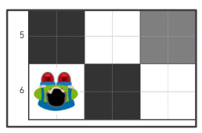
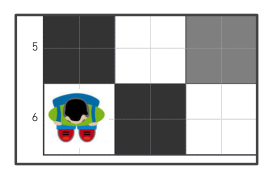
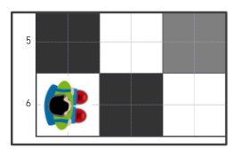

---
## Zielona misja

Przejdź do zielonego punktu zgodnie z poniższym programem:

---

Rozwiązanie: zielona misja. Widok z góry - „robot-dziecko” patrzy w górę.

---
## Fioletowa misja

Dojdź do fioletowego punktu zgodnie z poniższym programem:

---

Rozwiązanie: fioletowa misja. Widok z góry - „robot-dziecko” patrzy w dół.

---
## Niebieska misja

Dojdź do niebieskiego punktu zgodnie z poniższym programem.

---

Rozwiązanie: niebieska misja. Widok z góry - „robot-dziecko” patrzy w prawo.

