## Przewodnik prowadzenia zajęć z dziećmi od 4 lat

PrimaSTEM pomaga dzieciom krok po kroku opanować logiczne myślenie, podstawy programowania i matematykę. Ten przewodnik pomoże Ci prowadzić zajęcia z dziećmi od 4 lat.

### Jak działa urządzenie

Celem urządzenia jest zaprogramowanie ruchów małego robota-biedronki za pomocą żetonów poleceń umieszczanych na pilocie.

- Polecenie **„Naprzód”** — jazda prosto
- Polecenie **„Lewo”** — skręt w lewo
- Polecenie **„Prawo”** — skręt w prawo
- Żeton **„\[ \]” (Funkcja)** — zastępuje ciąg poleceń
- **„Powtórzenie”** — powtarza polecenie lub funkcję kilka razy

Układasz polecenia na pilocie i tworzysz w ten sposób program ruchu robota. Gdy program jest gotowy, naciśnij przycisk, a robot wykona instrukcje!

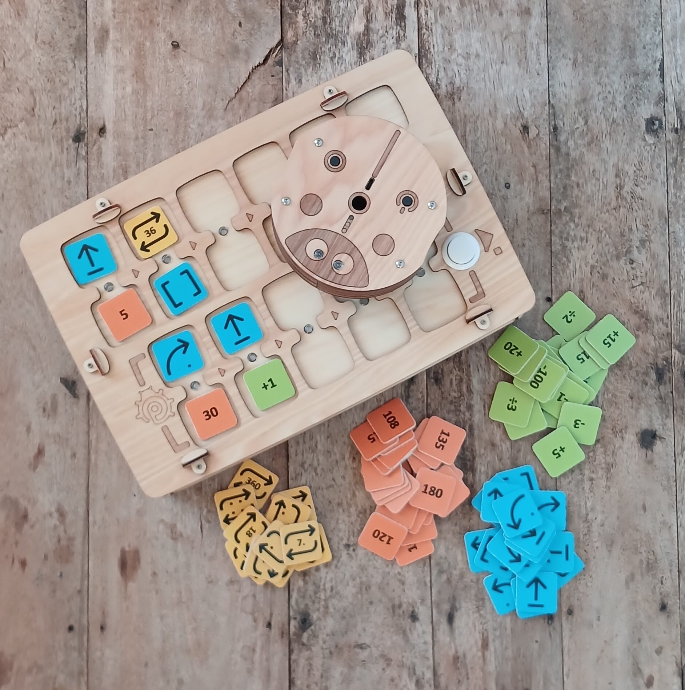

### Spis treści przewodnika

- Po co prowadzić zajęcia z robotyki i programowania?
- Wskazówki dotyczące organizacji zajęć w różnych warunkach
- Ćwiczenia i cele nauczania
- Szczegółowa instrukcja obsługi
- Opis ćwiczeń
- Załączniki
- O projekcie i autorach

### Wartość pedagogiczna

- Programowanie bez ekranu, własnymi rękami
- Zrozumienie, że maszyny działają według algorytmów
- Planowanie działań z wyprzedzeniem
- Rozwijanie logicznego myślenia
- Wprowadzenie do programowania sekwencyjnego i funkcji
- Pojęcie „buga” (błędu w kodzie) i umiejętność jego usuwania
- Wizualna nauka liczb, arytmetyki i geometrii

## Z czego składa się PrimaSTEM

### Co jest w pudełku:

- Robot-biedronka
- Pilot
- Żetony poleceń \*
- Przewodnik do ćwiczeń \*

(\*) Zawartość może się różnić w zależności od wersji zestawu

## Po co prowadzić zajęcia z programowania i matematyki?

Kod, programowanie i automatyzacja stały się częścią naszego codziennego życia.

W ostatnich latach ludzie nauczyli się tworzyć maszyny, które robią rzeczy, jakich wcześniej nie potrafiły: rozumieć, mówić, słyszeć, widzieć, odpowiadać, pisać.

Przykładów jest wiele: samochody autonomiczne, roboty-asystenci dla osób starszych, roboty dostawcze i inne.

### Po co programowanie i robotyka?

Nauka programowania to nie tylko nauka pisania kodu. Uczyć się programować znaczy uczyć się rozumieć maszyny, które nas otaczają. To umiejętność zamiany małych lub śmiałych pomysłów w prawdziwe projekty. To branie złożonych zadań i dzielenie ich na proste kroki. To wspólny wysiłek w rozwiązywaniu naszych problemów.

### Urodzeni w epoce cyfrowej

Dziś może się wydawać, że dzieci i młodzież dobrze znają technologie, bo aktywnie korzystają z cyfrowej rozrywki.

Ale co z braniem tych narzędzi do ręki, żeby tworzyć lub się wyrażać? Co się dzieje, gdy napotkają problem techniczny?

## Wskazówki dotyczące stosowania w zależności od kontekstu

Ćwiczenia powstały z myślą o różnych celach i środowiskach edukacyjnych. W przewodniku ćwiczenia są ponumerowane. Poniżej polecamy ćwiczenia dopasowane do Twoich warunków.

### Grupa docelowa

- Dzieci od 4 do 8 lat.
- Starsze grupy i oddziały przedszkolne, klasy 1 i 2 szkoły podstawowej.

### Zalecane ćwiczenia do nauki pozaszkolnej

1-2-x-4-5-6-7-8-9-10-x-x

### Zalecane ćwiczenia do nauki w szkole

x-2-3-4-5-6-7-8-9-x-11-12

### Zajęcia pozaszkolne

Do pracy z PrimaSTEM warto utworzyć grupę liczącą nie więcej niż 12 dzieci, aby każde mogło aktywnie uczestniczyć.

Zalecamy, aby jedno urządzenie przypadało na 2-3 uczniów. Sprzyja to nauce w zespole i rozwijaniu umiejętności społecznych.

### Zajęcia szkolne

Na lekcji z PrimaSTEM najlepiej utworzyć małe grupy po 4-6 dzieci z jednym nauczycielem. W tym czasie pozostali uczniowie mogą pracować nad innym zadaniem z pomocnikiem nauczyciela albo na przykład ćwiczyć rysowanie trasy robota według programu (dla uczniów klas 1-2). W obu przypadkach najlepiej prowadzić zajęcia z PrimaSTEM w sali wielofunkcyjnej, wprost na podłodze albo po odsunięciu stołów i krzeseł, żeby zrobić miejsce.

**Uwaga**: Pamiętaj, żeby wcześniej naładować akumulatory pilota i robota.

## Numery ćwiczeń i ich cele nauczania

| Ćwiczenie | Rozumienie pojęć algorytmu i programu | Podział trasy na etapy | Przewidywanie ruchu | Rozwiązywanie problemów, usuwanie błędów w programie | Praca zespołowa, współpraca |
| --- | :---: | :---: | :---: | :---: | :---: |
| 1 |   | X |   | X |   |
| 2 |   |   | X |   | X |
| 3 | X | X |   |   |   |
| 4 | X | X | X |   |   |
| 5 | X | X | X |   | X |
| 6 | X | X | X | X | X |
| 7 | X | X | X | X | X |
| 8 | X |   | X | X |   |
| 9 | X | X | X | X | X |
| 10 | X |   | X | X |   |
| 11 | X | X | X | X | X |
| 12 | X | X | X | X | X |

## Instrukcja obsługi

### Spis treści instrukcji

- Wprowadzenie do materiałów
- Programowanie funkcji
- Używane mapy
- Wyjaśnienia techniczne

## Wprowadzenie do materiałów

### Robot

Mały drewniany robot-biedronka z dwojgiem oczu.

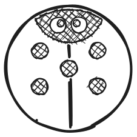

Ma trzy punkty podparcia: dwa koła i podpórkę z tyłu, dzięki którym utrzymuje równowagę.

### Podstawowe polecenia

| Polecenie | Ilustracja | Opis |
| --- | --- | --- |
| Naprzód |  | Robot jedzie o jedno pole, czyli o jeden logiczny krok (domyślnie 15 cm) |
| Lewo |  | Robot skręca o 90° w lewo |
| Prawo |  | Robot skręca o 90° w prawo |
| Wstecz |  | Robot cofa się o jedno pole, czyli o jeden logiczny krok (domyślnie) |
| Funkcja |  | Robot wykonuje ciąg poleceń umieszczonych w linii funkcji |
| Powtórzenie № |  | Robot powtarza polecenie ustawione w sparowanym polu określoną liczbę razy — № |

### Pilot

Pilot pozwala sterować robotem przez umieszczanie klocków poleceń (żetonów) w wolnych gniazdach (D).

6 górnych podwójnych gniazd (A), połączonych linią wykonania (E), tworzy główny ciąg programu. Program zaczyna się od gniazda po lewej stronie (D), a kończy nad przyciskiem START (B), który wysyła instrukcje do robota i uruchamia program.

5 dolnych gniazd (C) pozwala zaprogramować ciąg ruchów wykonywanych przez klocek „\[ \]”, czyli „funkcję”. Każde podwójne gniazdo ma swoją diodę LED (F), która zapala się po włożeniu żetonu i miga, gdy wykonywana jest bieżąca instrukcja.

#### Tworzenie ciągu poleceń

Gdy włożysz żeton do jednego z gniazd i jest on ułożony poprawnie, dioda LED zapala się na zielono. Gdy do polecenia ruchu w sparowanym gnieździe dodasz polecenie powtórzenia, dioda LED zapala się na niebiesko. Jeśli żetony są ułożone niepoprawnie (na przykład dwa żetony poleceń ruchu w jednym sparowanym gnieździe), zapala się czerwona dioda LED. W takim przypadku błędne polecenie zostanie pominięte podczas wykonywania programu.

### Akumulator i przycisk zasilania

Robot i pilot zasilane są wbudowanymi akumulatorami. Ładuje się je przez port USB-C. Przycisk zasilania (ON/OFF) znajduje się na górze robota oraz z przodu pilota, po lewej stronie.

Po włączeniu robota lub pilota rozlega się krótki sygnał dźwiękowy. Gdy pilot jest włączony, dioda LED na panelu przednim świeci na zielono. Gdy robot jest włączony, dioda LED przy złączu USB-C świeci na zielono.

### Komunikacja bezprzewodowa

Robot i pilot komunikują się przez Bluetooth, a zasięg wynosi około 5 m. System bezprzewodowy działa w tle, bez konfiguracji, po pierwszym połączeniu robota z pilotem.

> Pilot można skonfigurować do pracy z innym robotem (parowanie urządzeń).
>
> 1. Włącz robota, który nie jest sparowany z pilotem.
> 2. Włącz pilot.
> 3. Przytrzymaj przycisk START na pilocie przez 10 sekund, aż rozlegnie się sygnał dźwiękowy i świetlny.

### Tworzenie i wykonywanie programu

Ciąg ruchów („program”) zaczyna się po lewej stronie pilota i biegnie wzdłuż wygrawerowanego ciągu strzałek „\>” — linii wykonania łączącej poziomo sparowane gniazda.

Jeśli żeton zostanie dodany po pustym gnieździe, odpowiadająca mu instrukcja zostanie wykonana po pominięciu pustego gniazda.

Jeśli ustawiony jest nieprawidłowy żeton (na przykład „Powtórzenie” bez polecenia w jednym sparowanym gnieździe) albo kombinacja żetonów ruchu w sparowanym gnieździe (na przykład dwa żetony poleceń w jednym sparowanym gnieździe), dioda LED zapali się na czerwono, a taka część programu zostanie pominięta podczas wykonywania.

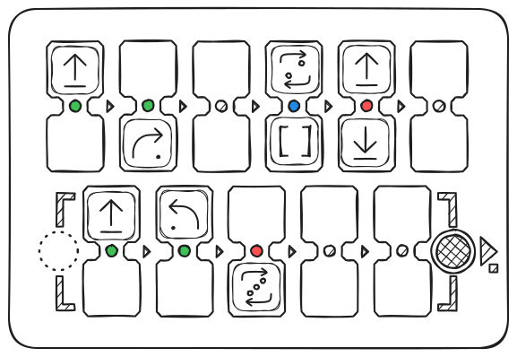

Gdy ciąg jest ustawiony, naciśnij przycisk „START”, aby uruchomić program.

Gdy robot wykonuje instrukcje, diody LED na pilocie gasną kolejno. Podczas wykonywania polecenia miga odpowiadająca mu dioda LED.

## Programowanie funkcji

### Tworzenie funkcji

Klocek „\[ \]”, zwany też klockiem „Funkcja”, służy do zastępowania ciągu poleceń.

Klocek „Funkcja” pozwala wykonywać bardziej złożone ciągi ruchów i przechodzić do trudniejszych zadań. Aby utworzyć funkcję, włóż ciąg ruchów do przeznaczonego na to pola, czyli do 5 podwójnych gniazd na dole pilota. Ten ciąg jest wykonywany od lewej do prawej za każdym razem, gdy w głównym ciągu (górnym) pojawi się klocek „Funkcja”.

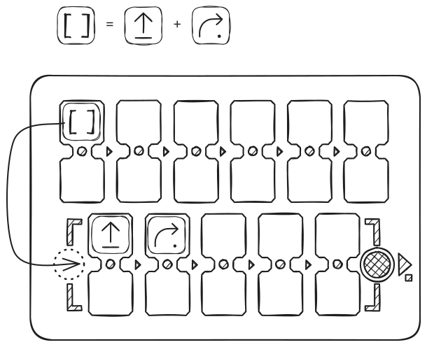

W poniższym przykładzie klocek „Funkcja” zastępuje jazdę prosto, a potem skręt w prawo. Program główny wywołuje „Funkcję” 2 razy, a następnie powtarza „Funkcję” jeszcze 2 razy za pomocą żetonu „Powtórzenie 2”.

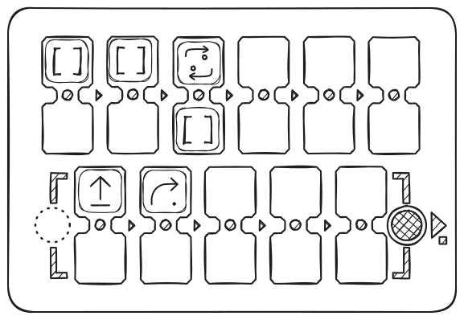

Wynik ruchu:

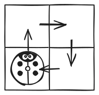

## Używane mapy

### Mapy

Na pierwszych lekcjach, czyli przy nauce algorytmów, programowania i liczb, robot musi poruszać się po mapie z siatką. Zalecamy mapy z polami 15 cm, bo tyle robot pokonuje w jednym kroku domyślnie.

Możesz używać dowolnych map przeznaczonych dla dowolnych robotów, z dowolną wielkością pola (odpowiednią dla robota).

> Domyślną długość kroku można zmienić z 15 cm na inną, dopasowaną do Twojej mapy: 10 cm, 12,5 cm lub 20 cm. W tym celu użyj specjalnego polecenia konfiguracyjnego „Krok” \+ liczba w mm (dla 10 cm wpisz 100, dla 12,5 cm — 125, dla 20 cm — 200).

Jeśli nie masz mapy, zrób ją własnymi rękami: wystarczy taśma malarska i płaski stół lub podłoga, arkusz brystolu (gruba tkanina bannerowa) i marker.

Mapy w szachownicę albo puste mapy z polami służą do ćwiczenia przechodzenia z jednego punktu do drugiego bez rozpraszania kolorami.

Do opowiadania krótkich historii o ruchach robota możesz użyć kolorowej mapy. Na przykład: „Biedronka wychodzi z domu i idzie przez las w góry”. Możesz zaproponować klasie stworzenie nowej mapy, żeby opowiadać nowe historie o podróżach biedronki.

#### Przykłady map:

Mapa w szachownicę

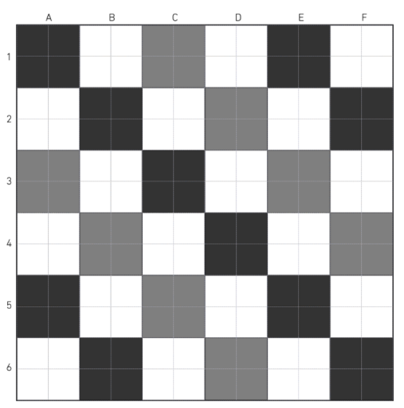

Mapa kolorowa

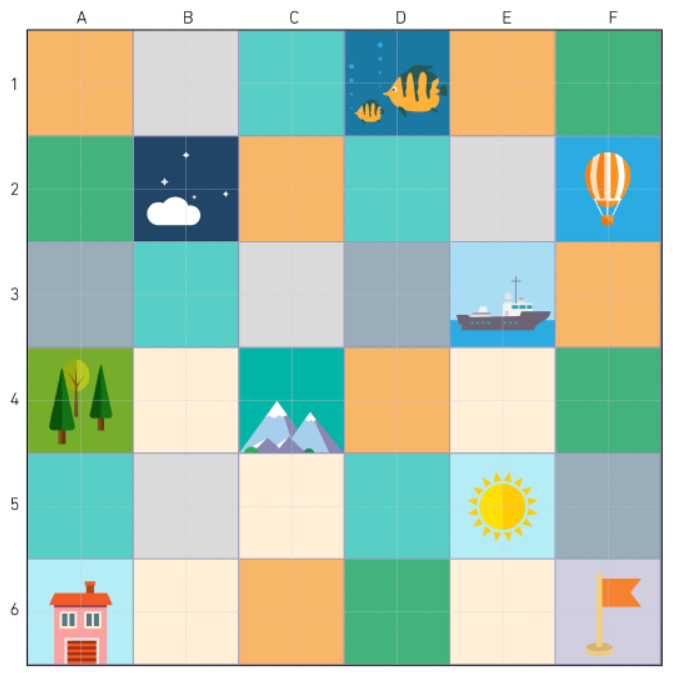

## Wyjaśnienia techniczne

### Z technicznego punktu widzenia

Pilot i robot używają mikrokontrolerów do sterowania, zasilane są akumulatorami Li-Ion i łączą się kanałem radiowym przez standardowy protokół komunikacji — Bluetooth.

Płytka drukowana robota odpowiada za całe jego zachowanie: steruje dwoma silnikami prądu stałego 5 V i dwiema wielokolorowymi diodami LED, odtwarza dźwięki, komunikuje się z pilotem i tak dalej.

Płytka drukowana pilota rozpoznaje żetony włożone do gniazd, odtwarza dźwięki i steruje 11 wielokolorowymi diodami LED przypisanymi do poszczególnych sparowanych gniazd.

Gdy żeton zostaje włożony do jednego z gniazd pilota, jest rozpoznawany dzięki naklejce z chipem NFC. Każdy żeton zawiera kod odpowiadający poleceniu sterującemu.

Gdy żetony zostaną rozpoznane na pilocie i uruchomisz program, polecenia są wysyłane do robota drogą bezprzewodową w celu wykonania.

### Możesz tworzyć własne żetony poleceń!

Dodatkowe żetony poleceń (na przykład „Powtórzenie 12” albo dodatkowe żetony ruchu) możesz wykonać z „pustych” żetonów z naklejkami NFC, używając telefonu z NFC. Obsługiwana jest większość typów 13,56 MHz.

Instrukcje wideo znajdziesz na naszym kanale YouTube — [https://www.youtube.com/@primastem](https://www.youtube.com/@primastem)

---

## Ćwiczenia

### Szczegółowy opis ćwiczeń

- **Ćwiczenie 1** — Przejście po szachownicy z punktu A do punktu B
- **Ćwiczenie 2** — Wprowadzenie do PrimaSTEM
- **Ćwiczenie 3** — Zrozumienie pojęć orientacji i algorytmu przez wcielenie się w robota
- **Ćwiczenie 4** — Przewidywanie ruchów robota na podstawie ciągu ruchów
- **Ćwiczenie 5** — Zrozumienie, jak działają ciągi instrukcji w losowym programie
- **Ćwiczenie 6** — Użycie pilota i poleceń ruchu, aby zaprowadzić robota w góry
- **Ćwiczenie 7** — Wprowadzenie do polecenia „funkcja”
- **Ćwiczenie 8** — Użycie funkcji do wyznaczenia trasy do celu
- **Ćwiczenie 9** — Usuwanie błędu w programie
- **Ćwiczenie 10** — Myślenie o usuwaniu błędów w ciągach z 1 błędem na papierze
- **Ćwiczenia 11 i 12** — Przewidywanie ruchów robota (z klockiem „funkcja”)

---

## Ćwiczenie 1: Przejście po szachownicy z punktu A do punktu B

- **indywidualnie**
- **15 min**
- **na papierze**
- **dokumenty do wydruku**

### Cel

> Zaplanuj ruch po polach z punktu A do punktu B na mapie.

Ćwiczenie trwa 10 minut wraz z omówieniem.

### Do wydruku

Do tego ćwiczenia wydrukuj po jednej kopii dla każdego ucznia arkusza „[Załącznik 1 — Poruszanie się po mapie](attachment-1)”.

### ĆWICZENIE

Dzieci mają narysować na siatce drogę, którą mysz musi przejść, żeby dotrzeć do sera. Możesz zacząć od lewego ćwiczenia, które jest prostsze, a potem przejść do prawego.

#### Poruszanie się po polach

Mysz porusza się po polach siatki (uwaga: nie można iść po przekątnej). Tu trzeba zrozumieć, że droga myszy jest podzielona na etapy: mysz przechodzi o jedno pole naraz. Mówi się, że idzie krok po kroku.

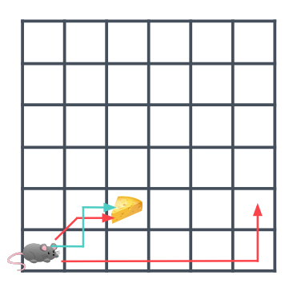

W powyższym przykładzie poprawna jest tylko niebieska droga. Krótka czerwona droga jest błędna, bo zawiera przekątną. Długa czerwona droga jest błędna, bo nie prowadzi do wskazanego punktu.

### Rozmowa w grupie...

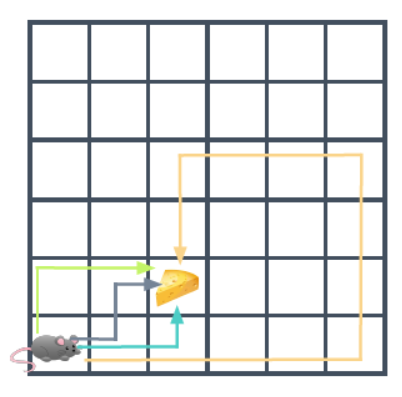

Na przykład w powyższym przykładzie wszystkie narysowane drogi są poprawne, bo każda pozwala myszy dojść do sera.

Pokaż dzieciom, że nie każdy wymyśla tę samą drogę, ale poprawnych dróg może być kilka.

#### Niektóre drogi są dłuższe od innych

Jeśli policzysz, ile pól mysz musi przejść, żeby dotrzeć do pola z serem, otrzymasz:

- 3 pola dla zielonej trasy
- 3 pola dla szarej trasy
- 3 pola dla niebieskiej trasy
- 13 pól dla żółtej trasy

#### Najkrótsza droga

Nawet jeśli wszystkie te drogi są poprawne, mysz i tak wybierze najkrótszą.

Poproś dzieci, żeby odpowiedziały na pytanie: „Dlaczego mysz wybrała najkrótszą drogę?”

Możliwych odpowiedzi jest kilka: mysz chce oszczędzić energię, jest bardzo zmęczona i chce iść jak najmniej... Albo mysz się spieszy, jest bardzo głodna i chce jak najszybciej dotrzeć do sera.

**Uwaga dla prowadzącego:** Z robotami jest tak samo. Ze względu na wydajność zawsze będziemy wybierać najkrótszą drogę.

#### Możliwych dróg jest kilka

Po zakończeniu ćwiczenia poproś uczniów, żeby pokazali narysowaną drogę. Ponieważ zawsze istnieje kilka możliwych scenariuszy, uczniowie najpewniej zaproponują różne, ale poprawne odpowiedzi.

---

## Ćwiczenie 2: Wprowadzenie do PrimaSTEM

- **15 min**
- **w grupie**
- **pokaz**
- **praktyka**

### Cele

> Zrozumieć możliwości ruchu robota Dowiedzieć się, że pilot steruje robotem Zrozumieć żetony poleceń

Do tego ćwiczenia utwórz małe grupy uczniów. Usiądźcie przy niskim stole albo na podłodze. Wyjmij mapę z siatką, pilot, robota i żetony. Przedstaw PrimaSTEM wszystkim uczniom i grupom po kolei.

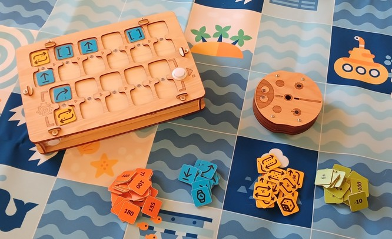

### Prezentacja

Pokaż każdy element na stole i wprowadź słownictwo, którego dzieci będą potrzebować.

Najpierw **mapa**: jest jak siatka, z którą pracowały w ćwiczeniu 1, tylko większa.

Potem **robot-biedronka**: umie jeździć.

Steruje się nim **pilotem**, zależnie od żetonów, które włożymy do gniazd.

**Żetony** to instrukcje: pozwalają kazać robotowi jechać naprzód, skręcić w lewo albo w prawo.

### 1. etap: pokaz

Gdy wyjaśnisz słownictwo, sam wykonaj czynność i pokaż dzieciom, co się dzieje po włożeniu żetonu do pilota.

| Obraz | Opis |
| --- | --- |
|  | Żeton polecenia **„Naprzód”** sprawia, że robot jedzie o jedno pole |

Postaw robota na jednym z pól mapy. Włóż żeton do pierwszego gniazda programu, jak na poniższym schemacie, a potem naciśnij biały przycisk — START.

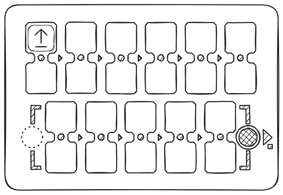

Robot pojedzie o jedno pole naprzód.

### 2. etap: oddaj sterowanie

| Obraz | Opis |
| --- | --- |
|  | Żeton ze strzałką skręcającą łukiem wokół środka to **„Lewo”**. Robot skręca w lewo, przeciwnie do ruchu wskazówek zegara. Domyślny kąt skrętu to 90 stopni. |

Wyjmij żeton „Naprzód” z pilota i podaj żeton „Lewo”. Tym razem możesz pozwolić dziecku włożyć żeton do pierwszego gniazda programu, a potem nacisnąć biały przycisk — START. Robot zostanie w miejscu i obróci się o ćwierć obrotu w lewo.

| Obraz | Opis |
| --- | --- |
|  | Żeton **„Prawo”** sprawia, że robot skręca w prawo. |

Poproś inne dziecko, żeby wyjęło żeton „Lewo” z pilota, włożyło na jego miejsce żeton „Prawo”, a potem nacisnęło biały przycisk — START. Robot zostanie w miejscu i obróci się o ćwierć obrotu w prawo.

Potem pozwól dzieciom działać po kolei, dając im tylko 3 żetony: **„Naprzód”**, **„Lewo”** i **„Prawo”**.

Mogą powtórzyć wykonanie stworzonego programu, naciskając ponownie przycisk START po zakończeniu ruchu robota.

Niech same się przekonają, że żetony można układać w dowolnych miejscach (poza dwoma poleceniami w jednym podwójnym gnieździe) i że są wykonywane kolejno, od lewej do prawej.

> Program można zatrzymać, naciskając ponownie przycisk START/STOP, gdy robot jedzie.

---

## Ćwiczenie 3: Zrozumienie pojęć orientacji i algorytmu przez wcielenie się w robota

- **45 min**
- **W grupie**
- **Gra**
- **Mapa**

### Cele

> Uwzględnić orientację robota na początku programu Przewidywać ruchy robota w zależności od programu

### Do wydruku

Do tego ćwiczenia wydrukuj po jednej kopii dla każdego ucznia kart „[Załącznik 2 — Karty zadań](attachment-2)”.

### Zasada gry

Gra fabularna na otwartej przestrzeni, w której dzieci przedstawiają robota na czarno-białym polu.

### Zasady gry

Jeden uczeń gra robota na mapie (albo na podłodze ze wzorem w kwadraty: wzorem, płytkami lub cienką taśmą malarską przyklejoną do podłogi), a pozostali uczniowie programują go za pomocą kart zadań.

Nie podajemy, w którą stronę patrzy dziecko-robot. Ustal, w którą stronę robot musi być zwrócony, żeby wykonać zadanie.

1. „Dziecko-robot” stoi na czerwonym polu 1 i ma dojść do zielonego pola 2.
2. „Dziecko-robot” stoi na czerwonym polu 1 i ma dojść do fioletowego pola 3.
3. „Dziecko-robot” stoi na czerwonym polu 1 i ma dojść do niebieskiego pola 4.

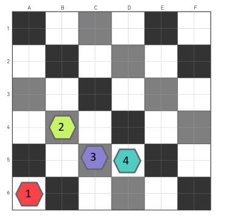

> Aby materiał mapy służył dłużej, poproś dziecko o zdjęcie butów.

### Koniec gry

Dziecko już rozumie, że programując ruch, trzeba brać pod uwagę położenie i orientację robota.

Robot reaguje na polecenie ruchu zależnie od tego, jak jest obrócony, zorientowany. Musi albo jechać prosto, albo skręcić w lewo, albo skręcić w prawo, **ALE ruszy zależnie od swojej początkowej orientacji.**

---

## Ćwiczenie 4: Przewidywanie ruchów robota na podstawie ciągu ruchów

- **45 min**
- **indywidualnie**
- **na papierze**
- **dokumenty do wydruku**

### Cele

> Uwzględnić początkową orientację robota Zrozumieć instrukcje programu Przewidywać ruchy robota w zależności od programu

### Do wydruku

Do tego ćwiczenia wydrukuj po jednej kopii dla każdego ucznia kart „[Załącznik 3 — Narysuj drogę dla podanego ciągu](attachment-3)”.

Dzieci dostają arkusz z programem złożonym z ciągu instrukcji. Mają narysować drogę, którą robot przejdzie dla tego ciągu ruchów.

W tym programie robot pojedzie trzy razy prosto:

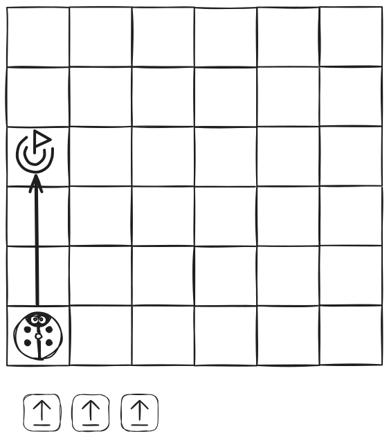

Oto ten sam program, robot też pojedzie trzy razy prosto. Tym razem jednak na początku nie jest zwrócony tak samo: patrzy w prawo. Dlatego pojedzie trzy razy w prawo:

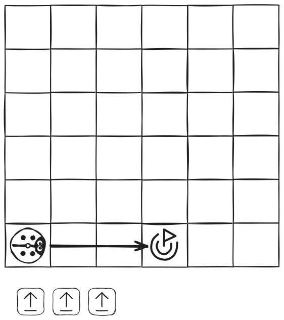

W tym programie wprowadzamy obrót robota. Tym razem robot zaczyna od skrętu w prawo, a potem jedzie o dwa pola:

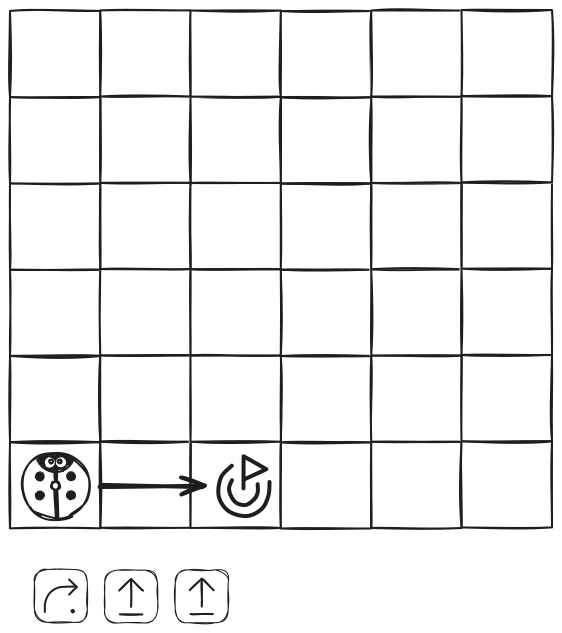

I wreszcie trudniejsze ćwiczenie z dwiema zmianami kierunku robota. Robot zaczyna od jazdy o jedno pole prosto, potem skręca w prawo, jedzie o jedno pole, następnie skręca w lewo i jedzie o dwa pola:

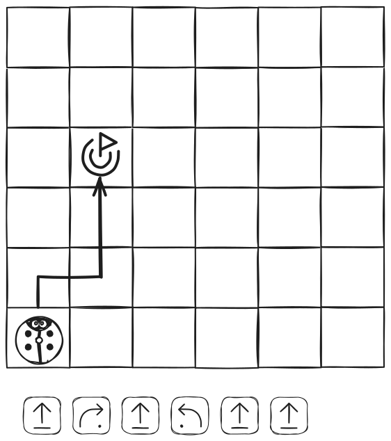

### Uwaga dla prowadzącego

To ćwiczenie na papierze może być trudne. Jeśli niektórym dzieciom trudno zrozumieć obroty robota i ciągi ruchów, weź zestaw do zabawy PrimaSTEM i poproś, żeby odtworzyły na pilocie programy z arkuszy. Gdy manipulujemy i obserwujemy, lepiej rozumiemy!

---

## Ćwiczenie 5: Zrozumienie, jak działają ciągi instrukcji w losowym programie

- **45 min**
- **w grupie**
- **gra**

### Cele

> Ustalić związek między instrukcjami a ruchami wykonywanymi przez robota Zobaczyć granice mapy Umieć przenieść instrukcje poleceń na „pilot”

### Przebieg gry

1. Na początek postaw robota na mapie, na dowolnym polu (zalecane jest pole na brzegu mapy), zwróconego w wybranym kierunku.
2. Rzuć kostką, żeby zacząć. Przesuń robota ręcznie i zapisz (narysuj znakiem polecenia „Naprzód” — strzałką) program ruchu na kartce albo na tablicy do rysowania. Jeśli robot wyjedzie poza mapę, rzuć kostką jeszcze raz.
3. Powtórz czynność, aby otrzymać ciąg 2 programów ruchu, i nie dopuść do wyjechania robota poza mapę, w razie potrzeby rzucając kostką ponownie.

Na końcu: na kartce powinny być 2 programy z poleceń „Naprzód”, które po kolejnym wykonaniu przesuną robota o wymaganą liczbę pól w stronę brzegu mapy.

Przykład:

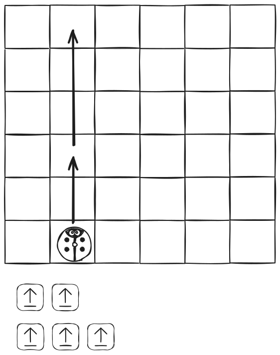

**Odtwórz zapisane programy w rzeczywistości za pomocą PrimaSTEM.**

---

## Ćwiczenie 6: Użycie pilota i poleceń ruchu, aby zaprowadzić robota w góry

- **45 min**
- **w grupie**
- **praktyka**

### Cele

> Podzielić trasę na etapy Zrealizować program z konkretnym celem

Do tego ćwiczenia potrzebne będą:

- pilot
- konkretne żetony poleceń ruchu: po 4 „Naprzód”, 4 „Lewo” i 4 „Prawo” na grupę, pozostałe żetony odłóż na bok.
- mapa i robot

Podziel dzieci na grupy po 3 lub 4 osoby i daj im pilot oraz zestaw żetonów.

### 1. etap: zastanowienie

Robot-biedronka jest w domu i chcemy go zaprowadzić w góry. Tutaj trzeba napisać na pilocie program, który pozwoli mu tam dotrzeć.

> Jeśli nie masz odpowiedniej mapy, narysuj schematycznie potrzebne miejsca docelowe na papierze, może razem z dziećmi, i przyklej je do mapy.

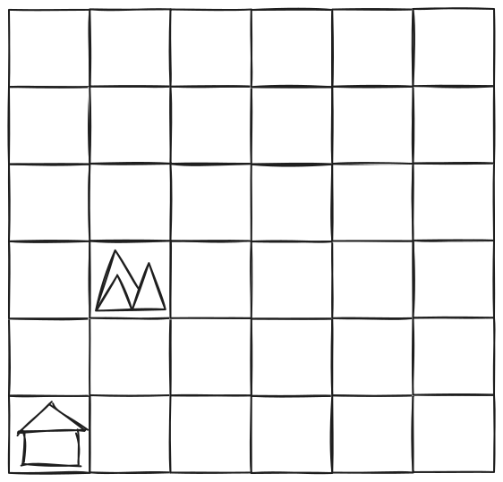

Zacznij od pytania, przez które pola dzieci chcą poprowadzić robota, żeby dotarł w góry. Znów możliwości jest wiele, a my wybieramy najkrótsze trasy, żeby oszczędzać energię i czas.

Gdy droga jest ustalona, zapytaj dzieci o ruchy, które robot będzie musiał wykonać, pole po polu.

Czy ma jechać prosto, skręcić w lewo, skręcić w prawo? Pokaż, jaki ruch robota wywoła każde polecenie, przesuwając go rękami po mapie.

### 2. etap: programowanie

Poproś dzieci, żeby za pomocą żetonów poleceń ułożyły na pilocie po kolei ruchy (program), które robot musi wykonać, żeby dotrzeć do celu.

**Oto oczekiwany wynik programu:**

### 3. etap: sprawdzenie

Jak każdy szanujący się programista, trzeba sprawdzić, czy program działa. Poproś dzieci, żeby odtworzyły swój program na pilocie i go uruchomiły.

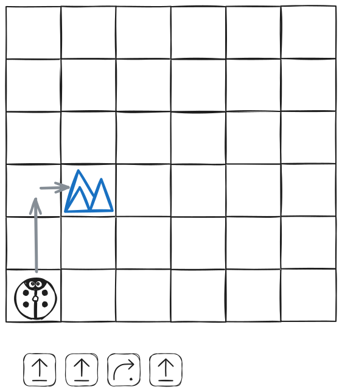

Czy robot dociera w góry? Jeśli nie, dlaczego? Pozwól dzieciom spróbować poprawić ewentualne błędy w programie.

---

## Ćwiczenie 7: Wprowadzenie do polecenia „funkcja”

- **15 min**
- **w grupie**
- **pokaz**

### Cele

> Zrozumieć, że polecenie „funkcja” może zastąpić inne instrukcje poleceń Poznać pojęcie powtarzania ciągu instrukcji

Do tego ćwiczenia utwórz małe grupy uczniów. Usiądźcie przy niskim stole albo na podłodze. Wyjmij mapę-pole, pilot, robota i żetony poleceń. Grupy uczniów po kolei poznają polecenie z klockiem „Funkcja”.

### 1. etap: pokaz

Pokaż dzieciom żeton polecenia „Funkcja”.

Służy on do zastępowania kilku poleceń ruchu: „Naprzód”, „Lewo”, „Prawo” lub „Wstecz”. Pozwala też kilka razy powtórzyć ten sam mały fragment programu.

Zacznij od pokazu. Ułóż program jak na poniższym obrazku.

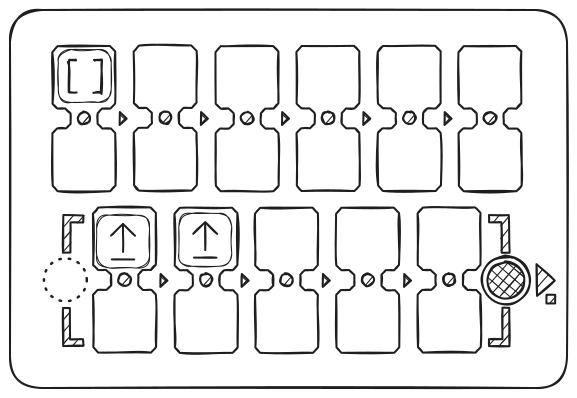

Gdy użyte jest polecenie „Funkcja”, wszystko dzieje się tak, jakbyśmy w miejsce żetonu „Funkcja” wstawili to, co znajduje się w ramce \[-----\] na dole pilota. W naszym przykładzie robot pojedzie dwa razy prosto.

### 2. etap: zagadki!

Teraz dodaj na końcu programu głównego klocek z poleceniem „Prawo”, jak na poniższym rysunku.

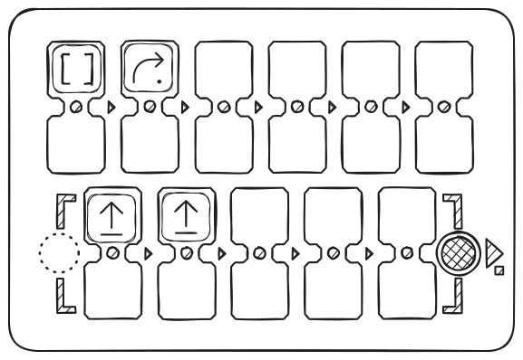

Przed uruchomieniem programu zapytaj dzieci, co się stanie. Wszystko dzieje się tak, jakby program składał się z dwóch czerwonych klocków „Naprzód”, a potem jednego klocka „Prawo”. Robot pojedzie o dwa pola i skręci w prawo (o ćwierć obrotu).

A na koniec: **pętla**! Odtwórz program z czterema klockami „Funkcja”, jak na poniższym rysunku.

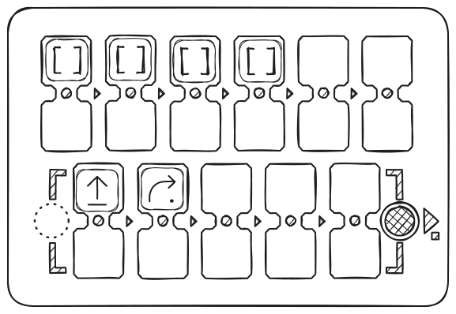

Przed uruchomieniem programu zapytaj dzieci, co się stanie, a potem uruchom program, żeby sprawdzić.

**Robot wykonuje pętlę**:

**Uwaga dla prowadzącego:** Gdy zaczynasz poznawać pojęcie klocka „funkcja”, bardzo przydatne jest patrzenie na diody LED, które migają podczas wykonywania programu. Dzięki temu możesz śledzić wykonywaną instrukcję i jednocześnie widzieć, jak porusza się robot.

---

## Ćwiczenie 8: Użycie funkcji do wyznaczenia trasy do celu

- **45 min**
- **w grupie**
- **praktyka**

### Cele

> Podzielić trasę na etapy. Zrealizować program z konkretnym celem. Użyć w programie klocka „funkcja”.

Do tego ćwiczenia potrzebne będą:

- żetony albo domowej roboty karty z rysunkami poleceń: po 4 „naprzód”, 4 „lewo”, 4 „prawo” i 4 „funkcja” na grupę.
- mapa i robot, bez pilota.

Jeśli dzieci jest dużo, podziel je na grupy po 3 lub 4 osoby i rozdaj karty z rysunkami poleceń albo żetony z zestawu (dokładnie 4\+4\+4\+4).

### 1. etap: zastanowienie

> Dostosuj zadanie, jeśli masz mapę z innymi obrazkami albo bez nich — trzeba oznaczyć 2 punkty (Start i Meta) w odległości 4 pól pod kątem 90 stopni.

Robot jest przy fladze i chcemy go zaprowadzić do pola nocy, przedstawionego jako chmury. Trzeba napisać program (ułożyć na stole algorytm z żetonów albo rysunków poleceń) z użyciem klocka „Funkcja”.

Zacznij od pytania, przez które pola dzieci chcą poprowadzić robota, żeby dotarł w góry (pole mniej więcej w połowie drogi). Możliwości jest wiele, a tym razem wybieramy trasy, w których ciągi instrukcji się powtarzają, żeby użyć polecenia „Funkcja”.

Gdy droga jest ustalona, zapytaj dzieci o ruchy, które robot będzie musiał wykonać, pole po polu, i zasymuluj wykonanie programu, przesuwając robota rękami.

### 2. etap: „nie działa! Ale jeśli...”

Poproś, żeby ułożyły na stole z kart (żetonów) po kolei ruchy, które ma wykonać robot.

Pilnuj liczby żetonów poleceń przydzielonych każdej grupie: 4 „naprzód”, 4 „lewo”, 4 „prawo” i 4 „funkcja”.

No i proszę! Nie mamy dość żetonów, żeby napisać program! Brakuje poleceń „Naprzód”! To cyfrowa panika! :)

Przypomnij, do czego przydaje się polecenie „Funkcja”: tym poleceniem można zastąpić kilka innych żetonów poleceń.

Na przykład można zastąpić kilka poleceń „Naprzód”, żeby robot pojechał naprzód kilka razy.

Pomóż dzieciom stworzyć program z klockiem „Funkcja”, jak na obrazku poniżej.

Przykładowa trasa i jej program:

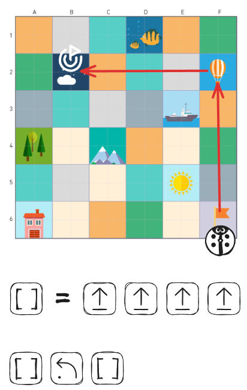

### 3. etap: sprawdzenie

Pomóż dzieciom odtworzyć program na pilocie w celu sprawdzenia, jak na obrazku:

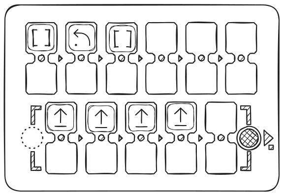

Czy robot dociera do pola „Noc”? Jeśli nie, dlaczego? Pozwól dzieciom spróbować poprawić ewentualne błędy w programie.

---

## Ćwiczenie 9: Usuwanie błędu w programie

- **20 min**
- **w grupie**
- **praktyka**

### Cele

> Znaleźć błąd w programie, obserwując jego wykonanie. Poprawić błąd w programie.

Do tego ćwiczenia utwórz małe grupy uczniów. Usiądźcie przy niskim stole albo na podłodze. Przygotuj pole z siatką, pilot, robota i żetony. Poproś grupy uczniów, żeby po kolei usuwały błąd w programie.

Chcemy, żeby robot dotarł w góry (szara droga).

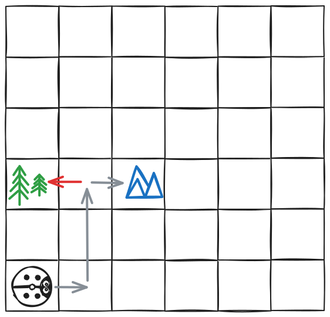

Pokaż dzieciom na pilocie ciąg ruchów, który zawiera błąd:

Z tym programem robot wjeżdża do lasu. Testując program, dzieci powinny spróbować znaleźć błąd i go poprawić.

Przykład poprawnego, poprawionego programu:

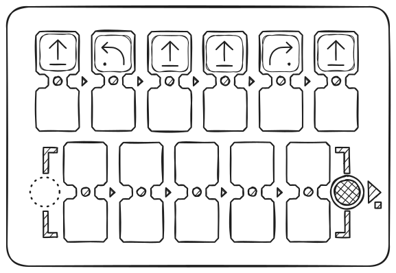

---

## Ćwiczenie 10: Myślenie o usuwaniu błędu w ciągu na papierze

- **20 min**
- **indywidualnie**
- **na papierze**
- **dokumenty do wydruku**

### Cele

> Przewidywać ruchy robota, żeby znaleźć błąd w programie. Zrozumieć, jak poprawić błąd w programie.

Dzieci dostają arkusz z programem złożonym z ciągu instrukcji prowadzących z punktu A do punktu B. Program zawiera błąd, dzieci mają go znaleźć i spróbować poprawić.

### Do wydruku

Do tego ćwiczenia wydrukuj po jednej kopii dla każdego ucznia kart „[Załącznik 4 — Znajdź i popraw błąd w programie](attachment-4)”.

### 1. etap: przeczytanie programu

Zacznij od prośby, żeby dzieci narysowały ruch robota według tego programu. Drogę, którą robot ma przejść, i oczekiwany punkt dojścia narysowano na siatce na niebiesko.

### 2. etap: wskazanie błędu

Gdy droga jest narysowana, widzimy, że robot nie idzie do mety (czarnej)! Dociera do czerwonej flagi. Zapytaj dzieci, w którym miejscu robot się pomylił. Trzeba tu znaleźć pole, które zawiera błąd, zakreślone na czerwono w poprawce.

Są 3 rodzaje błędów:

- pomyliliśmy polecenie
- zapomnieliśmy o poleceniu
- dodaliśmy zbędne polecenie

### 3. etap: poprawienie błędu

I na koniec poproś dzieci, żeby poprawiły błąd, pisząc program prowadzący do czarnej flagi.

**Uwaga:** To ćwiczenie na papierze może być trudne. Jeśli niektórym dzieciom trudno zobaczyć, gdzie są błędy, weź PrimaSTEM i poproś, żeby odtworzyły programy z arkuszy i uruchomiły program. Możesz na przykład poprosić, żeby powiedziały „O nie!”, gdy robot popełni błąd po drodze, i w ten sposób zaznaczyły błąd.

#### Przykład 1

W tym przykładzie pomyliliśmy instrukcję na końcu.

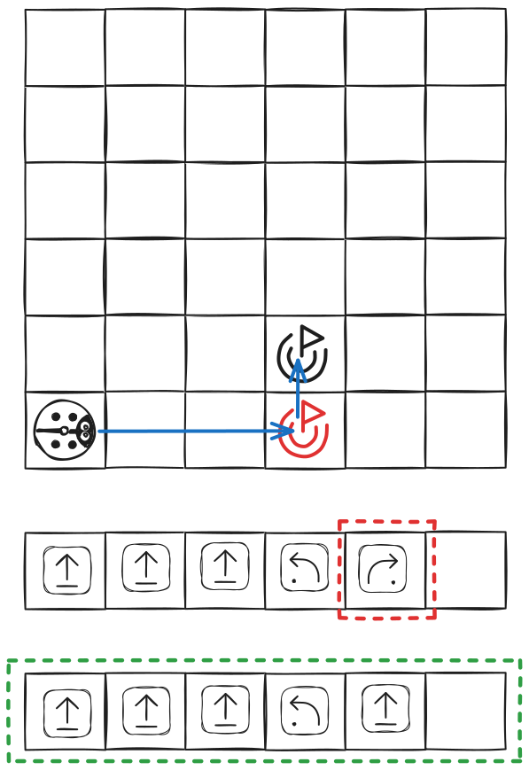

#### Przykład 2

W tym przykładzie dodaliśmy zbędną instrukcję na początku.

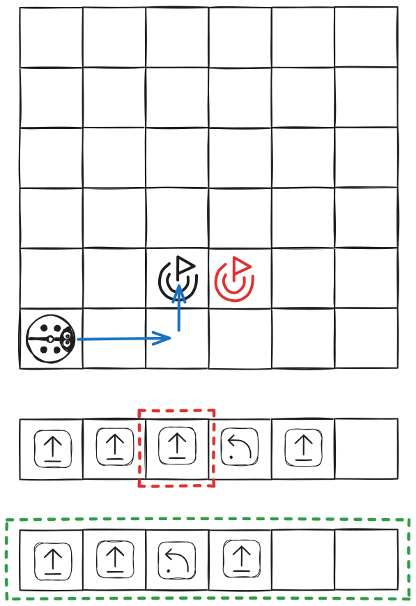

#### Przykład 3

W tym przykładzie zapomnieliśmy o instrukcji na początku.

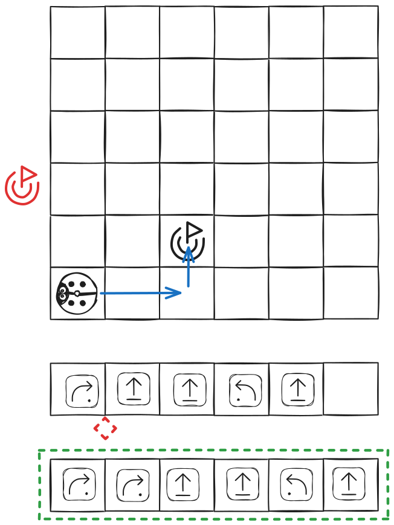

---

## Ćwiczenie 11: Przewidywanie ruchów PrimaSTEM

- **45 min**
- **w grupie**
- **praktyka**

### Cele

> Przewidywać ruchy robota, patrząc na program bez „funkcji”

Do tego ćwiczenia weź zestaw do zabawy PrimaSTEM bez poleceń „Funkcja”. Wszystkie dzieci mogą uczestniczyć w grze jednocześnie, ale tylko jedno dziecko naraz manipuluje.

### 1. Cisza, programujemy...

Dzieci po kolei stawiają robota w rogu mapy, a potem układają na pilocie program z najwyżej 5 instrukcji.

Gdy program jest gotowy, poproś dzieci, żeby poczekały z naciśnięciem przycisku.

### 2. Zakładajcie się!

Poproś pozostałe dzieci, żeby zgadły, czy robot wyjedzie poza mapę.

### 3. Sprawdzenie

Gdy zakłady są zawarte, uruchamiamy program, żeby sprawdzić, co się stanie. Potem stawiamy robota z powrotem w rogu i kolejne dziecko zaczyna swój program.

---

## Ćwiczenie 12

### Cele

> Przewidywać ruchy robota, patrząc na program z „funkcją”

Powtórz ćwiczenie 11, dodając do zestawu polecenia „funkcja”.

Tym razem dodaj klocki „Funkcja”, żeby włączyć programowanie funkcji. Wszystkie dzieci mogą uczestniczyć w grze jednocześnie, ale tylko jedno dziecko naraz manipuluje.

---

## O projekcie, autorzy

### Kim jesteśmy?

PrimaSTEM to firma, która stworzyła i produkuje oryginalne urządzenie o tej samej nazwie do nauki programowania i matematyki bez ekranu dla dzieci od 4 lat. Mieścimy się na południu Francji.

Stworzone materiały mają otwarte źródła i służą rozwijaniu kreatywności dzieci oraz dorosłych, którzy im towarzyszą.

Aby dowiedzieć się więcej o urządzeniu PrimaSTEM, odwiedź serwis z dokumentacją dostępny w 11 językach: [https://docs.primastem.com](https://docs.primastem.com)

### Masz pytania? Napisz do nas!

Śmiało się z nami skontaktuj: [info@primastem.com](mailto:info@primastem.com)

Nasza strona z informacjami i linkami do mediów społecznościowych: [https://primastem.com](https://primastem.com)

### Autorzy

**Adaptacja, tekst, ilustracje:** Andrei Chanov, 2026.

**Autorki koncepcji**: Julie Borgeot / Dorie Bruyas z Fréquence écoles

#### Licencja tego przewodnika

Ta praca jest udostępniana na licencji CC BY-SA 4.0. Aby zobaczyć kopię tej licencji, odwiedź [https://creativecommons.org/licenses/by-sa/4.0/](https://creativecommons.org/licenses/by-sa/4.0/)

**Creative Commons Uznanie autorstwa, na tych samych warunkach 4.0 Międzynarodowe**

Licencja wymaga, aby osoby korzystające z utworu podawały jego twórcę. Pozwala rozpowszechniać, remiksować, adaptować i rozwijać materiał w dowolnym medium i formacie, także w celach komercyjnych. Jeśli inni remiksują, adaptują lub rozwijają materiał, muszą udostępnić zmodyfikowany materiał na identycznych warunkach.

---

## Załączniki

## Załącznik 1 — Poruszanie się po mapie

Link do załącznika — [Załącznik 1 — Poruszanie się po mapie](attachment-1)

## Załącznik 2 — Karty zadań

Link do załącznika — [Załącznik 2 — Karty zadań](attachment-2)

## Załącznik 3 — Narysuj drogę dla podanego ciągu

Link do załącznika — [Załącznik 3 — Narysuj drogę dla podanego ciągu](attachment-3)

## Załącznik 4 — Znajdź i popraw błąd w programie

Link do załącznika — [Załącznik 4 — Znajdź i popraw błąd w programie](attachment-4)
