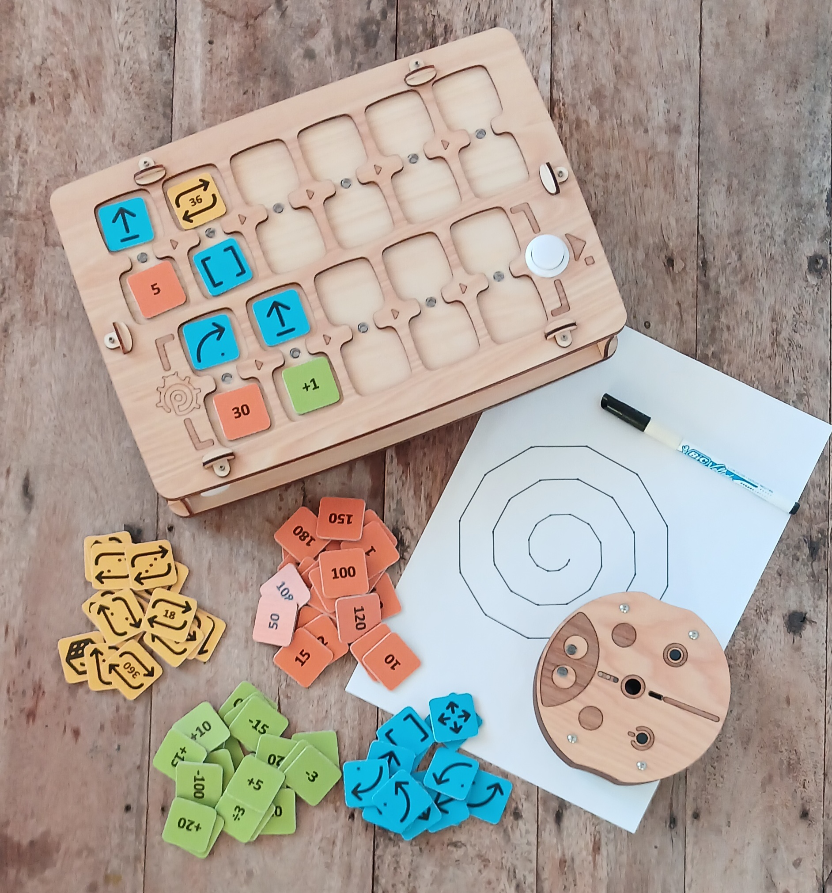
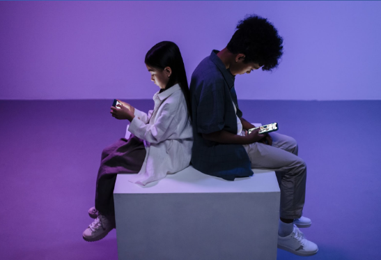
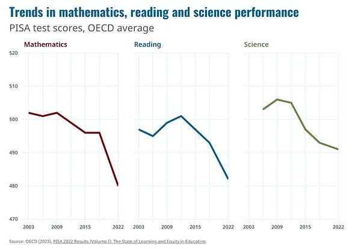
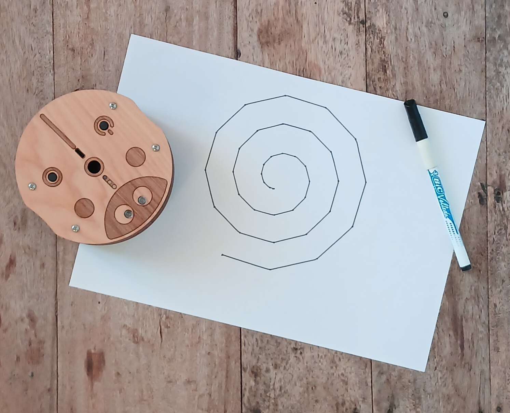

_Pilot, żetony programowania, robot i wyniki wykonania kodu._

## Dlaczego to ważne

**Współczesne dzieci** od najmłodszych lat interesują się grami wideo i urządzeniami elektronicznymi i szybko się nimi posługują.

Rodzice rozumieją, że technologie informacyjne są ważne dla rozwoju dziecka, a jednocześnie starają się utrzymać równowagę między nauką a zdrowiem dzieci.

Badania pokazują, że wczesny i częsty kontakt z ekranami może obniżać zdolności poznawcze i wyniki w nauce.

[_Źródło: Programme for International Student Assessment (PISA), wyniki 2022 (tom I)_](https://www.oecd-ilibrary.org/education/pisa-2022-results-volume-i_53f23881-en)

Korzystanie z ekranów przez małe dzieci często prowadzi do:

- problemów psychologicznych,
- uzależnienia od gier,
- pogorszenia wzroku i zdrowia fizycznego.

## Cele i zadania

To **narzędzie** edukacyjne pomaga dzieciom od 4 lat uczyć się programowania, logiki i matematyki **bez ekranów**.

Z PrimaSTEM dzieci opanowują:

- liczby,
- orientację w przestrzeni,
- algorytmy,
- myślenie logiczne,
- podstawy programowania,
- działania arytmetyczne i ciągi,
- pojęcia geometryczne.

**Zalety:**

- wszechstronne zastosowanie,
- angażująca, wizualna forma,
- nauka bez ekranów,
- dla dzieci w wieku przedszkolnym i wczesnoszkolnym,
- naturalne materiały.

> 🎯 **Główny cel** — rozwijanie umiejętności poznawczych przez namacalne i wizualne zrozumienie podstaw programowania oraz sensu wyników działania programu.

## Jak to działa?

1. Włącz robota i pilota.
2. Za pomocą żetonów poleceń ułóż program ruchu, wkładając je do gniazd pilota.
3. Naciśnij przycisk „Wykonaj”, a robot wykona program.

---

**Prezentacja wideo:** [youtu.be/Ztq\_I1WBiVo](https://youtu.be/Ztq_I1WBiVo)

  <iframe
    src="https://www.youtube.com/embed/Ztq_I1WBiVo?si=a54tevy8tUEQMOva"
    style={{
position: 'absolute',
top: 0,
left: 0,
width: '100%',
height: '100%',
}}
    frameBorder="0"
    allow="accelerometer; autoplay; clipboard-write; encrypted-media; gyroscope; picture-in-picture"
    allowFullScreen
  />

> 📺  Więcej filmów z instrukcjami i przykładami znajdziesz na naszym kanale [YouTube PrimaSTEM](https://www.youtube.com/@primastem)

## Dla kogo?

PrimaSTEM jest przeznaczony dla dzieci i wygląda jak gra, ale to elastyczne narzędzie dla nauczycieli i rodziców. Można go używać do nauki różnych przedmiotów — matematyki, programowania, fizyki, historii, geografii. Granicą są tylko wyobraźnia i umiejętności nauczyciela lub rodziców.

Dziecko zdobywa podstawy matematyczne i algorytmiczne. To bardzo dobre przygotowanie do szkoły i do pierwszego kontaktu z językami programowania (Scratch, Logo czy Minecraft).

_Przykładowy wynik: spirala narysowana przez dynamiczną zmianę zmiennej w pętli._