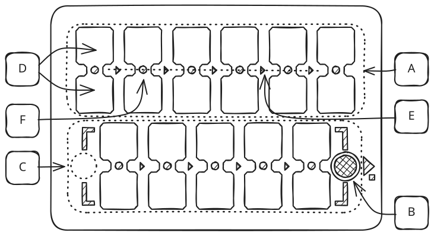
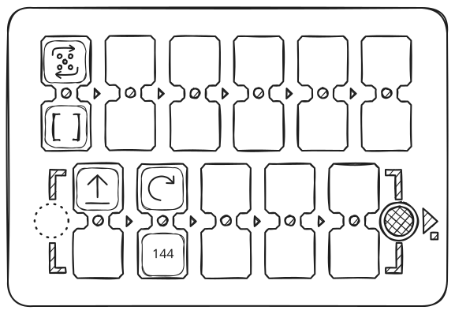
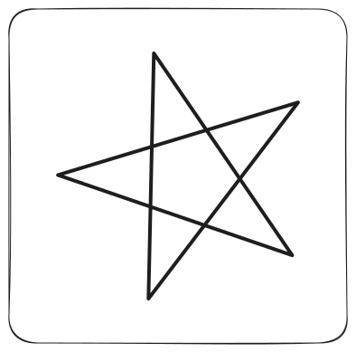
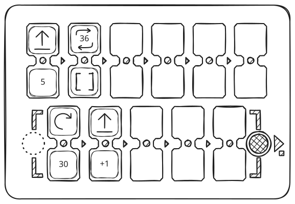
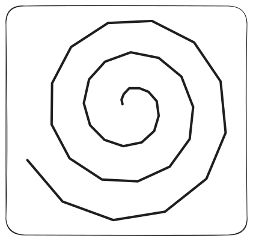

PrimaSTEM to zestaw edukacyjny bez ekranu do nauki programowania, logiki i matematyki, dla dzieci w wieku 4–10+ lat. Ta strona w skrócie wyjaśnia, **jak działa urządzenie**.

<Note>
**Nie masz jeszcze urządzenia? Wypróbuj je w przeglądarce.** Otwórz **[symulator internetowy](https://simulator.primastem.com)** — działającą kopię pilota i robota. Wkładaj żetony, naciśnij **▶ Start** i patrz, jak robot jedzie, gdy czytasz ten przewodnik.
</Note>

## 1. Co jest w pudełku

<CardGroup cols={3}>
  <Card title="Robot" icon="bug">
    Drewniany robot-biedronka na dwóch kołach. Na górze miejsce na pisak. Głośnik, USB-C, Bluetooth.
  </Card>
  <Card title="Pilot" icon="grid-3x3">
    Panel z parami gniazd na program. Wielokolorowe wskaźniki, przycisk ▶ Start/Stop, głośnik, USB-C, Bluetooth.
  </Card>
  <Card title="Żetony kodu" icon="square-stack">
    Kartonowe kafelki z naklejkami NFC — każdy to jedno polecenie w programie robota.
  </Card>
</CardGroup>

## 2. Włączanie

<Steps>
  <Step title="Włącz robota, potem pilota" icon="power">
    Każde urządzenie odtwarza krótki dźwięk; zielony wskaźnik zasilania oznacza, że jest włączone.
  </Step>
  <Step title="Połączone = biały" icon="check">
    Wolne gniazda na pilocie świecą na **biało**, oczy robota mrugają na **biało**. Możesz zaczynać.
  </Step>
  <Step title="Niebieski i błękitny = brak połączenia" icon="bluetooth">
    Robot miga na niebiesko, pilot świeci na błękitno. Jeśli połączenie się nie pojawi, przytrzymaj **▶ Start** na pilocie **dłużej niż 10 sekund**. W 5. sekundzie usłyszysz sygnał, trzymaj dalej: urządzenia się sparują, a robot uruchomi się ponownie.
  </Step>
</Steps>

**Zacznij od tego:** włóż żeton **Naprzód** do gniazda 1 (do dowolnego pola pary). Naciśnij **▶ Start**. Robot przejedzie 15 cm do przodu i się zatrzyma. *To jest program — jedno polecenie.*

## 3. Jak działa program

Pilot ma **dwa rzędy gniazd połączonych w pary**. Wkładaj żetony do pól, które świecą na biało — to jest twój program. Naciśnij **▶ Start** — robot go wykona.

<Frame caption="Układ pilota — oznaczenia A–F opisujemy niżej">
  
</Frame>

| Oznaczenie | Co to jest |
| :---: | --- |
| **A** | **Program główny** — 6 par gniazd, wykonywane od lewej → do prawej |
| **B** | **▶ Start / Stop** — naciśnij, aby uruchomić; naciśnij ponownie w trakcie programu, aby zatrzymać |
| **C** | **Funkcja** — 5 par gniazd, wywoływane żetonem Funkcja |
| **D** | Jedno **pole** pary |
| **E** | **Linia wykonania** łącząca sparowane pola |
| **F** | **Wielokolorowy wskaźnik LED** przy każdym polu |

**Para to dwa logicznie połączone pola.** Kolejność góra/dół nie ma znaczenia — polecenie włóż do dowolnego pola pary, a żeton powtórzenia, liczby lub działania do drugiego. Jeśli drugie pole jest puste, używane są wartości domyślne: krok 15 cm i obrót 90° — to wystarcza małym dzieciom.

Kolory LED podczas wykonywania:

| ⚪ Biały | 🟢 Zielony | 🔵 Niebieski | 🔴 Czerwony |
| :---: | :---: | :---: | :---: |
| Bezczynność (gniazdo wolne) | Polecenie ustawione | Polecenie + liczba / powtórzenie / działanie | Błąd (patrz niżej) |

Puste gniazda i czerwone pary są pomijane przy układaniu programu. LED miga przy polu, które jest właśnie wykonywane.

Jeśli pole mignie na czerwono w trakcie pracy, działanie nie ma wyniku: robot wykona krok z poprzednią liczbą. Jeśli wszystkie pola mrugną na czerwono dwa razy, robot na coś wpadł i utknął. Zatrzyma się sam, a program pójdzie dalej.

## 4. Żetony — według grup

| Grupa | Co robią żetony |
| --- | --- |
| **Ruch** | Naprzód · Wstecz · Lewo · Prawo |
| **Powtórzenie** | Dwie strzałki w pętli + w środku kropki 2–6 (jak na kostce, dla małych dzieci) lub cyfry. W parze z poleceniem powtarza je. |
| **Liczby** | `1`–`999`. Ustawiają odległość ruchu w mm lub kąt obrotu w stopniach. |
| **Działania** | `+N` `−N` `×N` `÷N` `√` `^N` — jeden żeton na działanie + liczbę. Zmienia zapamiętaną wartość ruchu lub obrotu. Wynik ujemny odwraca kierunek! Liczy do 5000 w obie strony, dzieli bez ułamków (150 ÷ 4 = 37). Jeśli wyniku nie ma (ponad 5000, dzielenie przez 0, pierwiastek z liczby ujemnej, silnia ponad 6), pole mignie na czerwono, a liczba się nie zmieni. |
| **Funkcja** | Wywołuje dolny rząd jako podprogram. Z żetonem powtórzenia wykonuje go tyle razy. |
| **Krok** | Żeton serwisowy + liczba = zmienia domyślną długość kroku (np. liczba 100, w milimetrach, dla siatki 10 cm). Zapisuje się po wyłączeniu zasilania. Liczba od 1 do 999; bez liczby krok wraca do 150 mm. Z działaniem albo zerem pole mignie na czerwono, krok się nie zmieni. |

## 5. Wartości domyślne i zapamiętana wartość

<Note>
**Naprzód = 150 mm (15 cm), obrót = 90°.** Żeton **Krok** zmienia „domyślną” odległość, a zmiana zostaje po wyłączeniu zasilania. Używaj go do map z siatką dla dowolnego robota.

W trakcie jednej sesji każde polecenie ruchu zachowuje **własną** zapamiętaną wartość:

- **liczba** w parze z poleceniem → zastępuje ostatnią zapamiętaną wartość lub wartość domyślną
- **działanie arytmetyczne** → modyfikuje ją (`+`, `−`, `×`, `÷`, `√`, `^`)
- **puste pole** w parze z poleceniem → używa ostatniej zapamiętanej wartości lub domyślnej

Zapamiętane wartości są kasowane po wyłączeniu pilota, wartość domyślna (Krok) zostaje.

**Krótka ściąga:**

- `Naprzód` bez liczby    → 150 mm (15 cm) — domyślnie
- `Naprzód` + `100`      → 100 mm — zastępuje poprzednią
- `Naprzód` + `+50`      → 150 mm  (poprzednio 100 + 50) — modyfikuje
- `Lewo` bez liczby      → 90° — domyślnie
- `Lewo` + `45`          → 45° — zastępuje poprzednią
- `Lewo` + `−10`         → 35°  (poprzednio 45° − 10°) — modyfikuje
- `Lewo` + `720`         → dwa pełne obroty
</Note>

## 6. Robot rysuje to, co zaprogramujesz

Wypróbuj te przykłady — zobaczysz, do czego zdolne jest urządzenie. Włóż pisak na środku robota — podczas jazdy **rysuje**.

<CardGroup cols={2}>
  <Card title="Gwiazda — liczby + powtórzenie">
    <Frame>
      
    </Frame>
    <Frame>
      
    </Frame>
  </Card>
  <Card title="Spirala — działania w pętli">
    <Frame>
      
    </Frame>
    <Frame>
      
    </Frame>
  </Card>
</CardGroup>

Więcej przykładów w [Przykładach rysunków](mathdrawings).

## 7. Jak uczyć z PrimaSTEM

<Tip>
**Wprowadzaj żetony poleceń po jednym, w tej kolejności:**

**Naprzód → Obroty → Powtórzenie → Funkcja → Liczby → Działania.**

Dodawaj każdy kolejny dopiero wtedy, gdy poprzedni jest pewnie opanowany. Pełny plan 12 lekcji z wiekiem, czasem trwania i materiałami dla małych dzieci jest w [Książce 1](book-1/book-1).

**Praca w grupie:** zalecamy jeden zestaw na **2–3 dzieci**.

**Mapy:** sprawdzi się każda mapa z siatką, zrobiona dla dowolnego robota edukacyjnego. Rozmiar pola ustaw żetonem **Krok** plus liczba (np. 100, 120, 150, 200 mm).

**Sposób na 10 kroków zamiast 6.** Włóż żeton **Funkcja [ ]** do ostatniego (6.) gniazda górnego rzędu i zabezpiecz go taśmą malarską. Program działa wtedy jako jeden długi łańcuch: 5 kroków u góry + 5 na dole = **10 kroków z rzędu**. Przydaje się małym dzieciom, którym potrzebny jest dłuższy program, zanim będą gotowe zrozumieć pojęcie funkcji.
</Tip>

## 8. Więcej możliwości

<CardGroup cols={2}>
  <Card title="Pisak i rysowanie" icon="pen-line">
    Włóż pisak do robota — **rysuje** swoją trasę na papierze: od prostej trajektorii po wielokąty, gwiazdy, spirale i fraktale.
  </Card>
  <Card title="Głos" icon="volume-2">
    Pilot czyta każdy żeton na głos — głosem w **dowolnym lokalnym języku**, obecnie **obsługiwanych jest 19** (w tym arabski i fiński), dodamy każdy na życzenie. Pomaga małym dzieciom i tym, które jeszcze nie czytają. Zawiera litery alfabetu i miejsca (Dom, Szkoła, Sklep, Las itp.)
  </Card>
  <Card title="Dźwiękowe naklejki NFC i mapy" icon="map">
    Naklej znaczniki NFC na mapę i zaprogramuj dowolny dostępny dźwięk z telefonu. Robot ma od spodu antenę — gdy zatrzyma się na znaczniku, odtwarza nagrany dźwięk.
  </Card>
  <Card title="Otwarta platforma NFC" icon="nfc">
    Zapisuj własne żetony — dowolny znacznik NFC 13.56 MHz (tani, sprzedawany na każdym marketplace) + kod tekstowy z naszej dokumentacji — całość zajmuje 10 sekund. Darmowa aplikacja na telefon (NFC Tools).
  </Card>
</CardGroup>

## Co czytać dalej

<CardGroup cols={2}>
  <Card title="Instrukcja obsługi" icon="book-open" href="usermanual">
    Pełne dane techniczne, parowanie, kalibracja, bezpieczeństwo.
  </Card>
  <Card title="Przewodnik dla nauczyciela" icon="book" href="teachersguide">
    Pedagogika, praca w klasie, pojęcia programowania przez zabawę.
  </Card>
  <Card title="Książka 1 — Lekcje" icon="graduation-cap" href="book-1/book-1">
    12 gotowych lekcji dla małych dzieci — z wiekiem, czasem trwania i materiałami do wydruku.
  </Card>
  <Card title="Żetony poleceń" icon="nfc" href="nfc">
    Wszystkie kody NFC — do zapisywania własnych żetonów telefonem.
  </Card>
  <Card title="Przykłady rysunków" icon="pen-line" href="mathdrawings">
    Figury geometryczne, fraktale, spirale — programy i wyniki.
  </Card>
  <Card title="Słownik audio" icon="volume-2" href="sounds_reference">
    Słowa — miejsca i pojęcia, alfabet, nuty, dźwięki systemowe. Do nagrywania własnych żetonów i odtwarzania.
  </Card>
</CardGroup>
