PrimaSTEM to pomoc edukacyjna dla dzieci w wieku 4-12 lat. Uczy programowania bez komputerów, tabletów i telefonów. Rozwija logikę, umiejętności programistyczne i matematykę.

Zajęcia z PrimaSTEM sprawiają, że programowanie staje się dla dzieci proste i namacalne. Nawet najmłodsze dzieci rozumieją i czują ten proces w rękach. Podstawy programowania, logiki i matematyki opanowują w formie zabawy.

Zabawa z PrimaSTEM rozwija kluczowe umiejętności: myślenie logiczne, algorytmikę, programowanie, matematykę, geometrię, a także kreatywność i kompetencje społeczno-emocjonalne. Zestaw PrimaSTEM to przygotowanie do pracy z blokowymi językami programowania, takimi jak [Scratch](https://en.wikipedia.org/wiki/Scratch_\(programming_language\)) czy [LOGO](https://en.wikipedia.org/wiki/Logo_\(programming_language\)).

## Poznajemy zestaw edukacyjny

### Gdzie można używać PrimaSTEM?

Zestaw sprawdza się w takich programach edukacyjnych:

- Ośrodki edukacji przedszkolnej
- Przedszkola pracujące metodą Montessori
- Szkoła podstawowa
- Edukacja domowa
- Ośrodki wspierające rozwój dzieci ze specjalnymi potrzebami
- Zajęcia pozalekcyjne
- Kluby programowania dla początkujących
- Dziecięce obozy edukacyjne

### Co trzeba wiedzieć na start?

Przed pracą z zestawem nauczyciele i rodzice powinni przeczytać [instrukcję obsługi](usermanual) i ten przewodnik. Nie potrzebujesz żadnych specjalnych umiejętności programistycznych. Materiały zawierają podstawy potrzebne do rozpoczęcia nauki.

## Badania i wartość zestawu

PrimaSTEM czerpie z języka programowania [LOGO](https://en.wikipedia.org/wiki/Logo_\(programming_language\)), który stworzył [Seymour Papert](https://en.wikipedia.org/wiki/Seymour_Papert), oraz z pedagogiki Montessori. LOGO i robot-żółw sprawiły, że programowanie stało się dla dzieci zrozumiałe i dostępne.

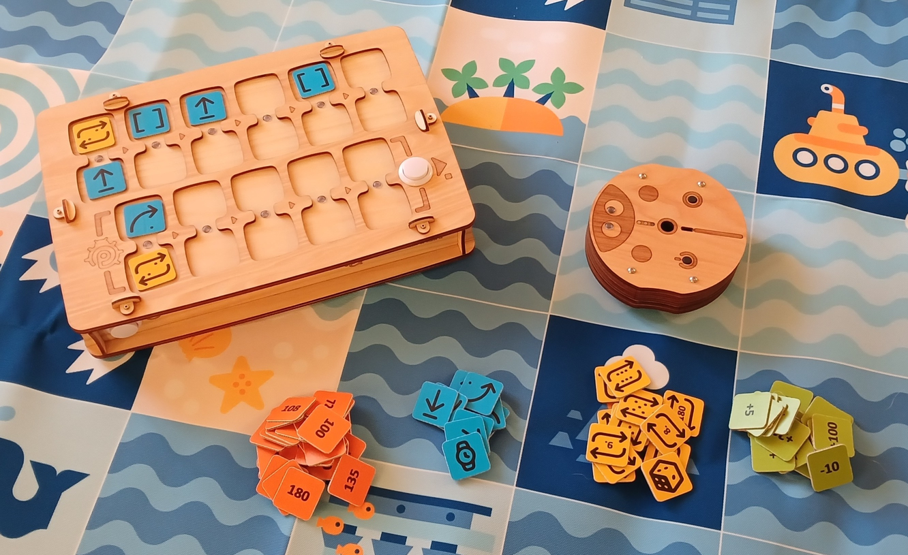

Żetony poleceń PrimaSTEM realizują to podejście. Nauka jest intuicyjna dzięki prostej obsłudze dotykowej i nie wymaga ekranów ani tekstu.

Obserwując robota, dzieci uczą się rozumieć każde polecenie i opanowują algorytmy w praktyce.

Robot ma ważną cechę: ma kierunek. Dziecko może się z nim utożsamić i łatwiej rozumie podstawową logikę działania programów.

Wszystkie polecenia są proste i czytelne: wskazują, w którym dokładnie kierunku ma ruszyć robot. Gdy dziecko uczy robota „działać” lub „myśleć”, zastanawia się nad własnymi działaniami i myślami. Dzięki temu nauka programowania jest skuteczniejsza.

Żetony PrimaSTEM to wizualne, uproszczone odwzorowanie języków programowania. Na początku nauki nie ma tekstów ani liczb, są tylko podstawowe polecenia.

### Dlaczego drewno?

🌱 Pilot i robot są zrobione z drewna. Z praktyki wynika, że dzieci wolą bawić się drewnianymi zabawkami. Są bezpieczne, trwałe i zachowują ślady indywidualnego użytkowania.

## Koncepcja programowania z PrimaSTEM

Fizyczne żetony PrimaSTEM odpowiadają instrukcjom w prawdziwych językach programowania i pokazują ważne pojęcia.

### Algorytmy

**Algorytm** to ciąg precyzyjnych poleceń (żetonów), które tworzą program.

### Kolejka

Polecenia na pilocie PrimaSTEM wykonują się ściśle od lewej do prawej. Dziecko widzi w ten sposób kolejkę wykonania.

### Poprawianie błędów (debugowanie)

Błąd łatwo naprawić: wystarczy wymienić żeton. Takie podejście uczy samodzielnego debugowania programu.

### Funkcja

Funkcja (podprogram) to zestaw poleceń w dolnej części pilota. Program główny wywołuje ją żetonem „**Funkcja**”.

## Zastosowanie w innych przedmiotach

PrimaSTEM pomaga rozwijać także inne umiejętności:

- **Komunikacja**: zabawa w grupie uczy współpracy.
- **Motoryka**: praca z żetonami poprawia koordynację.
- **Umiejętności społeczne**: dzieci uczą się pewności siebie i wspólnego rozwiązywania problemów.
- **Matematyka**: dzieci poznają podstawowe pojęcia matematyczne.
- **Logika**: dzieci uczą się układać ciągi i przewidywać wyniki.

> Układając łańcuch żetonów, dziecko opanowuje programowanie dotykiem, wzrokiem i myślą. Po naciśnięciu przycisku „Wykonaj” robot rusza, a dziecko porównuje wynik ze swoim przewidywaniem. Takie całościowe doświadczenie przyspiesza naukę.

## Poznajemy robota i pilota

### Robot

Powiedz dzieciom, że robot jest ich przyjacielem i mogą go programować. Wyjaśnij, że robot nie ma własnych myśli i wykonuje tylko ich instrukcje, jak sprzęt domowy, który trzeba włączyć.

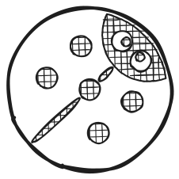

### Pilot

Wyjaśnij, że pilot przekazuje polecenia robotowi. Pokaż, jak wkładać żetony poleceń i programować robota.

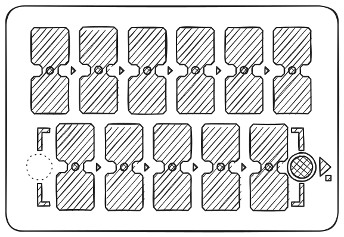

> Program główny układasz w górnym rzędzie pilota (6 pól). Dolny rząd (5 pól) jest przeznaczony na podprogram funkcji i działa razem z poleceniem „**Funkcja**”.

### Żetony poleceń

Żetony to polecenia dla robota, które wkłada się do pilota. Po naciśnięciu „Wykonaj” robot wykonuje ułożony ciąg. Każdy żeton to osobne polecenie. Uczy dzieci myślenia obliczeniowego i projektowania programów. Ważne, żeby dzieci rozumiały, co robi robot po aktywacji każdego polecenia. Dzięki temu uczą się projektować programy i przewidywać działania robota. Powiedz dzieciom, że żetonów nie wolno gubić ani niszczyć, bo bez nich robot nie ruszy.

## 1 - Pierwszy program

### Przyczyna i skutek

Głównym celem jest pokazanie dzieciom związku między poleceniem a działaniem. Niech dziecko włoży żeton „Naprzód” do pierwszego pola pilota i naciśnie „Wykonaj”. Dziecko powinno zobaczyć, że żeton odpowiada określonemu działaniu.

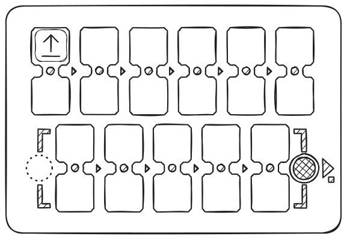

### Jednoznaczne instrukcje

Powtórz te kroki dla każdego kierunku (**naprzód**, skręt w **lewo**, skręt w **prawo**), aż dziecko będzie rozpoznawać każdy żeton.

### Pierwsze zadanie

Przygotuj planszę do gry albo narysuj siatkę 15x15 cm taśmą lub markerem. Postaw robota na polu startowym. Poproś dziecko, żeby ułożyło program, który przesunie robota o jedno pole naprzód. Jeśli dziecko wybrało zły żeton, cofnij robota i zachęć je do zastanowienia się nad nowym rozwiązaniem.

## 2 - Program i debugowanie

### Kolejka zdarzeń

Postaw cel dwa pola przed robotem.

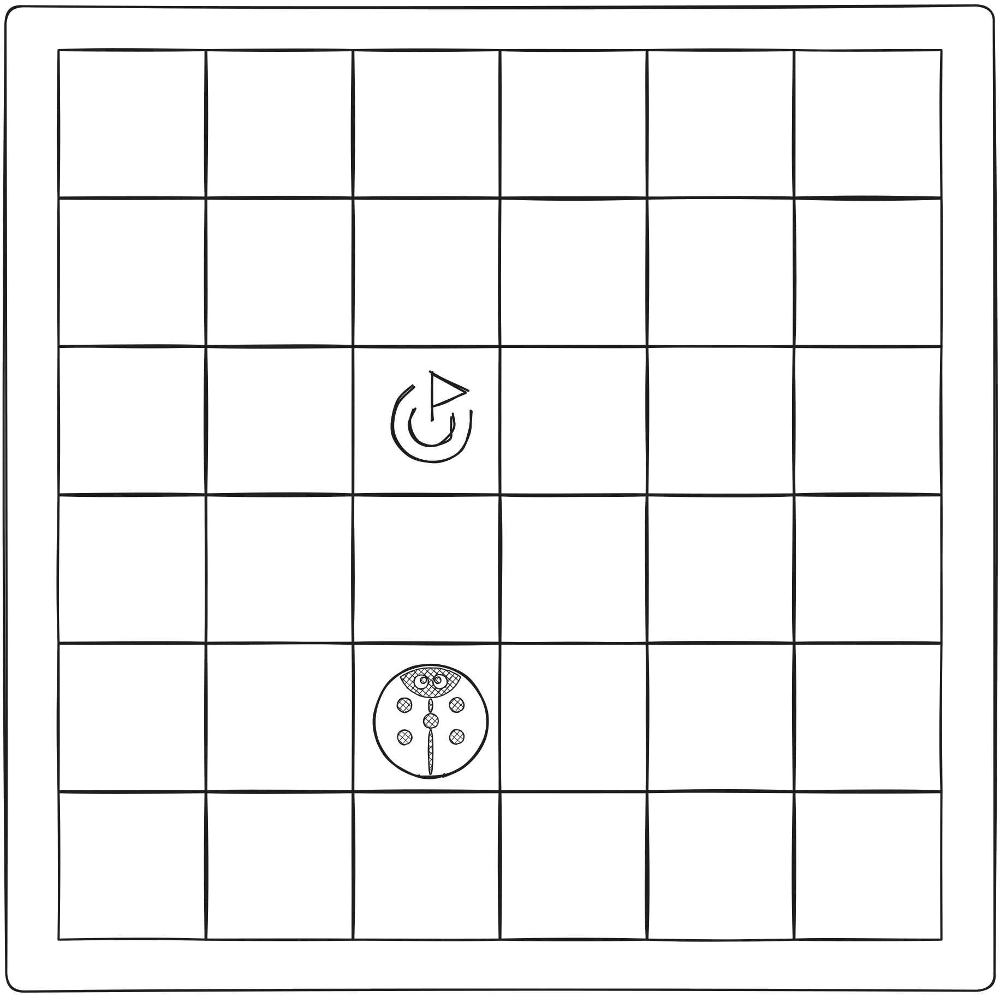

Niech dziecko ułoży program z dwóch żetonów, który doprowadzi robota do celu.

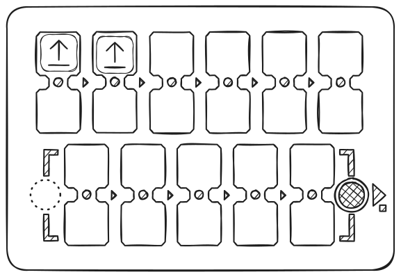

### Ciąg trzech żetonów

Tym razem cel leży jedno pole naprzód i jedno pole w prawo.

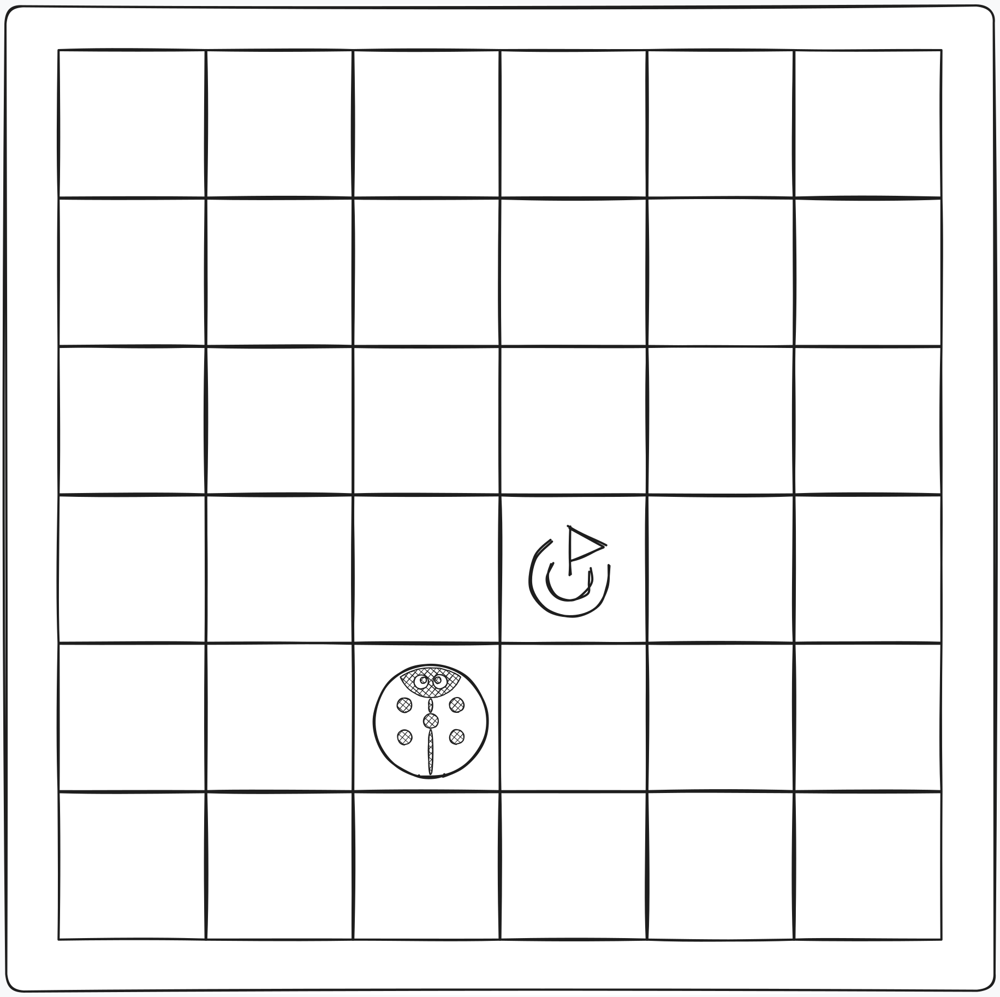

Niech dziecko samo wybierze właściwy ciąg poleceń.

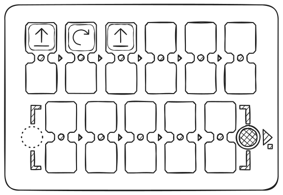

Nie przejmuj się, jeśli dziecko wybrało zły żeton. Po prostu ustaw robota z powrotem w pozycji wyjściowej i poproś dziecko, żeby uzasadniło swój wybór i spróbowało innych rozwiązań.

### Debugowanie, czyli szukanie błędu

Postaw punkt docelowy jedno pole przed robotem i jedno pole na lewo od niego.

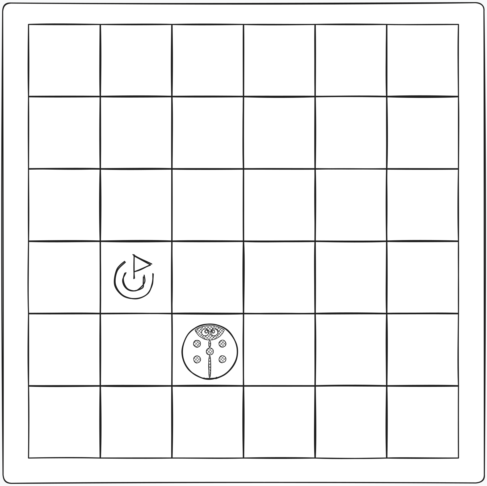

Tym razem ułóż program, który rozwiązuje zadanie, ale celowo wstaw do ciągu błędny skręt.

Poproś dziecko, żeby wskazało błędne polecenie w programie i samo przewidziało błędny wynik. Potem pozwól mu nacisnąć przycisk „**Wykonaj**”, żeby sprawdzić swoją hipotezę.

Gdy dziecko potwierdzi, że pokazany ciąg był błędny, czy to przez rozumowanie, czy przez sprawdzenie, pozwól mu zamienić błędne polecenie na właściwe. W ten sposób debuguje program.

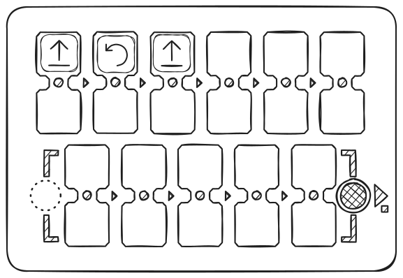

## 3 - Program z funkcją

### Polecenie „Funkcja”

Gdy dzieci opanują podstawowe polecenia, pokaż im żeton **Funkcja**. To zestaw poleceń, który można wielokrotnie wywoływać z programu głównego.

> Żeby wyjaśnić, jak to działa, możesz użyć metafory wieży (pod żetonem funkcji leżą jedno po drugim inne polecenia). Wyjaśnij, że w jednym żetonie można zmieścić więcej instrukcji.

Pokaż przykład: najpierw połóż dwa żetony „Naprzód” w górnych polach i uruchom program. Robot przejedzie dwa pola.

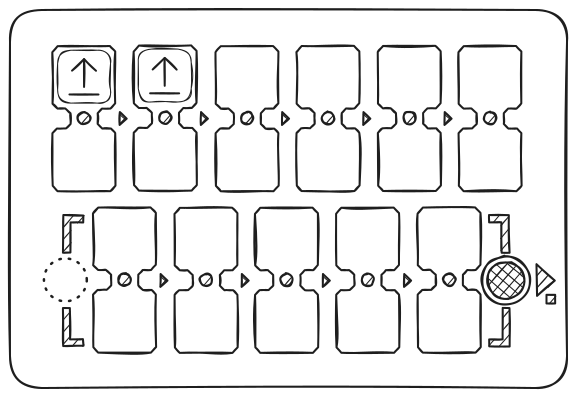

Teraz połóż te same dwa żetony „Naprzód” w funkcji (dolny rząd), a w programie głównym użyj „Funkcji”. Wynik będzie ten sam, ale część programu jest teraz ukryta w podprogramie.

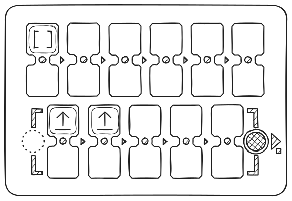

Następnie ułóż ciąg: **Naprzód - Naprzód - Prawo - Naprzód - Naprzód**.

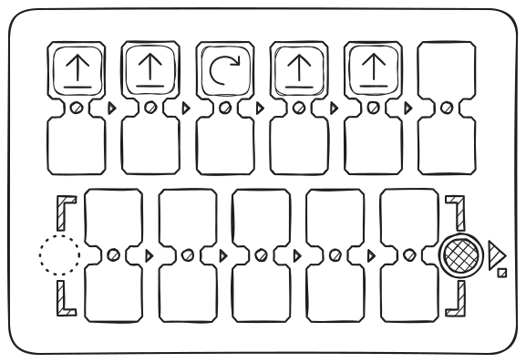

Poproś dzieci, żeby znalazły powtarzające się części i „schowały” je w funkcji. Końcowy ciąg: w części głównej **Funkcja - Prawo - Funkcja**, na dole **Naprzód - Naprzód**.

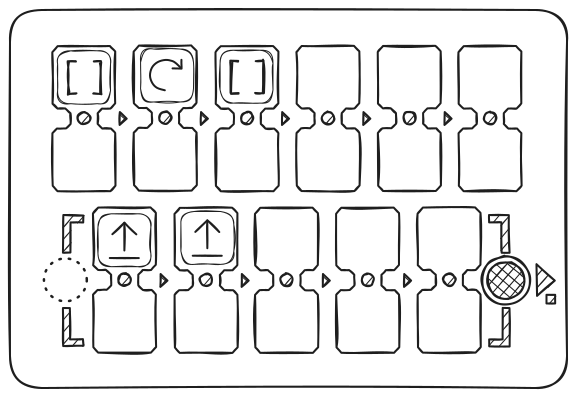

### Rozwiązywanie zadań z funkcją

Daj dziecku 3 żetony „**Naprzód**” i 2 żetony „**Funkcja**”.

Zadanie: przesunąć robota o 5 pól naprzód.

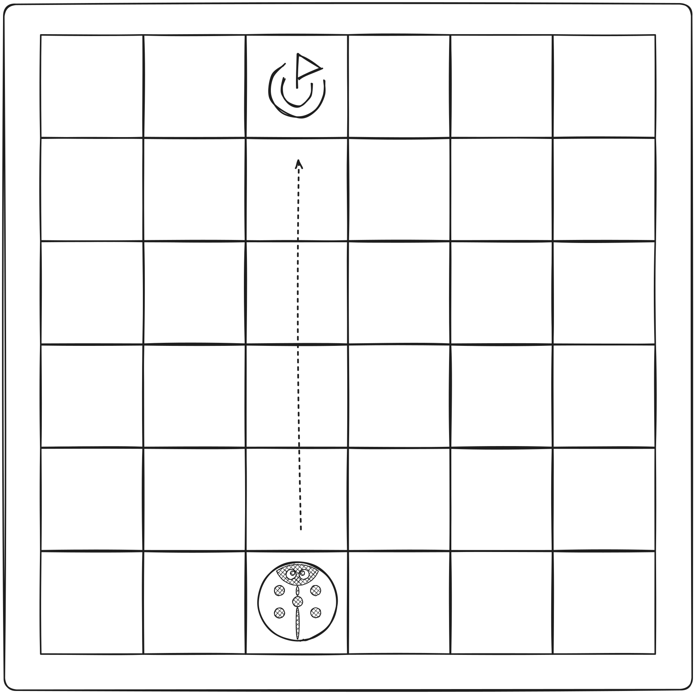

Niech dziecko samo zrozumie, że do wielokrotnych działań trzeba użyć funkcji, i rozwiąże zadanie.

Jeśli ciąg jest błędny, po prostu ustaw robota z powrotem w pozycji wyjściowej i poproś dziecko, żeby zastanowiło się nad poprawnym rozwiązaniem i wypróbowało nowe warianty.

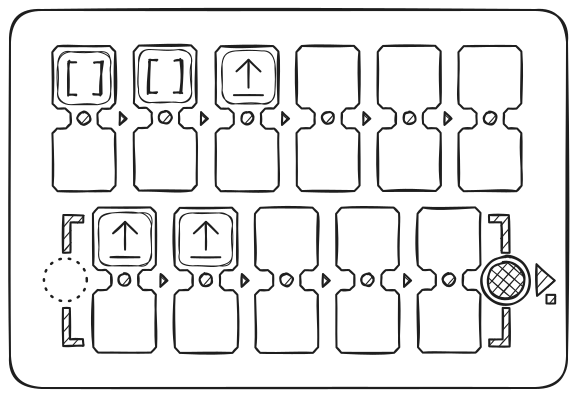

## 4 - Losowość

### Polecenie „Losowy kierunek”

Żeby wprowadzić pojęcie losowości, weź 4 żetony kierunków: „**Naprzód**”, „**Lewo**”, „**Prawo**” i „**Wstecz**”. Włóż je do nieprzezroczystego pudełka lub worka i wymieszaj. Poproś dzieci, żeby po kolei wyciągały 1 żeton bez zaglądania i pokazywały go grupie, a potem odkładały z powrotem. Na tym przykładzie wyjaśnij dzieciom, czym jest losowość z czterech możliwości.

Następnie pokaż dzieciom żeton „**Losowy ruch**”.

Wyjaśnij, że ten żeton robi prawie to samo, co dzieci robiły wcześniej, losując żetony z worka: losowo wybiera kierunek, w którym pojedzie robot, a potem przesuwa go o 1 krok logiczny, czyli o jedno pole. Robot może więc przejechać 1 pole naprzód, w prawo, w lewo albo wstecz.

Połóż żeton „**Losowy ruch**” w górnym polu i uruchom program kilka razy. Za każdym razem robot ruszy inaczej.

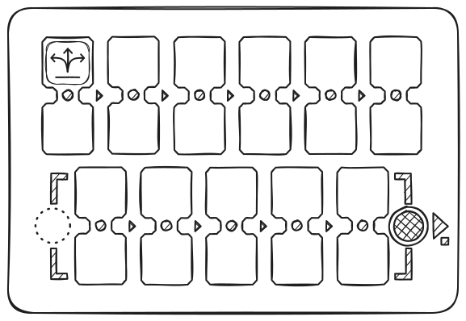

Pobaw się z dziećmi: niech zgadują, dokąd pojedzie robot, zanim wykonasz polecenie.

Podkreśl, że to jest **losowość** i nie zawsze da się trafnie odgadnąć kierunek.

Spróbuj razem z dziećmi stworzyć małą grę z żetonem „**Losowy ruch**”.

## 5 - Pętle (powtarzanie poleceń)

### Poznajemy pętle liczbowe

Pokaż dzieciom żetony wartości. Zapytaj, czy znają liczby, czy widziały kostkę do gier planszowych i czy grały w takie gry.

Połóż dwa żetony „Naprzód” w górnych polach i uruchom program. Robot przejedzie dwa pola.

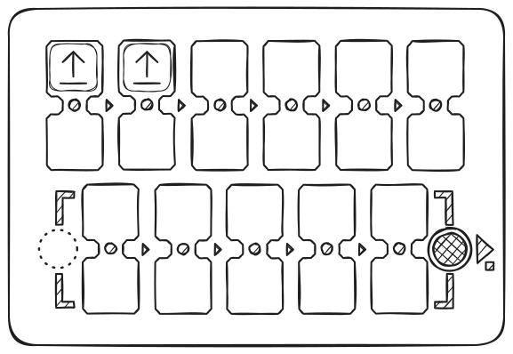

Teraz zostaw jeden „Naprzód”, a pod nim połóż żeton „pętla 2”. Wynik będzie ten sam: działanie powtórzy się dwa razy.

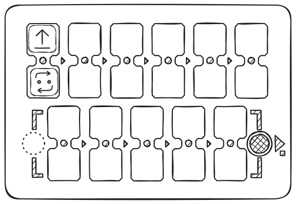

Ułóż 4 polecenia „**Naprzód**”, obejrzyj wynik, a potem poproś dzieci, żeby użyły żetonów wartości, czyli **pętli**, i powtórzyły ruch robota na 4 pola.

Możliwe są zarówno proste rozwiązania z żetonem „**Naprzód**” i pętlą o wartości 4, jak i inne warianty, na przykład „**Naprzód**” z pętlą 3 i jeszcze jedno polecenie „**Naprzód**”.

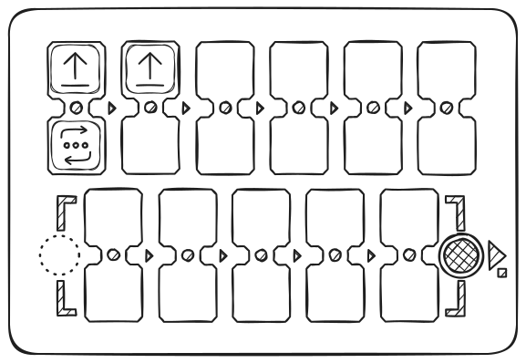

### Pętla wywołująca funkcję

Spróbuj z dziećmi zastosować pętlę z wartością do polecenia „Funkcja”. Na przykład niech robot idzie zygzakiem: użyj polecenia „Funkcja” z pętlą o wartości 5, a w dolnej części pilota ułóż ciąg funkcji z poleceniami „**Naprzód**”, „**Prawo**”, „**Naprzód**”, „**Lewo**”.

Najpierw ułóż z funkcją program ruchu „schodkami”: „naprzód”, „prawo”, „naprzód”, „lewo”, i uruchom go.

Potem dodaj do funkcji pętlę z liczbą 5. Funkcja powtórzy się kilka razy, a robot pójdzie schodkami w prawo i do góry.

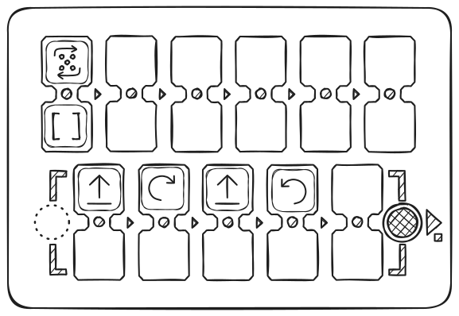

Robot pójdzie schodami po przekątnej w prawo i do góry, robiąc po drodze 5 stopni.

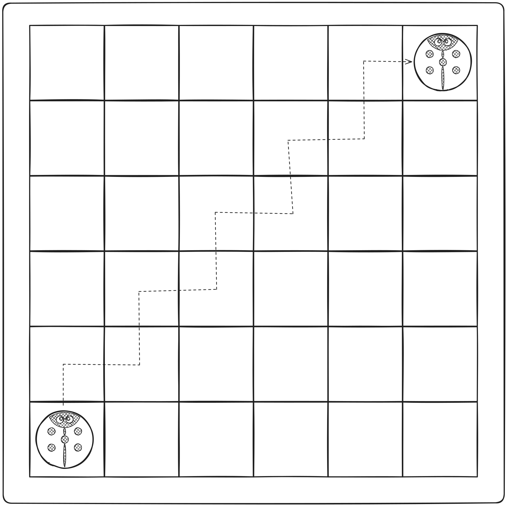

## 6 - Liczby losowe

### Pojęcie liczby losowej

Wśród żetonów jest „Powtórz losową liczbę razy (od 1 do 6)” (z obrazkiem kostki). Wybiera on losową wartość od 1 do 6. Zagrajcie w losowanie żetonów pętli z worka.

Żeby wprowadzić pojęcie liczby losowej, weź 4 żetony pętli: „**2**”, „**3**”, „**4**” i „**5**”. Włóż je do nieprzezroczystego pudełka lub worka i wymieszaj. Poproś dzieci, żeby po kolei wyciągały 1 żeton bez zaglądania, pokazywały go i nazywały wartość, a potem odkładały z powrotem. Zagrajcie: kto wylosuje wyższą wartość. Na tym przykładzie wyjaśnij dzieciom, czym jest losowość z czterech możliwości.

Następnie pokaż dzieciom żeton wartości „**Powtórz losową liczbę razy (od 1 do 6)**”. Wyjaśnij, że ten żeton robi prawie to samo, co dzieci robiły wcześniej, losując żetony wartości z worka: losowo wybiera 1 z 6 liczb (od 1 do 6), jak kostka, i przekazuje ją robotowi, żeby powtórzył działania.

Połóż żeton „**Naprzód**” w górnym polu pilota, a pod nim żeton „**Powtórz losową liczbę razy (od 1 do 6)**”. Poproś dzieci, żeby nacisnęły przycisk „**Wykonaj**”. Ustaw robota z powrotem w miejscu startu. Powtórz to zadanie kilka razy.

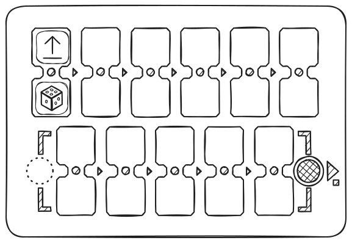

Zagrajcie: czyj robot zajedzie dalej.

Zwróć uwagę dzieci, że robot przejeżdża losową liczbę pól: od 1 do 6. Podkreśl, że to jest losowość i nie da się z góry wiedzieć, jak daleko robot dojedzie.

## 7 - Liczby: odległości i kąty

### Poznajemy liczby

Jeśli nie położysz wartości liczbowych przy poleceniach (nad poleceniem lub pod nim, w podwójnym polu), robot używa domyślnych parametrów ruchu: bez parametrów jedzie 15 cm naprzód i obraca się o 90°. Te wartości można zmienić żetonami wartości.

Przykład: dodaj wartość **200** do polecenia „**Naprzód**” i zobacz, jaką odległość pokona robot. Dodaj wartość **180** do polecenia „**obrót**” i oceń zmiany.

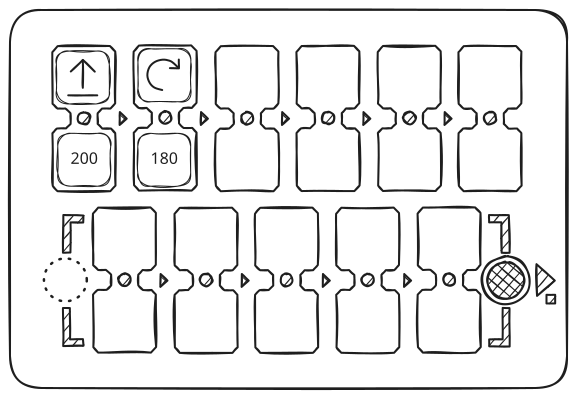

> **Ważne:** pilot zapamiętuje ostatnią wartość ustawioną dla poleceń ruchu i obrotu. Jeśli polecenie zostanie użyte bez nowej wartości, obowiązuje ostatnia zapamiętana wartość, aż do wyłączenia pilota. Ustawienie nowej wartości zmienia wartość domyślną. Wartości domyślne (150 mm = 15 cm i 90°) przywrócisz, ustawiając je jawnie albo uruchamiając pilota ponownie.

Zmiana parametrów pozwala tworzyć bardziej złożone trajektorie i scenariusze ruchu. Przykłady znajdziesz na [stronie z rysunkami matematycznymi](mathdrawings).

## 8 – Arytmetyka

### Działania arytmetyczne

Działania arytmetyczne na liczbach pozwalają dynamicznie zmieniać wartości w programie dla poleceń ruchu (Naprzód, Wstecz, Lewo, Prawo). Sterowanie robotem staje się dzięki temu bardziej elastyczne.

Gdy dodasz działanie arytmetyczne, pilot zmienia zapamiętaną liczbę dla polecenia ruchu i wysyła nową wartość do robota.

Przykład:

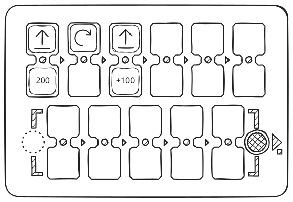

„Naprzód 200” — robot jedzie 20 cm, „Naprzód \+100” — jeszcze 30 cm. Łączna odległość: 50 cm.

Użycie takich działań w pętli pozwala tworzyć progresje.

> Jeśli wynik działania arytmetycznego jest ujemny, robot wykonuje działanie przeciwne: zamiast jechać naprzód, jedzie wstecz, a zamiast skręcać w lewo, skręca w prawo.

Dostępne działania: dodawanie (\+), odejmowanie (−), mnożenie (\*), dzielenie (/), pierwiastek kwadratowy (√), potęgowanie (^).

Przykłady wzorów znajdziesz na [stronie z rysunkami matematycznymi](mathdrawings).

---

## Bawcie się i uczcie razem z dziećmi!

Najlepiej znasz swoich uczniów. PrimaSTEM to uniwersalne narzędzie do nauki przez zabawę. Używaj go do nauki programowania, logiki i innych przedmiotów. Wszystko zależy od Twojej wyobraźni!

P.S. Dziękujemy, że korzystasz z PrimaSTEM i interesujesz się naszym zestawem! Czekamy na Twoją opinię. [Napisz do nas](contacts) o swoich doświadczeniach i wrażeniach.
