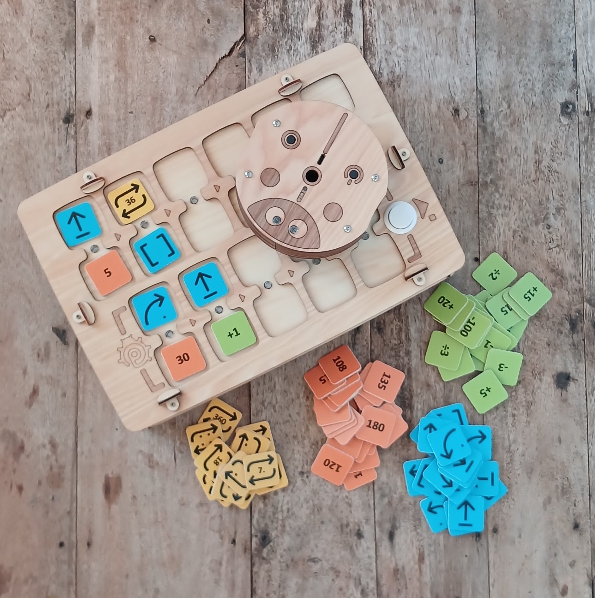
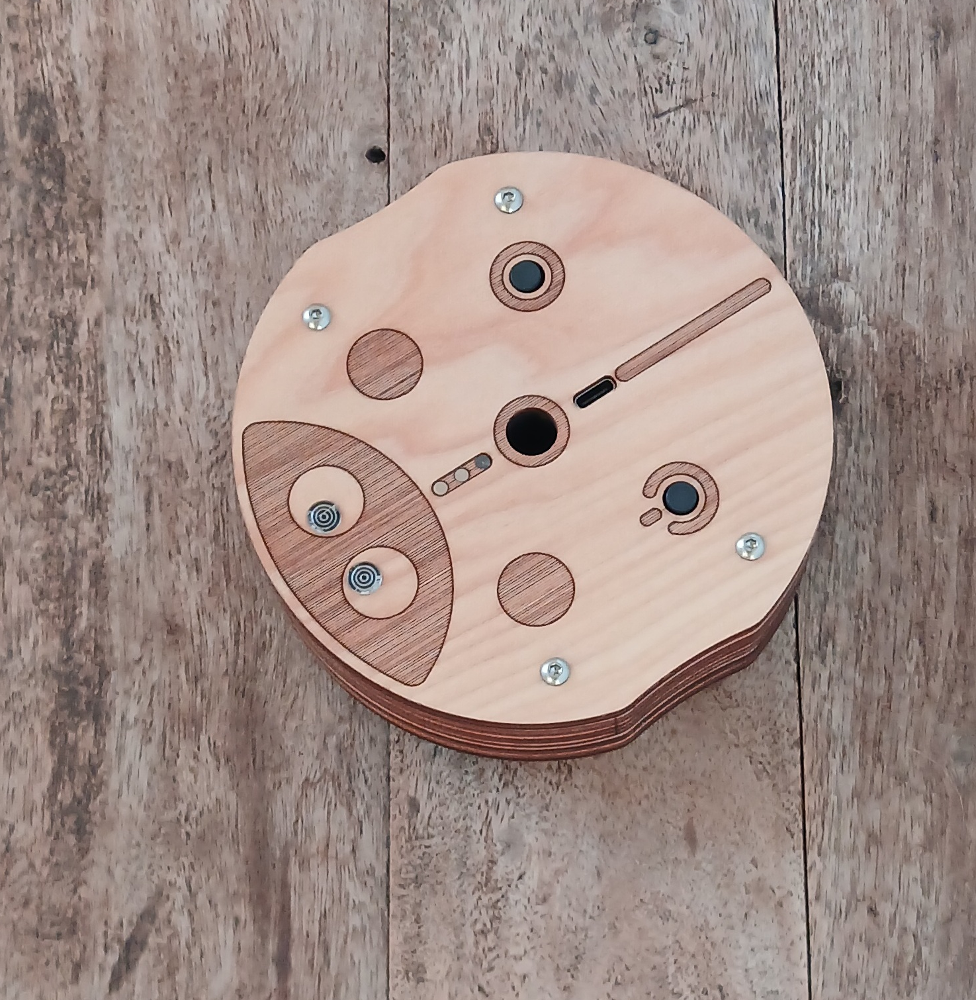
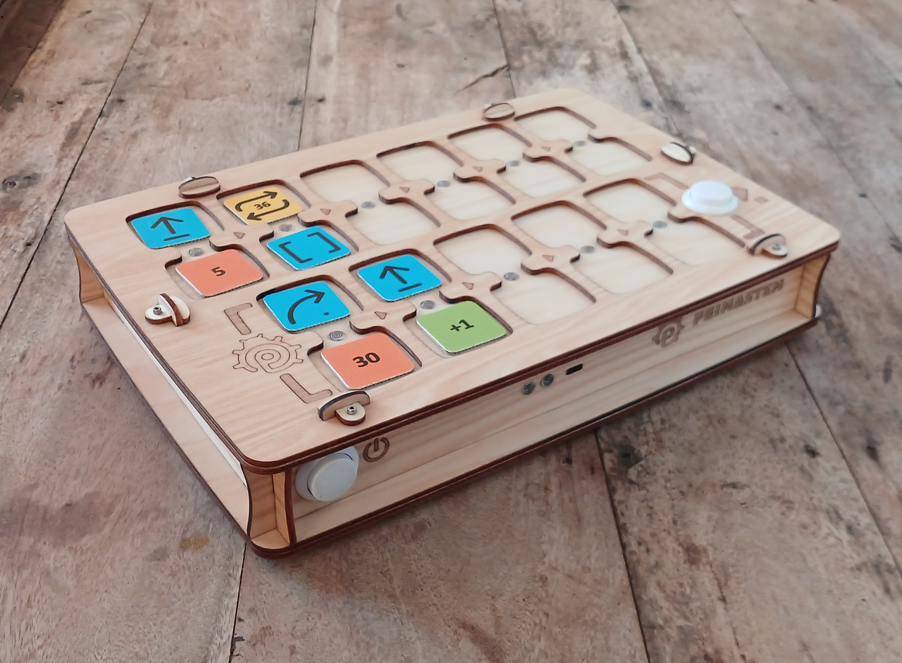
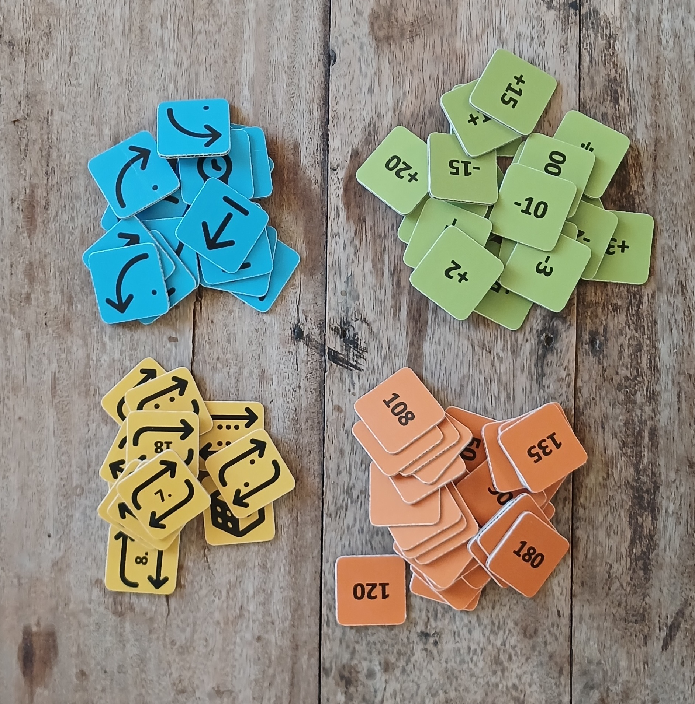
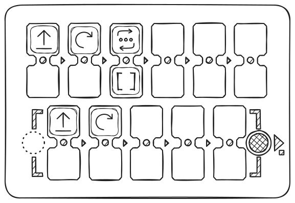

## Dane techniczne i zawartość zestawu

- Robot do zabawy
- Pilot robota
- Żetony poleceń, wartości i działań arytmetycznych do tworzenia programów

> Zawartość zestawu i wygląd mogą się nieznacznie różnić. Sprawdź je przy zakupie.

### Robot do zabawy

Wymiary: D=125 mm, H=44 mm.

Robot ma przycisk zasilania, diody LED, głośnik, przycisk funkcyjny i port USB-C do ładowania akumulatora.

Na środku robota można zamontować pisak o średnicy do 10 mm, aby podczas jazdy rysował proste kształty.

Wygląd może się nieznacznie różnić w zależności od wersji, ale podstawowe działanie pozostaje takie samo.

### Pilot

Wymiary: L=317 mm, W=217 mm, H=62 mm.

Pilot ma 11 podwójnych gniazd na żetony poleceń i wartości: 6 na program główny (górna część), 5 na podprogram (dolna część). Pilot ma dwa przyciski: po lewej — zasilanie, po prawej — „Wykonaj / Stop”, który uruchamia i zatrzymuje program.

Gdy włożysz żetony poleceń i wartości do gniazd, naciśnij „Wykonaj”: robot uruchomi program. Aktywne polecenia podświetlają diody LED między gniazdami.

Jeśli żeton jest włożony nieprawidłowo, pilot sygnalizuje to czerwoną diodą, ale program działa dalej (na przykład gdy żeton wartości leży bez polecenia).

Pilot ma port USB-C do ładowania i głośnik do odtwarzania dźwięków.

### Żetony instrukcji

Wymiary: LxW=33 mm.

W zestawie są żetony do tworzenia programów. Każdy żeton to polecenie o jasnym znaczeniu i instrukcji. Kolejność bloków określa zachowanie robota.

Żetony dzielą się na **polecenia**, **wartości** i **działania arytmetyczne**.

#### Żetony poleceń

Podstawowe bloki do układania programu sterującego:

- **Naprzód** — ruch do przodu (domyślnie 15 cm)
- **Prawo** — obrót o 90° zgodnie z ruchem wskazówek zegara
- **Lewo** — obrót o 90° przeciwnie do ruchu wskazówek zegara
- **Wstecz** — ruch do tyłu (domyślnie 15 cm)
- **Funkcja** — wykonuje podprogram z dolnej części pilota
- **Losowy ruch** — jedna z czynności ruchu robota: Naprzód, Lewo, Prawo lub Wstecz (na „kroku domyślnym”)
- **Żetony powtórzeń (pętle)** - Żetony z liczbami od 2 do 6 (według liczby kropek) i piktogramy powtórzenia z liczbą w środku. Żeton z kostką oznacza losową liczbę powtórzeń od 1 do 6.

> Żetony wartości liczbowych i działań arytmetycznych służą też do rozszerzania możliwości programowania: na przykład do powtarzania polecenia albo zmiany kąta lub odległości ruchu.

#### Żetony wartości

Żetony kąta i odległości: 30°, 36°, 45°, a także ich wielokrotności (60°, 72° itd.). Kąty podane są w stopniach, odległości w milimetrach. Domyślnie — 90° i 150 mm (15 cm).

#### Żetony działań arytmetycznych

Zmieniają parametry poleceń ruchu:

- Dodawanie (\+)
- Odejmowanie (−)
- Mnożenie (\*)
- Dzielenie (/)
- Pierwiastek kwadratowy (√)
- Potęga (^)
- Silnia (!)

Arytmetyka liczy do 5000 w obie strony, więc „Naprzód” można ustawić do 5 metrów, a obrót do 5000°. Jeśli wynik jest większy niż 5000 lub mniejszy niż −5000, jeśli dzielisz przez 0, liczysz pierwiastek z liczby ujemnej albo silnię z liczby większej niż 6, pole mignie na czerwono, a liczba się nie zmieni. Dzielenie jest bez ułamków: 150 ÷ 4 = 37.

## Łączenie pilota z robotem

Zalecamy włączyć najpierw robota, potem pilota.

Przed połączeniem postaw robota na płaskiej powierzchni: po sparowaniu diody LED zaświecą się na biało. Dopóki połączenia nie ma, robot i pilot świecą na błękitno.

Sprawdź połączenie: włóż żeton „Naprzód” i naciśnij „Wykonaj”.

Jeśli połączenia nie ma, uruchom oba urządzenia ponownie albo naładuj je. Połączenie może na chwilę zaniknąć w pobliżu silnych źródeł pola elektromagnetycznego (telefon komórkowy, hotspot WiFi).

> **Po aktualizacji oprogramowania urządzenia** może być potrzebne ponowne parowanie: włącz robota, potem pilota, naciśnij i przytrzymaj przycisk „Wykonaj” na pilocie dłużej niż 10 sekund. W 5. sekundzie usłyszysz krótki sygnał: nie puszczaj, trzymaj dalej. W 10. sekundzie zacznie się parowanie.

## Jak to działa?

Aby zaprogramować ruch, wkładaj żetony poleceń do gniazd pilota (na przykład „Naprzód”, „Lewo”, „Funkcja” itd.). Możesz ustawiać wartości poleceń i liczbę powtórzeń, a także kąt, odległość i działania arytmetyczne.

Aby włożyć polecenie razem z wartością (powtórzeniem), gniazda są połączone „mostkami” ze wskaźnikami.

_Poniżej przykład programu z pętlą, która powtarza podobny fragment kodu. Program wyznacza robotowi trasę w kształcie kwadratu:_

Polecenia układa się najpierw w górnej części pilota (6 gniazd) i wykonuje od lewej do prawej. Puste gniazda i błędy są pomijane (na przykład dwa polecenia w jednym bloku albo wartość bez polecenia).

Kolejność bloków określa ruch robota.

Naciśnij „Wykonaj”, aby uruchomić program.

Domyślnie:

- „Naprzód” — 15 cm.
- „Lewo/Prawo” — 90°.
- Pętle (powtórzenia) powtarzają polecenie kilka razy.
- „Funkcja” wywołuje podprogram z dolnej części pilota (5 gniazd).
- Możesz wywołać podprogram kilka razy w pętli, dodając do „Funkcji” żeton powtórzenia (przykład wyżej).

### Ważne funkcje:

- **Przerwij** wykonywanie programu, naciskając „Wykonaj” ponownie w trakcie ruchu.
- Pilot pamięta ostatnią **ustawioną wartość** (odległość/kąt) polecenia ruchu do wyłączenia zasilania: na przykład jeśli „Naprzód” = „200”, wszystkie kolejne polecenia „Naprzód” są wykonywane z tą wartością.
- Wartości po działaniach arytmetycznych też są zapamiętywane.
- Zmień „**domyślną odległość**” za pomocą żetonu serwisowego: na przykład dla 12,5 cm włóż żeton „Krok” z wartością 125. Wartość zapisuje się po wyłączeniu zasilania. Pasują liczby od 1 do 999. Żeton bez liczby przywraca 150 mm. Z działaniem arytmetycznym albo zerem pole mignie na czerwono, a krok się nie zmieni.
- Pilot i robot **wyłączają się automatycznie**, jeśli przez 15 minut nic się nie dzieje.
- Jeśli robot nie jest używany przez 1–3 minuty, wykonuje małe ruchy, aby zasygnalizować, że jest aktywny i gotowy.
- **Krótkie naciśnięcie przycisku robota**: robot odczyta żeton pod sobą i powie, co to jest.
- **Wszystkie dźwięki robota** wyłączysz i włączysz, przytrzymując przycisk robota przez 5 sekund: poczekaj na krótki sygnał i puść. Robot mignie na czerwono, jeśli dźwięk się wyłączył, i na zielono, jeśli się włączył.
- **Dźwięk pilota** wyłączysz i włączysz, przytrzymując przycisk „Wykonaj” przez 5 sekund: poczekaj na krótki sygnał i puść. Gdy program jest wykonywany, przytrzymanie nie działa.
- **Po aktualizacji oprogramowania** może być potrzebna kalibracja ruchu robota.
- **Reset ustawień robota**: przytrzymaj przycisk robota przez 10 sekund (więcej w sekcji „Kalibracja robota”).
- **Parowanie pilota z robotem** może być potrzebne po aktualizacji oprogramowania urządzenia. Przytrzymaj przycisk „Wykonaj” na pilocie dłużej niż 10 sekund: sygnał w 5. sekundzie oznacza, że trzeba trzymać dalej.

### Kalibracja robota:

- Najpierw uruchom żeton „Kalibracja” bez liczby: robot sprawdza biegunowość silników, usuwa luzy i ustawia jazdę po linii prostej. Żeton działa do 2 minut. Przez pierwsze pół minuty robot musi stać nieruchomo, nie dotykaj go. Przycisk robota w tym czasie nie działa.
- Potem skalibruj kąty obrotu. Zaznacz na blacie dokładne ustawienie robota. Potrzebujesz 16 obrotów o 90° w prawo: zbuduj program „Powtórzenie 8 + Prawo” i uruchom go dwa razy. Robot powinien wykonać cztery pełne obroty (90×16 = 1440°) i wrócić do pierwotnego ustawienia.
- Oceń odchylenie od znaku i wprowadź poprawkę żetonem „Kalibracja” plus żeton z liczbą: jeśli robot zatrzymał się przed znakiem, dodaj „+” (na przykład „Kalibracja” + „+5”); jeśli przekroczył znak, dodaj „−” (na przykład „Kalibracja” + „−5”), potem „Wykonaj”. Liczba mówi, o ile stopni robot pomylił się łącznie we wszystkich 16 obrotach. Więcej niż 90 robot nie przyjmie. Zwykła liczba bez „+” lub „−” przy „Kalibracji” nie działa: pole mignie na czerwono.
- Powtarzaj, aż robot wróci dokładnie do pierwotnego ustawienia.
- Kalibracja zapisuje się po wyłączeniu zasilania.
- Uwaga! Reset kalibracji: przytrzymaj przycisk robota przez 10 sekund, światła mrugną na czerwono, zielono, niebiesko i biało. Reset kasuje wszystkie kalibracje, głośność i wyłączony dźwięk. Po resecie wyłącz i włącz robota, a potem powtórz kalibrację od początku.

<Accordion title="Kalibracja pierwszej wersji urządzenia (MVP) z robotem o średnicy 10 cm" icon="rectangle-terminal">
  Ten sposób dotyczy tylko pierwszej wersji (MVP). W nowym oprogramowaniu „Kalibracja” ze zwykłą liczbą nie działa, pole mignie na czerwono.

  1. Aby skalibrować żyroskop, postaw robota na poziomej powierzchni, włóż żeton „Kalibracja” do pilota i naciśnij „Wykonaj”.
  2. Aby skalibrować odległość ruchu, zmierz rzeczywistą drogę przy poleceniu „Naprzód”, włóż „Kalibracja” oraz żeton z potrzebną wartością, potem „Wykonaj”. Wartość możesz zapisać na dowolnym cyfrowym żetonie NFC telefonem z NFC jako tekst w postaci nXXX (na przykład n095 dla 95 mm). Potem odległość ruchu robota będzie dokładna.\*
</Accordion>

### Programowanie żetonów NFC

Możesz zmieniać żetony albo **tworzyć własne** - polecenia, wartości cyfrowe lub działania arytmetyczne - za pomocą telefonu z NFC i programu do odczytu i zapisu znaczników, na przykład „NFC Tools”. Wartość zapiszesz na pustym cyfrowym znaczniku NFC (żetonie) telefonem z NFC jako zwykły tekst w postaci 4 znaków.

## Ważne!

> Zestaw **nie jest przeznaczony dla dzieci poniżej 4 lat** i zawiera drobne elementy — **ryzyko zadławienia**! Używaj **wyłącznie pod nadzorem dorosłych**!

Urządzenie zawiera akumulatory Li-ion. **Ładuj tylko pod nadzorem dorosłych** za pomocą standardowego zasilacza USB 5V i kabla USB-C.

Ładowanie pilota i robota (1 godzina) wystarcza na 1–2 lekcje; pełne naładowanie (2–3 godziny) — na 3 lekcje po 30–45 minut. Z czasem pojemność akumulatorów może spadać; można je wymienić na nowe akumulatory Li-ion 16340.

Jeśli zestaw nie jest używany przez dłuższy czas, ładuj akumulatory **raz na 2-3 miesiące**. Przy głębokim rozładowaniu akumulatory mogą ulec uszkodzeniu i wymagać wymiany.

**Nie otwieraj urządzenia** samodzielnie — w razie usterki lub potrzeby wymiany akumulatorów skontaktuj się ze sprzedawcą lub wyspecjalizowanym serwisem elektroniki.

Przechowuj, używaj i ładuj zestaw w suchym pomieszczeniu w temperaturze \+5…\+35°C. Unikaj bezpośredniego światła słonecznego, cieczy, kurzu oraz nagłych zmian temperatury lub wilgotności, które mogą powodować skraplanie się wody.

Unikaj wstrząsów i drgań. Przewoź i przechowuj urządzenie w oryginalnym opakowaniu w temperaturze \+5…\+35°C, chroniąc je przed uszkodzeniami mechanicznymi i wilgocią.

P.S.: PrimaSTEM to praktyczne narzędzie do nauki programowania, rozwijania twórczego myślenia i logiki. Szczegółowe informacje o funkcjach znajdziesz w **Przewodniku dla nauczyciela**.
