## Руководство по проведению занятий с детьми от 4 лет

PrimaSTEM помогает детям шаг за шагом освоить логическое мышление, основы программирования и математики. Это руководство поможет вам проводить занятия с детьми от 4 лет.

### Как устроено устройство

Цель устройства — программировать движения маленького робота-божьей коровки с помощью фишек-команд, которые размещаются на пульте управления.

- Команда **«Вперёд»** — движение прямо
- Команда **«Влево»** — поворот налево
- Команда **«Вправо»** — поворот направо
- Фишка **«[ ]» (Функция)** — заменяет последовательность команд
- **«Повтор»** — повторяет команду или функцию несколько раз

Вы размещаете команды на пульте, создавая программу движения робота. Когда программа готова, нажмите кнопку — и робот выполнит инструкции!

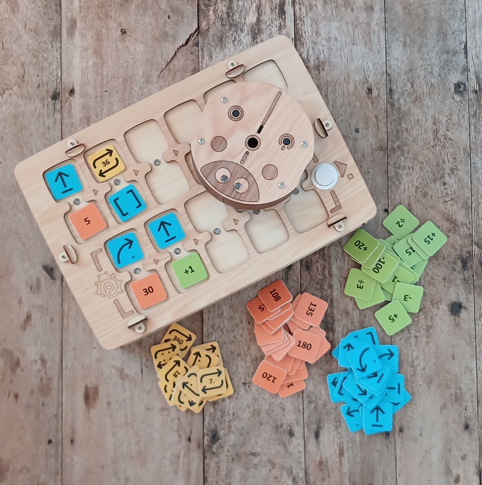

### Содержание руководства

- Зачем проводить занятия по робототехнике и программированию?
- Советы по организации занятий в разных условиях
- Занятия и цели обучения
- Подробная инструкция по использованию
- Описание занятий
- Приложения
- О проекте и авторах

### Педагогическая ценность

- Программирование без экрана — руками
- Понимание, что машины работают по алгоритмам
- Планирование действий заранее
- Развитие логического мышления
- Знакомство с последовательным программированием и функциями
- Понятие «баг» (ошибка в коде) и навыки отладки
- Наглядное изучение чисел, арифметики и геометрии

## Из чего состоит PrimaSTEM

### Что в коробке:

- Руководство по занятиям *
- Робот-божья коровка
- Пульт управления
- Фишки-команды *

* Состав набора может меняться в зависимости от комплектации

## Зачем проводить занятия по программированию и математике?

Код, программирование и автоматизация стали частью нашей повседневной жизни.

В последние годы люди научились создавать машины, которые делают то, на что раньше не были способны: понимать, говорить, слышать, видеть, отвечать, писать.

Примеров множество: беспилотные автомобили, роботы-помощники для пожилых людей, роботы-доставщики и другие.

### Зачем программирование и робототехника?

Учиться программировать — это не просто учиться писать код. Учиться программировать — значит учиться понимать машины, которые нас окружают. Это способность превращать маленькие или смелые идеи в реальные проекты. Это значит брать сложные задачи и разбивать их на простые шаги. Это совместная работа для решения наших проблем.

### Рождённые в цифровую эпоху

Сегодня может показаться, что дети и молодёжь хорошо разбираются в технологиях, потому что они активно пользуются цифровыми развлечениями.

Но как насчёт того, чтобы взять в руки эти инструменты для творчества или самовыражения? Что происходит, когда они сталкиваются с технической проблемой?

## Советы по использованию в зависимости от контекста

Занятия были разработаны для различных целей и образовательных контекстов. В руководстве представлены пронумерованные виды деятельности.
Ниже мы рекомендуем занятия в зависимости от ваших условий.

### Целевая аудитория

- Дети от 4 до 8 лет.
- Старшие и подготовительные группы детского сада, 1-й и 2-й классы начальной школы.

### Рекомендуемые занятия для внеклассного обучения

1-2-x-4-5-6-7-8-9-10-x-x

### Рекомендуемые занятия для школьного обучения

x-2-3-4-5-6-7-8-9-x-11-12

### Внеклассная деятельность

Для работы с PrimaSTEM желательно формировать группу не более 12 детей, чтобы каждый мог активно участвовать.

Рекомендуем использовать одно устройство на 2-3 ученика для обучения в команде и развития социальных навыков.

### Школьная деятельность

На уроке для работы с PrimaSTEM идеально формировать небольшие группы по 4-6 детей с одним учителем.
В это время другие ученики могут работать над другим заданием с помощником воспитателя или, например, тренироваться рисовать путь робота по программе (для учеников 1-2 классов).
В обоих случаях предпочтительно проводить занятия с PrimaSTEM в многоцелевом зале, прямо на полу или сдвинув столы и стулья, чтобы освободить место.

**Внимание**: Не забудьте заранее зарядить аккумуляторы пульта и робота.

## Номера занятий и их цели обучения

| Цели обучения                           | 1   | 2   | 3   | 4   | 5   | 6   | 7   | 8   | 9   | 10  | 11  | 12  |
| --------------------------------------- | --- | --- | --- | --- | --- | --- | --- | --- | --- | --- | --- | --- |
| Понимание понятий алгоритма и программы |     |     | X   | X   | X   | X   | X   | X   | X   | X   | X   | X   |
| Разложение маршрута на этапы            | X   |     | X   | X   | X   | X   | X   |     | X   |     | X   | X   |
| Предвидение перемещения                 |     | X   |     | X   | X   | X   | X   | X   | X   | X   | X   | X   |
| Решение проблемы, отладка программы     | X   |     |     |     |     | X   | X   | X   | X   | X   | X   | X   |
| Работа в команде, сотрудничество        |     | X   |     |     | X   | X   | X   |     | X   |     | X   | X   |

## Инструкция по использованию

### Содержание инструкции

- Знакомство с материалами
- Программирование функции
- Используемые карты
- Технические пояснения

## Знакомство с материалами

### Робот

Маленький деревянный робот-божья коровка с двумя глазами.

У него три точки опоры: два колеса и подставка в задней части, которые позволяют ему сохранять равновесие.

### Основные команды

| Команда | Рисунок                             | Описание                                                                                     |
| ------- | ----------------------------------- | -------------------------------------------------------------------------------------------- |
| Прямо   |   | Робот продвигается на одну клетку — логический шаг (по умолчанию равен 15 см)              |
| Налево  |      | Робот поворачивается на 90° налево                                                           |
| Направо |     | Робот поворачивается на 90° направо                                                          |
| Назад   |      | Робот едет назад на одну клетку — логический шаг по умолчанию                                |
| Функция |  | Робот выполняет последовательность команд, расположенную в строке функции                    |
| Повтор№ |   | Робот повторяет команду, установленную в парной ячейке, определённое количество раз — №      |

### Пульт дистанционного управления

Пульт позволяет управлять роботом, размещая блоки-команды (фишки) в доступные ячейки (D).

6 верхних сдвоенных ячеек (A), соединённых линией выполнения (E), составляют основную последовательность программы. Программа начинается с ячейки, расположенной слева (D), и заканчивается над кнопкой START (B), которая позволяет отправить инструкции роботу и запустить программу.

5 нижних ячеек (C) позволяют запрограммировать последовательность движений, выполняемую блоком «[ ]» — «функцией». Каждая сдвоенная ячейка связана со светодиодом (F), который загорается при установке фишки и мигает при выполнении текущей инструкции.

#### Создание последовательности

Когда вы вставляете фишку в одну из ячеек и она правильно расположена, светодиод загорается зелёным светом.
При добавлении в парную ячейку команды повтора к команде движения светодиод загорается синим цветом.
При неправильной установке фишек (например, две фишки-команды движения в парной ячейке) загорается красный диод. В этом случае ошибочная команда будет проигнорирована при выполнении программы.

### Аккумулятор и кнопка включения

Робот и пульт дистанционного управления питаются от встроенных аккумуляторов. Они заряжаются через порт USB-C. Кнопка включения (ON/OFF) находится сверху на роботе и на передней стороне пульта слева.

При включении робота или пульта раздаётся короткий звуковой сигнал.
Когда пульт включён, светодиод на передней панели горит зелёным светом. Когда робот включён, светодиод около разъёма USB-C горит зелёным светом.

### Беспроводная связь

Робот и пульт дистанционного управления общаются по беспроводной связи Bluetooth с радиусом действия около 5 м. Беспроводная система работает в фоновом режиме, без настройки, после первого подключения робота к пульту.

> Пульт можно настроить на работу с другим роботом (сопрячь устройства).
> 1. Включите робота, не сопряжённого с пультом.
> 2. Включите пульт.
> 3. Удерживайте на пульте кнопку СТАРТ 10 секунд до звукового и светового сигнала.

### Создание и выполнение программы

Последовательность движений («программа») начинается слева на пульте и следует по выгравированной последовательности стрелок «>» — линии выполнения, соединяющей горизонтально парные ячейки.

Если фишка добавлена после пустой ячейки, соответствующая ей инструкция будет выполнена после пропуска пустой ячейки.

Если выставлена неправильная фишка (например, «Повтор» без команды в одной парной ячейке) или комбинация фишек движения в парной ячейке (например, две фишки-команды в одной парной ячейке), то светодиод загорится красным, и такая часть программы будет пропущена при выполнении.

После того как последовательность установлена, нажмите кнопку «СТАРТ» для запуска программы.

Когда робот выполняет инструкции, светодиоды на пульте последовательно гаснут. Когда команда выполняется, соответствующий ей светодиод мигает.

## Программирование функции

### Создание функции

Блок «[ ]», также называемый блоком «Функция», используется для замены последовательности команд.

Блок «Функция» позволяет выполнять более сложные последовательности и переходить к более сложным задачам. Чтобы создать функцию, вставьте последовательность движений в специально отведённое поле — 5 сдвоенных ячеек в нижней части пульта. Эта последовательность выполняется слева направо каждый раз, когда в основной последовательности (сверху) встречается блок «Функция».

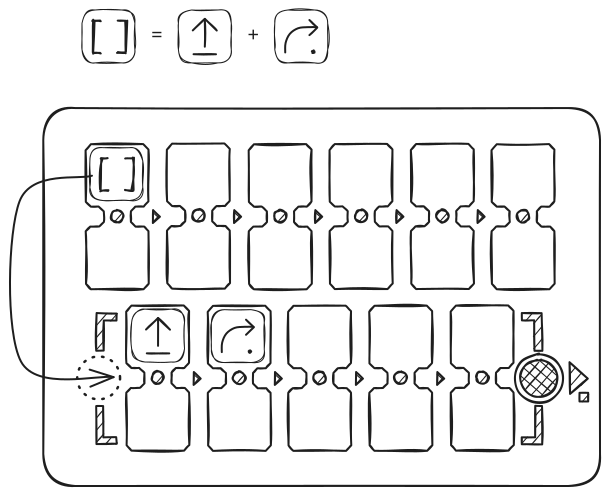

На примере ниже блок «Функция» заменяет движение прямо и затем поворот направо. Основная программа вызывает «Функцию» 2 раза, затем повторяет «Функцию» ещё 2 раза с помощью фишки «Повтор 2».

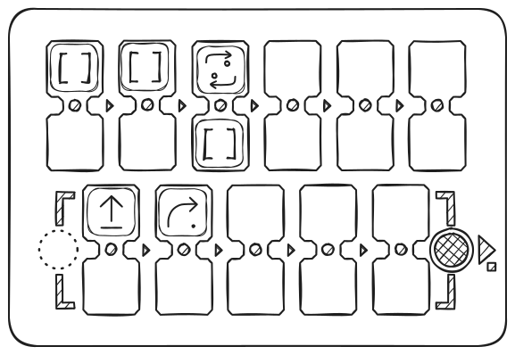

Результат движения:

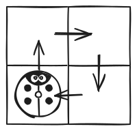

## Используемые карты

### Карты

Для начальных занятий — обучения алгоритмам, программированию и числам — робот должен перемещаться по карте с сеткой. Рекомендуется использовать карты с клеткой размером 15 см: это расстояние робот проходит за один шаг по умолчанию.

Вы можете использовать любые карты, предназначенные для любых роботов с любым (адекватным роботу) размером клеток.

> Возможно изменить расстояние шага по умолчанию с 15 см на любое другое под имеющуюся у вас карту — 10 см, 12,5 см или 20 см. Для этого используйте специальную команду установки «Шаг» + число в мм (для 10 см используйте 100, для 12,5 см — 125, для 20 см — 200).

Если у вас нет карты, сделайте её своими руками: для создания карты можно использовать тонкий бумажный скотч и плоскую поверхность стола или пола, лист ватмана (плотной баннерной ткани) и маркер.

Карта-шахматная доска или пустая карта с клетками используется для отработки перемещения из одной точки в другую без отвлечения на цвета.

Чтобы рассказывать небольшие истории о перемещениях робота, можно использовать цветную карту. Например: «Божья коровка выходит из дома и идёт в горы через лес». Можно предложить классу создать новую карту, чтобы рассказывать новые истории о путешествиях божьей коровки.

#### Примеры карт:

Карта шахматная

Карта цветная

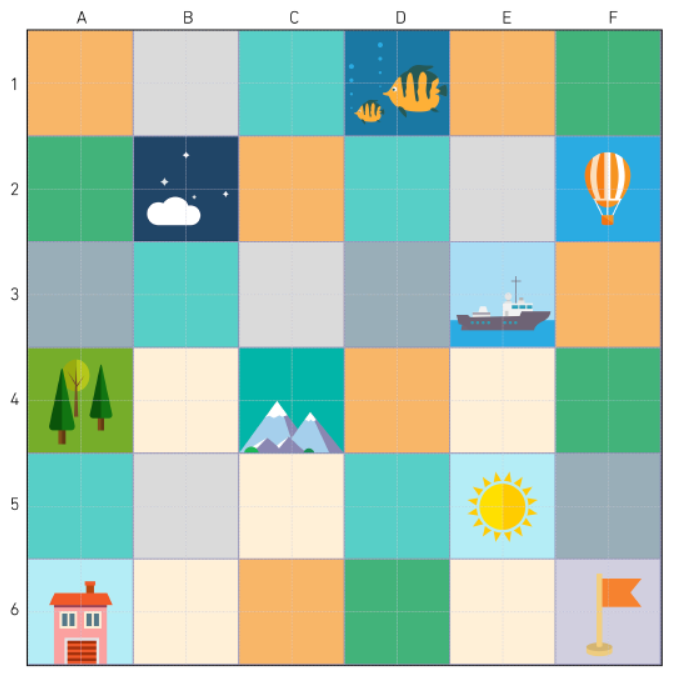

## Технические пояснения

### С технической точки зрения

Пульт управления и робот используют микроконтроллеры для управления, работают от аккумуляторов Li-Ion и соединяются по радиоканалу с помощью стандартного протокола связи — Bluetooth.

Печатная плата робота отвечает за всё его поведение: управляет двумя двигателями постоянного тока 5V, двумя многоцветными светодиодами, воспроизводит звуки, общается с пультом дистанционного управления и т. д.

Печатная плата пульта дистанционного управления идентифицирует вставленные в ячейки фишки, воспроизводит звуки и управляет 11 многоцветными светодиодами, связанными с каждой парной ячейкой.

Когда фишка вставлена в одну из ячеек пульта, она идентифицируется с помощью NFC-чипа-стикера. Каждая фишка содержит код, соответствующий команде управления.

После идентификации фишек на пульте и запуска программы команды отправляются роботу по беспроводной связи для выполнения.

### Вы можете создать свои фишки-команды!

Вы можете создать дополнительные фишки-команды (например, «Повтор 12» или дополнительные фишки движения), используя «пустые» фишки с NFC-стикерами и телефон с поддержкой NFC. Поддерживается большинство типов с частотой 13,56 МГц.

Видеоинструкция доступна на нашем канале YouTube — https://www.youtube.com/@primastem

---

## Занятия

### Подробное описание занятий

- **Занятие 1** — Перемещение по шахматной доске из точки А в точку Б
- **Занятие 2** — Знакомство с PrimaSTEM
- **Занятие 3** — Понимание понятия ориентации и алгоритма через воплощение в робота
- **Занятие 4** — Предвидение движений робота по последовательности движений
- **Занятие 5** — Понимание работы последовательностей инструкций в случайной программе
- **Занятие 6** — Использование пульта и команд движения, чтобы отвести робота в горы
- **Занятие 7** — Знакомство с командой «функция»
- **Занятие 8** — Использование досок и магнитов, чтобы отвести робота к цели
- **Занятие 9** — Отладка программы с ошибкой
- **Занятие 10** — Обдумывание отладки последовательностей с 1 ошибкой на бумаге
- **Занятие 11 и 12** — Предвидение движений робота (с блоком «функция»)

---

## Занятие 1: Перемещение по шахматной доске из точки А в точку Б

- **индивидуально**
- **15 мин**
- **на бумаге**
- **документы для печати**

### Цель

> Спроектировать перемещение по клеткам из точки А в точку Б на карте.

Упражнение длится 10 минут с подведением итогов.

### Для печати

Для этого занятия вам понадобится распечатать по одному экземпляру на каждого ученика листа «[Приложение 1 — Перемещение по карте](attachment-1)».

### УПРАЖНЕНИЕ

Дети должны начертить на сетке путь, который должна пройти мышь, чтобы добраться до сыра. Вы можете начать с левого упражнения, более простого, а затем продолжить с правым.

#### Перемещение по клеткам

Мышь перемещается по клеткам сетки (замечание: нельзя двигаться по диагонали). Здесь нужно понять, что путь мыши делится на этапы: она перемещается на одну клетку за раз. Говорят, что она движется пошагово.

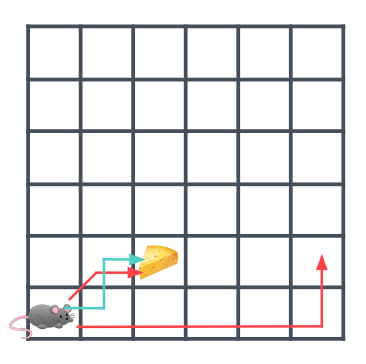

На примере выше правильным является только синий путь. Короткий красный путь неверен, так как он включает диагональ. Длинный красный путь неверен, так как он не приводит в нужную точку.

### Обсуждение в группе...

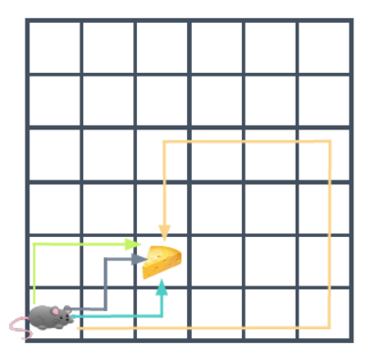

Например, в примере выше все нарисованные пути верны, так как все они позволяют мыши добраться до сыра.

Покажите детям, что не все думают об одном и том же пути, но несколько путей могут быть правильными.

#### Некоторые пути длиннее других

Если посчитать количество клеток, которые должна пройти мышь, чтобы добраться до клетки с сыром, получится:
- 3 клетки для зелёного маршрута
- 3 клетки для серого маршрута
- 3 клетки для синего маршрута
- 13 клеток для жёлтого маршрута

#### Самый короткий путь

В конце концов, даже если все эти пути верны, мышь выберет самый короткий.

Попросите детей ответить на этот вопрос: «Почему мышь выбрала самый короткий путь?»

Возможны несколько ответов: мышь хочет сэкономить энергию, она очень устала и хочет пройти как можно меньше... Или мышь торопится, она очень голодна и хочет как можно быстрее добраться до сыра.

**Примечание для ведущего:** С роботами то же самое. Мы всегда будем предпочитать самый короткий путь из соображений эффективности.

#### Возможны несколько путей

После окончания упражнения попросите учеников показать путь, который они нарисовали. Поскольку всегда существует несколько возможных сценариев, вероятно, что ученики предложат разные, но все правильные ответы.

---

## Занятие 2: Знакомство с PrimaSTEM

- **15 мин**
- **в группе**
- **демонстрация**
- **практика**

### Цели

> Понять возможности перемещения робота
> Узнать, что пульт управляет роботом
> Понять фишки-команды

Для этого занятия сформируйте небольшие группы учеников. Сядьте за низкий стол или на пол. Достаньте карту с сеткой, пульт, робота и фишки. Познакомьте по очереди всех учеников и группы с PrimaSTEM.

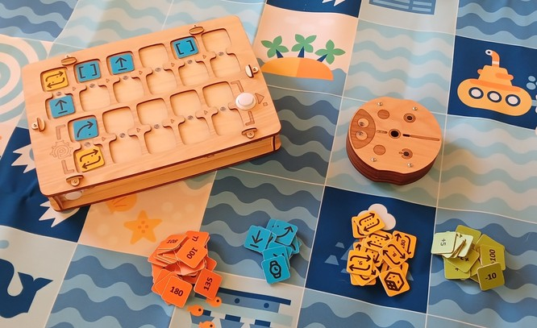

### Презентация

Представьте каждый элемент на столе и введите словарный запас, который понадобится детям.

Сначала **карта**: это как сетка, с которой они работали во время занятия 1, но больше.

Затем **робот-божья коровка**: он может катиться.

Им управляют с помощью **пульта**, в зависимости от фишек, которые мы кладём в ячейки.

**Фишки** — это инструкции: они позволяют сказать роботу двигаться прямо, поворачивать налево или направо.

### 1-й этап: демонстрация

После того как вы объяснили лексику, выполните манипуляцию сами и покажите детям, что происходит, когда вы кладёте фишку в пульт.

| Изображение                                        | Описание                                                                    |
| -------------------------------------------------- | --------------------------------------------------------------------------- |
|  | Фишка-команда **«Вперёд»** заставляет робота двигаться на одну клетку |

Поместите робота на одну из клеток карты. Вставьте фишку в первую ячейку для программы, как на схеме ниже, затем нажмите белую кнопку — СТАРТ.

Робот продвинется на одну клетку вперёд.

### 2-й этап: передайте управление

| Изображение                                     | Описание                                                                                                                                                                                |
| ----------------------------------------------- | --------------------------------------------------------------------------------------------------------------------------------------------------------------------------------------- |
|  | Фишка со стрелкой, поворачивающей по дуге вокруг центра, — **«Влево»** заставляет робота поворачиваться налево, против часовой стрелки. Шаг поворота по умолчанию равен 90 градусам. |

Уберите фишку «Вперёд» с пульта и передайте фишку «Влево». На этот раз вы можете позволить ребёнку вставить фишку в первую ячейку программы, а затем нажать белую кнопку — СТАРТ. Робот останется на месте и сделает четверть оборота налево.

| Изображение                                      | Описание                                                     |
| ------------------------------------------------ | ------------------------------------------------------------ |
|  | Фишка **«Вправо»** заставляет робота поворачиваться направо. |

Попросите другого ребёнка убрать фишку «Влево» из пульта и поставить на её место фишку «Вправо», а затем нажать белую кнопку — СТАРТ. Робот останется на месте и сделает четверть оборота направо.

Затем позвольте детям по очереди манипулировать, давая им только 3 фишки: **«Вперёд»**, **«Влево»** и **«Вправо»**.

Они могут повторить выполнение программы, которую создали, нажав ещё раз на кнопку СТАРТ после того, как робот закончит движение.

Позвольте им убедиться, что фишки могут быть размещены где угодно (кроме двух команд в одной сдвоенной ячейке) и выполняются по очереди — слева направо.

> Программа может быть остановлена повторным нажатием на кнопку СТАРТ/СТОП во время выполнения роботом.

---

## Занятие 3: Понимание понятия ориентации и алгоритма через воплощение в робота

- **45 мин**
- **В группе**
- **Игра**
- **Карта**

### Цели

> Учитывать ориентацию робота в начале программы
> Предвидеть движения робота в зависимости от программы

### Для печати

Для этого занятия вам понадобится распечатать по одному экземпляру на каждого ученика карточек «[Приложение 2 — Карточки миссий](attachment-2)».

### Принцип игры

Ролевая игра на свободном пространстве, где дети изображают робота на черно-белом поле.

### Правила игры

Один ученик выступает в роли робота на карте (или на полу с квадратным орнаментом — рисунком, плиткой или наклеенным на пол тонким скотчем), а другие ученики программируют его с помощью карточек с заданиями.

Никаких указаний относительно того, в каком направлении находится ребёнок-робот, не даётся.
Определите, какое направление робота является правильным для выполнения миссии.

1. «Ребёнок-робот» становится на красную клетку 1, он должен добраться до зелёной клетки 2.
2. «Ребёнок-робот» становится на красную клетку 1, он должен добраться до фиолетовой клетки 3.
3. «Ребёнок-робот» становится на красную клетку 1, он должен добраться до синей клетки 4.

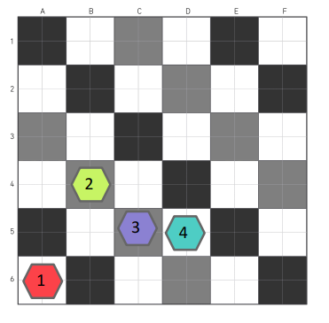

> Чтобы обеспечить долговечность материала карты, попросите ребёнка снять обувь.

### Конец игры

Ребёнок теперь понимает, что положение и ориентация робота должны учитываться при программировании перемещения.

Робот реагирует на команду перемещения в зависимости от того, как он повёрнут, сориентирован. Он должен либо двигаться прямо, либо поворачивать налево, либо поворачивать направо, **НО он будет двигаться в зависимости от своей начальной ориентации.**

---

## Занятие 4: Предвидение движений робота по последовательности движений

- **45 мин**
- **индивидуально**
- **на бумаге**
- **документы для печати**

### Цели

> Учитывать ориентацию робота в начале
> Понимать инструкции программы
> Предвидеть движения робота в зависимости от программы

### Для печати

Для этого занятия вам понадобится распечатать по одному экземпляру на каждого ученика карточек «[Приложение 3 — Начертить путь для заданной последовательности](attachment-3)».

Детям даётся лист с программой, состоящей из последовательности инструкций. Дети должны начертить путь, который проделает робот для этой последовательности движений.

С этой программой робот продвинется три раза прямо:

Здесь та же программа, робот также продвинется три раза прямо.
Только на этот раз он не сориентирован так же вначале: он смотрит направо. Поэтому он продвинется три раза направо:

С этой программой мы вводим вращение робота. На этот раз робот начинает с поворота направо, а затем продвигается на две клетки:

И наконец, более сложное упражнение с двумя изменениями направления для робота. Он начинает с продвижения на одну клетку прямо, затем поворачивает направо, продвигается на одну клетку, затем поворачивает налево и продвигается на две клетки:

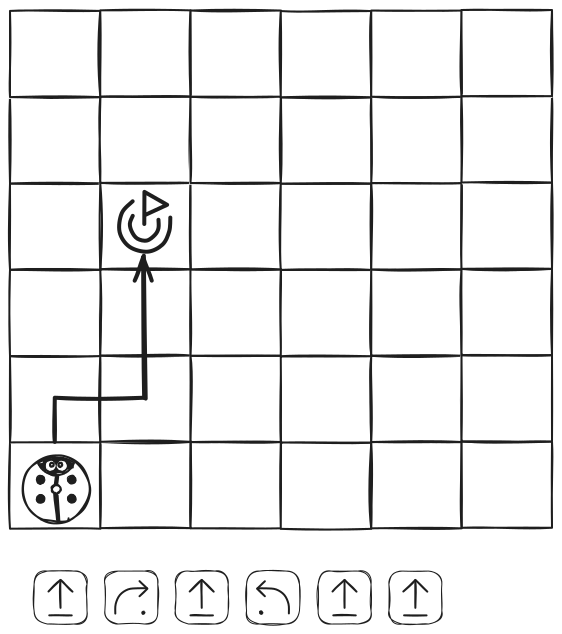

### Примечание для ведущего

Это упражнение на бумаге может оказаться сложным.
Если некоторым детям трудно понять вращения робота и последовательности движений, возьмите игровой набор PrimaSTEM и попросите их воспроизвести на пульте программы, которые находятся на листах.
Манипулируя и наблюдая, мы понимаем лучше!

---

## Занятие 5: Понимание работы последовательностей инструкций в случайной программе

- **45 мин**
- **в группе**
- **игра**

### Цели

> Установить связь между инструкциями и движениями, выполняемыми роботом
> Визуализировать границы карты
> Быть способным переносить инструкции-команды на «пульт управления»

### Проведение игры

1. Для начала поместите робота на карту, в любую клетку (рекомендуемая клетка — у края карты), в желаемом направлении.
2. Бросьте кубик, чтобы начать. Переместите робота вручную и запишите (зарисуйте знаком команды «Вперёд» — стрелкой) программу для перемещения на бумаге или доске для рисования. Если робот выходит за пределы карты, бросьте кубик ещё раз.

3. Повторите операцию, чтобы получить последовательность из 2 программ для движения и не дать роботу выйти за пределы карты, перебрасывая кубик при необходимости.

В итоге: вы должны получить на листе бумаги 2 программы из команд «Вперёд», которые после последовательного выполнения передвинут робота на нужное количество клеток к краю карты.

Пример:

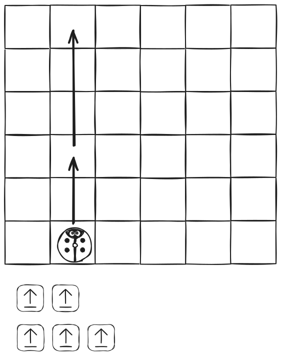

**Воспроизведите записанные программы в реальности с помощью PrimaSTEM.**

---

## Занятие 6: Использование пульта управления и команд движения, чтобы отвести робота в горы

- **45 мин**
- **в группе**
- **практика**

### Цели

> Разложить маршрут на этапы
> Реализовать программу с определённой целью

Для этого занятия вам понадобятся:
- пульт управления
- определённые фишки-команды движения: 4 «Вперёд», 4 «Влево» и 4 «Вправо» на группу, оставьте остальные фишки в стороне.
- карта и робот

Разделите детей на группы по 3 или 4 ребёнка и раздайте им пульт управления и набор фишек.

### 1-й этап: размышление

Робот-божья коровка находится дома, и мы хотим отвести его в горы. Здесь нужно будет написать на доске программу, которая позволит ему туда добраться.

> Если у вас нет нужной карты, нарисуйте необходимые пункты назначения схематично на бумаге, можно с детьми, и закрепите их на карте скотчем.

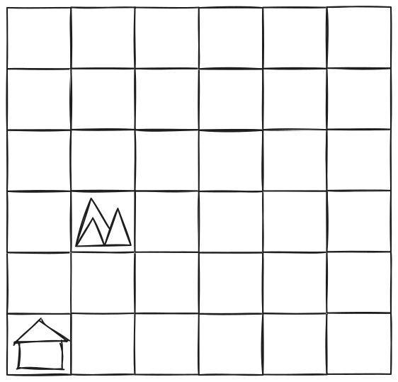

Начните с того, что спросите у детей, через какие клетки они хотят провести робота, чтобы добраться до горы. Опять же, возможностей много, и мы предпочтём самые короткие маршруты из соображений экономии энергии и времени.

После того как путь определён, спросите у детей о движениях, которые робот должен будет сделать, клетка за клеткой.

Должен ли он идти прямо, повернуть налево, повернуть направо?
Покажите им, каждое движение произведёт на робота каждая команда, перемещая его по карте руками.

### 2-й этап: программирование

Попросите детей написать, по порядку, движения (программу), которые должен сделать робот для достижения цели на пульте управления с помощью фишек-команд.

**Вот ожидаемый результат программы:**

### 3-й этап: проверка

Как и для любого уважающего себя программиста, следует проверить, работает ли программа. Попросите детей воспроизвести их программу на пульте и запустить её.

Робот добирается до горы? Если нет, то почему? Позвольте детям попытаться исправить свои ошибки в программе, если они есть.

---

## Занятие 7: Знакомство с командой «функция»

- **15 мин**
- **в группе**
- **демонстрация**

### Цели

> Понять, что команда «функция» может заменять другие команды-инструкции
> Рассмотреть понятие повторения последовательности инструкций

Для этого занятия сформируйте небольшие группы учеников. Сядьте за низкий стол или на пол. Достаньте поле-карту, пульт, робота и фишки-команды. По очереди группы учеников знакомятся с командой-блоком «Функция».

### 1-й этап: демонстрация

Покажите детям фишку-команду «Функция».

Она служит для замены нескольких команд движения: «Вперёд», «Влево», «Вправо» или «Назад». Она также позволяет повторять несколько раз один и тот же небольшой фрагмент программы.

Начните с демонстрации. Создайте программу, как на рисунке ниже.

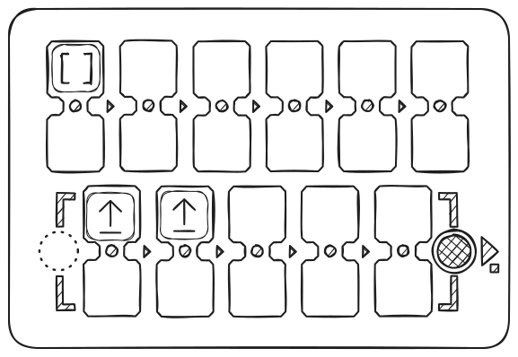

Когда используется команда «Функция», все происходит так, как если бы на место фишки «Функция» мы поставили то, что находится внутри рамки [-----], в нижней части пульта управления.
В нашем примере робот продвинется дважды прямо.

### 2-й этап: загадки!

Теперь добавьте блок с командой «Вправо» в конце вашей основной программы, как на рисунке ниже.

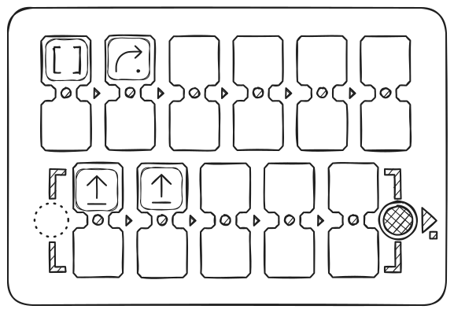

Прежде чем запустить программу, спросите у детей, что произойдёт. Все происходит так, как если бы программа состояла из двух красных блоков «Вперёд», а затем одного блока «Вправо». Робот продвинется на две клетки и сделает поворот направо (четверть оборота).

И для финала: **цикл**!
Воспроизведите программу с четырьмя блоками «Функция», как на рисунке ниже.

Прежде чем запустить программу, спросите у детей, что произойдёт, а затем запустите программу для проверки.

**Робот выполняет цикл**:

**Примечание для ведущего:** Когда вы начинаете знакомиться с понятием блока «функция», очень полезно смотреть на светодиоды, которые мигают во время выполнения программы. Так можно следить за выполняемой инструкцией и смотреть, как робот перемещается одновременно.

---

## Занятие 8: Использование функции, чтобы проложить маршрут к цели

- **45 мин**
- **в группе**
- **практика**

### Цели

> Разложить маршрут на этапы.
> Реализовать программу с определённой целью.
> Использовать блок «функция» в программе.

Для этого занятия вам понадобятся:
- фишки или самодельные карточки с рисунками команд: 4 «вперёд», 4 «влево», 4 «вправо» и 4 «функция» на группу.
- карта и робот, без пульта.

Если детей много, то разделите их на группы по 3 или 4 ребёнка и раздайте карточки с рисунками команд или фишки из набора (ровно по 4+4+4+4).

### 1-й этап: размышление

> Адаптируйте задание, если у вас карта с другими изображениями или без них — необходимо обозначить 2 точки (Старт и Финиш) на расстоянии 4 клеток под углом в 90 градусов.

Робот находится у флага, и мы хотим отвести его в клетку-ночь, представленную облаками. Нужно будет написать программу (выложить алгоритм из фишек или рисунков команд на столе), используя блок «Функция».

Начните с того, что спросите у детей, через какие клетки они хотят провести робота, чтобы добраться до горы (клетка примерно на середине пути). Возможностей много, и на этот раз мы предпочтём маршруты, где повторяются последовательности инструкций, чтобы использовать команду «Функция».

После того как путь определён, спросите у детей о движениях, которые робот должен будет сделать, клетка за клеткой, и смоделируйте выполнение программы, перемещая робота руками.

### 2-й этап: «это не работает! Но если...»

Попросите их выложить карточками (фишками) на столе, по порядку, движения, которые должен сделать робот.

Будьте строги в отношении количества команд-фишек, розданных каждой группе: 4 «вперёд», 4 «влево», 4 «вправо» и 4 «функция».

Вот так! У нас недостаточно фишек, чтобы написать программу! Не хватает команд «Вперёд»! Это цифровая паника! :)

Напомните им о пользе команды «Функция»: с помощью этой команды можно заменить несколько других команд-фишек.

Например, можно заменить несколько команд «Вперёд», чтобы заставить робота двигаться вперёд несколько раз.

Направляйте детей в создании программы с блоком «Функция», как на рисунке ниже.

Пример маршрута и его программа:

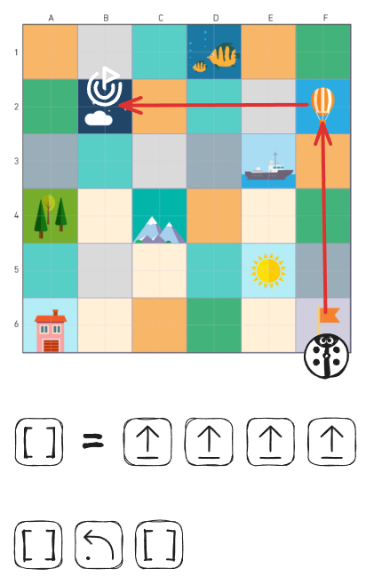

### 3-й этап: проверка

Помогите детям воспроизвести их программу на пульте управления для проверки, как на рисунке:

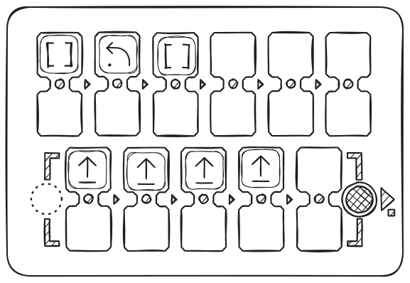

Робот добирается до клетки "Ночь"? Если нет, то почему?
Позвольте детям попытаться исправить свои ошибки в программе, если они есть.

---

## Занятие 9: Отладка программы с ошибкой

- **20 мин**
- **в группе**
- **практика**

### Цели

> Найти ошибку в программе, наблюдая за её выполнением.
> Исправить ошибку в программе.

Для этого занятия сформируйте небольшие группы учеников. Сядьте за низкий стол или на пол. Подготовьте поле с сеткой, пульт, робота и фишки.
По очереди просите группы учеников отладить программу.

Мы хотели бы, чтобы робот добрался до горы (серый путь).

Покажите детям последовательность движений на пульте, которая содержит ошибку:

С этой программой робот отправляется в лес. Тестируя программу, дети должны попытаться найти ошибку и исправить её.

Пример правильной, исправленной программы:

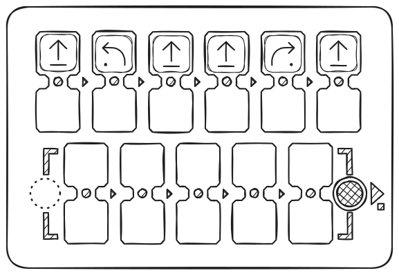

---

## Занятие 10: Обдумывание отладки последовательности с ошибкой на бумаге

- **20 мин**
- **индивидуально**
- **на бумаге**
- **документы для печати**

### Цели

> Предвидеть движения робота, чтобы найти ошибку в программе.
> Понять, как исправить ошибку в программе.

Детям даётся лист с программой, состоящей из последовательности инструкций для перехода из точки А в точку Б. Программа содержит ошибку, дети должны найти эту ошибку и попытаться её исправить.

### Для печати

Для этого занятия вам понадобится распечатать по одному экземпляру на каждого ученика карточек «[Приложение 4 — Найти и исправить ошибку в программе](attachment-4)».

### 1-й этап: прочитать программу

Начните с того, что попросите детей начертить перемещение робота с этой программой. На сетке синим цветом начерчен путь, который мы хотели бы, чтобы прошёл робот, и желаемая точка прибытия.

### 2-й этап: определить ошибку

После того как путь начерчен, мы видим, что робот не идёт к финишу (чёрному)! Он прибывает на красный флаг.
Спросите у детей, где робот ошибся. Здесь нужно найти клетку, которая содержит ошибку, обведённую красным в исправлении.

Существует 3 типа ошибок:
- мы ошиблись с командой
- мы забыли команду
- мы добавили лишнюю команду

### 3-й этап: исправить ошибку

И наконец, попросите детей исправить ошибку, написав программу движения до чёрного флага.

**Примечание:** Это упражнение на бумаге может оказаться сложным. Если некоторым детям трудно увидеть, где ошибки, возьмите PrimaSTEM и попросите их воспроизвести программы, которые находятся на листах, и запустить программу. Вы можете, например, попросить их сказать «О, нет!», когда робот ошибается на своём пути для фиксации ошибки.

#### Пример 1
В этом примере мы ошиблись с инструкцией в конце.

#### Пример 2
В этом примере мы добавили лишнюю инструкцию в начале.

#### Пример 3
В этом примере мы забыли инструкцию в начале.

---

## Занятие 11: Предвидение движений PrimaSTEM

- **45 мин**
- **в группе**
- **практика**

### Цели

> Предвидеть перемещения робота, глядя на программу без «функции»

Для этого занятия возьмите игровой набор PrimaSTEM без команд «Функция». Все дети могут участвовать в игре одновременно, но только один ребёнок за раз манипулирует.

### 1. Тишина, мы программируем...

По очереди дети помещают робота в угол карты, а затем составляют программу с максимум 5 инструкциями на пульте.

После того как программа закончена, попросите детей подождать, прежде чем нажимать кнопку.

### 2. Делаем ставки!

Попросите других детей угадать, выедет ли робот за пределы карты.

### 3. Проверяем

После того как мы сделали ставки, мы запускаем программу, чтобы проверить, что произойдёт.
Затем мы снова ставим робота в угол, и следующий ребёнок начинает свою программу.

---

## Занятие 12

### Цели

> Предвидеть перемещения робота, глядя на программу с «функцией»

Воспроизведите занятие 11, добавив команды «функция» в набор.

На этот раз добавьте блоки «Функция», чтобы интегрировать программирование функции. Все дети могут участвовать в игре одновременно, но только один ребёнок за раз манипулирует.

---

## О проекте, авторы

### Кто мы?

PrimaSTEM — это компания, которая создала и производит оригинальное одноимённое устройство для обучения детей от 4 лет программированию и математике без экрана. Мы расположены на юге Франции.

Созданные материалы являются открытыми и направлены на развитие творчества детей и взрослых, которые их сопровождают.

Чтобы узнать больше об устройстве PrimaSTEM, посетите ресурсный сайт документации, доступной на 10 языках: https://docs.primastem.com

### Есть вопросы? Свяжитесь с нами!

Не стесняйтесь обращаться к нам: primastem@gmail.com
Наш сайт с информацией и ссылками на социальные сети: https://primastem.com

### Авторы

**Адаптация, текст, иллюстрации:** Андрей Чанов, 2026.

**Авторы концепции**: Julie Borgeot / Dorie Bruyas из Fréquence écoles

#### Лицензия этого руководства

This work is licensed under CC BY-SA 4.0. To view a copy of this license, visit https://creativecommons.org/licenses/by-sa/4.0/

**Creative Commons Attribution-ShareAlike 4.0 International**

This license requires that reusers give credit to the creator. It allows reusers to distribute, remix, adapt, and build upon the material in any medium or format, even for commercial purposes. If others remix, adapt, or build upon the material, they must license the modified material under identical terms.

---

## Приложения

## Приложение 1 — Перемещение по карте

Приложение по ссылке — [Приложение 1 — Перемещение по карте](attachment-1)

## Приложение 2 — Карточки миссий

Приложение по ссылке — [Приложение 2 — Карточки миссий](attachment-2)

## Приложение 3 — Начертить путь для заданной последовательности

Приложение по ссылке — [Приложение 3 — Нарисуйте путь для заданной последовательности](attachment-3)

## Приложение 4 — Найти и исправить ошибку в программе

Приложение по ссылке — [Приложение 4 — Найти и исправить ошибку в программе](attachment-4)
