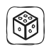

## 🧭 Движение

| Команда | Фишка | NFC Code |
| --- | --- | --- |
| Вперёд |  | `cfor` |
| Влево |  | `clef` |
| Вправо |  | `crig` |
| Назад |  | `cbac` |
| Случайное движение |  | `crnd` |

## 🔁 Повтор и управление

| Команда | Фишка | NFC Code |
| --- | --- | --- |
| Повтор 2–999 |  | `r002`–`r999` |
| Повтор случайное число раз (от 1 до 6) |  | `rrnd` |
| Функция |  | `cfun` |
| Пауза |  | `cwat` |

## 🔢 Числа

| Значение | NFC Code |
| --- | --- |
| Числа 1–999 | `n001`–`n999` |

## 🧮 Математические операции

| Операция | NFC Code |
| --- | --- |
| +1 to +999 | `a001`–`a999` |
| −1 to −999 | `s001`–`s999` |
| ×N | `m002`–`m999` |
| ÷N | `d002`–`d999` |
| X^N | `e002`–`e999` |
| Корень из X | `sqrt` |
| Факториал | `fact` |

## ⚙️ Настройки

| Команда | NFC Code |
| --- | --- |
| Калибровка расстояния | `ccal` |
| Установить длину шага по умолчанию | `clen` |

## 🔧 Дополнительно

| Команда | NFC Code |
| --- | --- |
| Аудио семпл (см. [Аудио файлы](/ru/sounds_reference)) | `xNNN` |
| Звуковой семпл пульта | `csou` |
| Уровень громкости | `clvl` |

## Как записать данные на NFC-метку

Вы можете создать собственный токен — просто запишите текстовый код на NFC-метку. Можно использовать любые числа (от 0 до 999), любые повторения и любые числа для арифметических операций.

Чтобы записать текстовые данные на NFC-метку, откройте Google Play Store и установите приложение **RFID NFC Reader** или **NFC Tools** на свой телефон.

Инструкция по записи NFC-метки находится здесь — [youtu.be/UbKaQxZs8JA](https://youtu.be/UbKaQxZs8JA)

  <iframe
    src="https://www.youtube.com/embed/UbKaQxZs8JA?si=WT8wWYBe_Ql7TovQ"
    style={{
    position: 'absolute',
    top: 0,
    left: 0,
    width: '100%',
    height: '100%',
  }}
    frameBorder="0"
    allow="accelerometer; autoplay; clipboard-write; encrypted-media; gyroscope; picture-in-picture"
    allowFullScreen
  />

