# Руководство для учителя

Это руководство описывает функционал комплекса PrimaSTEM, необходимый для создания уроков и применения в учебном процессе.

PrimaSTEM - учебная игрушка для детей 4–12 лет, помогающая учиться программировать дружелюбного робота без компьютеров, планшетов и телефонов. Она развивает логику, навыки программирования и математику.

Занятия с PrimaSTEM делают программирование простым и наглядным для детей. Даже малышам процесс становится понятным и тактильным - основы программирования, логики и математики осваиваются в форме игры.

Игра с PrimaSTEM способствует развитию ключевых навыков: логического мышления, алгоритмики, программирования, математики, геометрии, а также творческого и социально-эмоционального развития. Набор PrimaSTEM - это подготовительная ступень к знакомству с блочными языками программирования, такими как [Scratch](https://en.wikipedia.org/wiki/Scratch_(programming_language)) или [LOGO](https://en.wikipedia.org/wiki/Logo_(programming_language)).

## Знакомство с обучающим набором

### Где можно использовать PrimaSTEM?

Применение эффективно в следующих образовательных программах:

- Центры дошкольного образования
- Детские сады с методиками Монтессори
- Начальная школа
- Домашнее обучение
- Специальные центры развития
- Группы продлённого дня
- Начальные кружки программирования
- Детские образовательные лагеря

### Что нужно знать для начала?

Перед работой с набором рекомендуем учителям и родителям ознакомиться с [инструкцией по использованию](user_manual.md) и этим руководством. Специальные навыки программирования не требуются - материалы дадут необходимые основы для начала обучения.

## Исследования и ценность набора

PrimaSTEM вдохновлен языком программирования [LOGO](https://en.wikipedia.org/wiki/Logo_(programming_language)), созданным [Сеймуром Паппертом](https://en.wikipedia.org/wiki/Seymour_Papert), и педагогикой Монтессори. LOGO и робот-черепашка сделали программирование для детей наглядным и доступным.

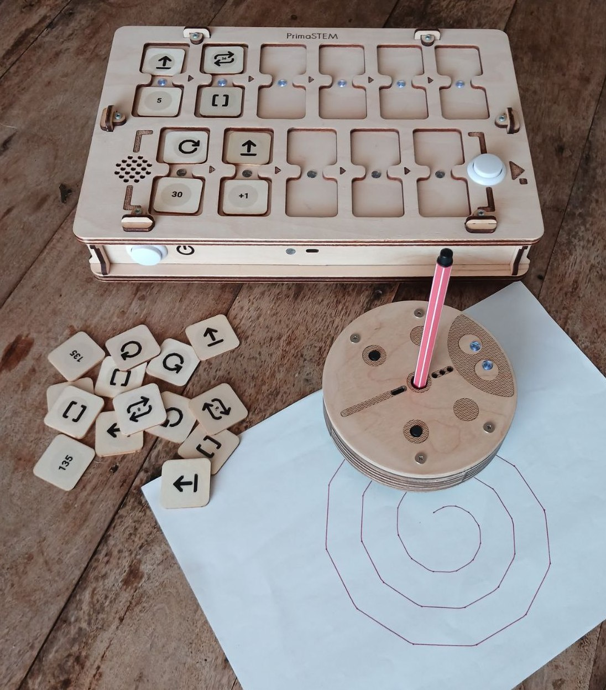

Фишки-команды PrimaSTEM реализуют этот подход. Обучение становится интуитивным через простое тактильное управление, не требующее экранов или текста.

Наблюдая за роботом, дети учатся понимать каждую команду, освоив алгоритмы на практике.

Робот обладает важным качеством: у него есть направление, что позволяет ребенку идентифицировать себя с ним и легче понять основную логику работы программ.

Все команды просты и понятны: они указывают в каком именно направлении робот должен перемещаться. Обучение робота "действовать" или "думать" заставляет детей осмысливать собственные действия и мысли, поэтому процесс обучения программированию становится более эффективным.

Фишки PrimaSTEM - наглядное и упрощённое представление языков программирования. В начале обучения никаких текстов и чисел - только базовые команды.

### Почему дерево?

🌱 Пульт и робот изготовлены из дерева. Практика показала, что детям приятнее играть с деревянными игрушками - они безопасны, долговечны и создают индивидуальную историю использования.

## Концепция программирования с PrimaSTEM

Физические фишки PrimaSTEM аналогичны инструкциям реальных языков программирования, демонстрируя важные концепции.

### Алгоритмы

**Алгоритмы** - это последовательность точных команд (фишек), составляющих программу.

### Очередь

Команды на пульте PrimaSTEM выполняются строго слева направо, что наглядно демонстрирует очередь исполнений.

### Исправление ошибок (отладка)

Ошибку легко исправить: достаточно заменить фишку. Такой подход развивает навык самостоятельной отладки программы.

### Функция

Функция (подпрограмма) - это набор команд в нижней части пульта, вызываемый из основной программы фишкой «**Функция**».

## Применение в других предметах

PrimaSTEM помогает освоить и другие навыки:

- **Общение**: Групповая игра способствует сотрудничеству.
- **Моторика**: Работа с фишками улучшает координацию.
- **Социальные навыки**: Дети учатся уверенности и совместному решению задач.
- **Математика**: Осваиваются базовые математические понятия.
- **Логика**: Дети учатся строить последовательности и прогнозировать результат.

> Ребёнок, выстраивая цепочку из фишек, тактильно, зрительно и умственно осваивает программирование. После нажатия кнопки «Выполнить» робот движется, и результат сравнивается с ожиданием ребёнка. Такой комплексный опыт ускоряет обучение.

## Знакомство с роботом и пультом

### Робот

Расскажите детям, что робот - их друг, которого можно программировать. Объясните: у него нет своих мыслей, и он выполняет только их инструкции - как бытовая техника, которую надо включить.

### Пульт управления

Объясните, что пульт передает команды роботу. Покажите, как устанавливать фишки-команды и программировать робота.

> Основная программа строится в верхней строке пульта управления (6 ячеек). Нижняя строка (5 ячеек) предназначена для подпрограммы-функции и используется с командой «**Функция**».

### Фишки-команды

Фишки - это команды для робота, которые вставляются в пульт. После нажатия «Выполнить» робот исполняет последовательность. Каждая фишка - отдельная команда, учит детей вычислительному мышлению и проектированию программ. Важно, чтобы дети понимали, что делает робот при активации каждой команды. Это учит их проектированию программ и прогнозированию действий робота. Объясните детям: фишки нельзя терять или портить, без них робот не сможет двигаться.

## 1 - Первая программа

### Причина и следствие

Главная цель - показать детям связь между командой и действием. Пусть ребёнок вставит фишку «Вперёд» в первую ячейку пульта и нажмёт «Выполнить». Ребёнок должен увидеть соответствие фишки и действия.

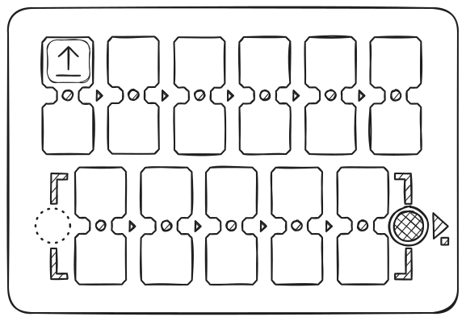

### Однозначные инструкции

Повторите шаги с каждым направлением (**вперёд**, поворот **влево**, поворот **вправо**), пока ребёнок не научится узнавать каждую фишку.

### Первая задача

Разверните игровое поле или сделайте сетку 10×10 см. с помощью скотча или маркера. Поместите робота на стартовую клетку. Попросите ребёнка составить программу для движения на одну клетку вперёд. Если была выбрана неверная фишка, верните робота и предложите порассуждать над новым вариантом.

## 2 - Программа и отладка

### Очередь событий

Поставьте цель на две клетки впереди робота.

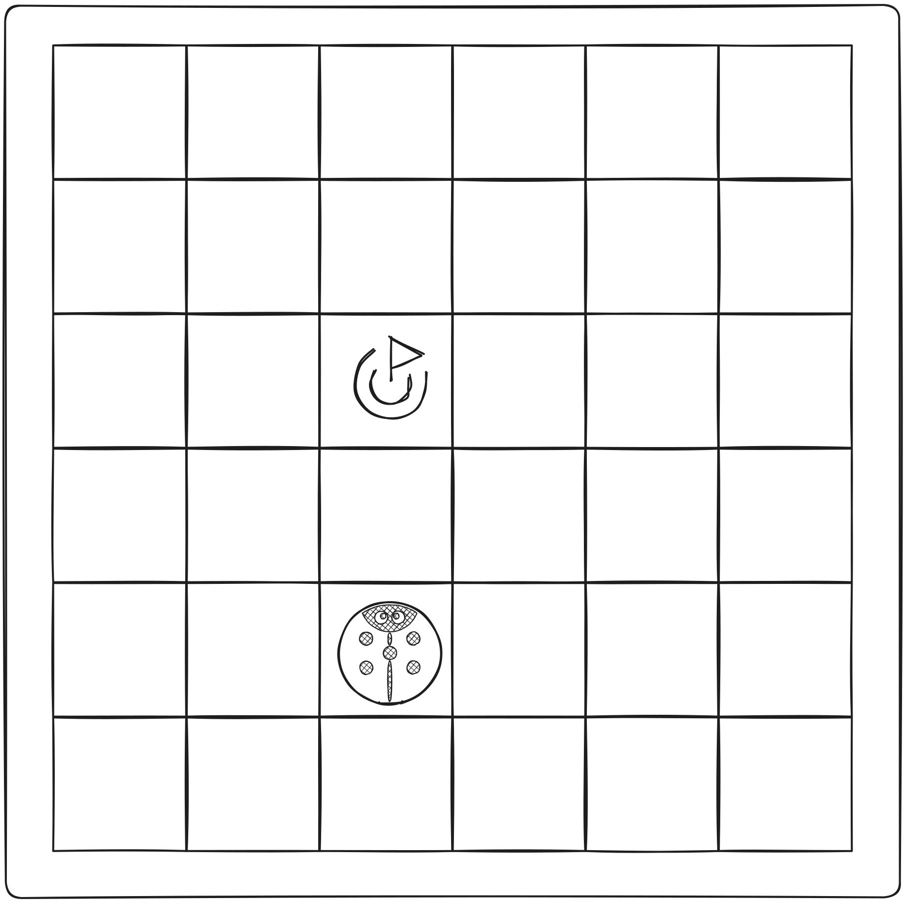

Пусть ребёнок составит программу из двух фишек для достижения цели.

### Последовательность из трёх фишек

На этот раз цель - одна клетка впереди и одна справа.

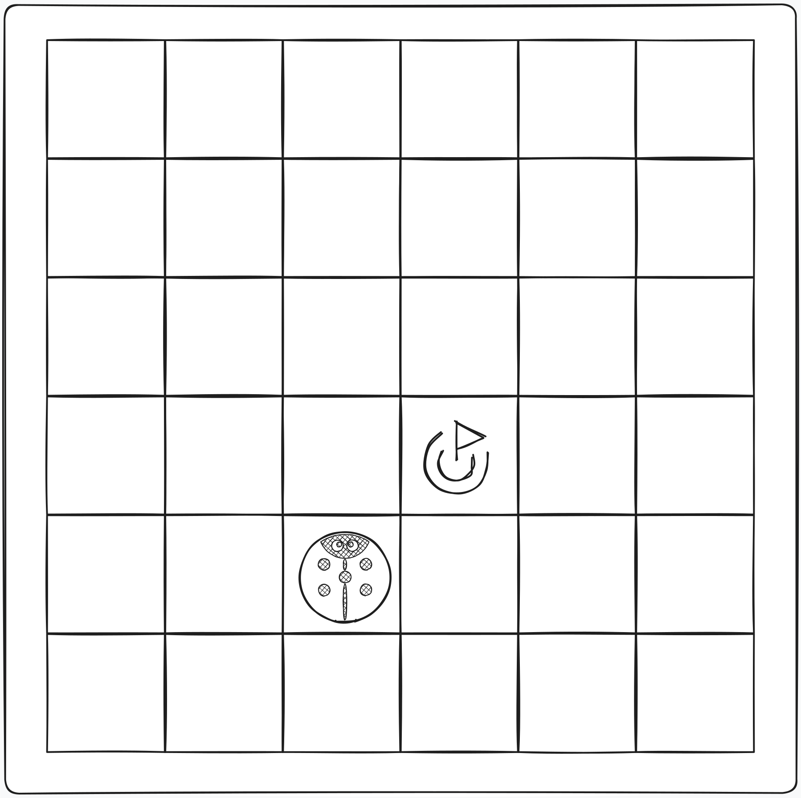

Пусть ребёнок сам выберет правильную последовательность команд.

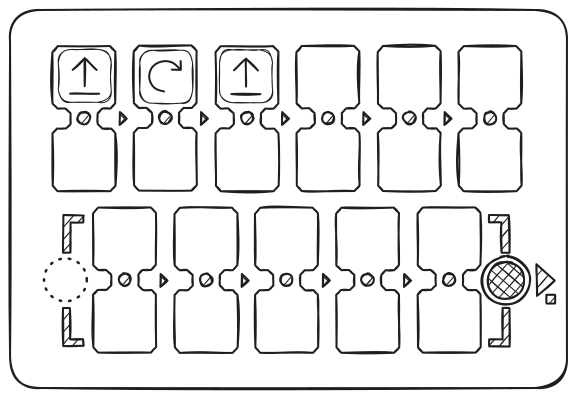

Не волнуйтесь, если была выбрана неверная фишка. Просто верните робота на первоначальную позицию и попросите ребенка порассуждать о своем выборе и попробовать новые варианты.

### Отладка - нахождение ошибки

Установите точку прибытия на один квадрат впереди робота и на один квадрат слева от него.

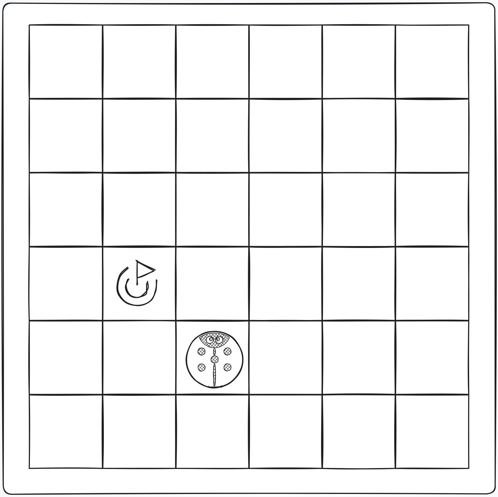

На этот раз создайте программу для решения проблемы, намеренно вставив неверный поворот в последовательность.

Попросите ребенка предсказать неверную команду в программе и самостоятельно предсказать неверный результат, а также позвольте ему нажать кнопку “**Выполнить**”, чтобы подтвердить свое предположение.

После того, как ребенок убедится в том, что представленная последовательность была неправильной, либо путем рассуждения, либо путем проверки, позвольте ему изменить неправильную команду на правильную, тем самым отлаживая программу.

## 3 - Программа с Функцией

### Команда «Функция»

Когда основные команды освоены, введите фишку-команду **Функция**. Это повторяемый набор команд, к которому можно обращаться из основной программы.

> Чтобы объяснить, как это работает, вы можете использовать метафору башни (под фишкой функции сложены другие команды одна за другой), объясняющую, что можно поместить больше инструкций внутри одной фишки.

Покажите пример: сначала поместите две фишки «Вперёд» в верхние ячейки и выполните программу - робот проедет две клетки.

Теперь те же две «Вперёд» разместите в функцию (нижний ряд), а в основной программе используйте «Функция». Результат будет одинаков, но теперь часть программы спрятана в подпрограмму.

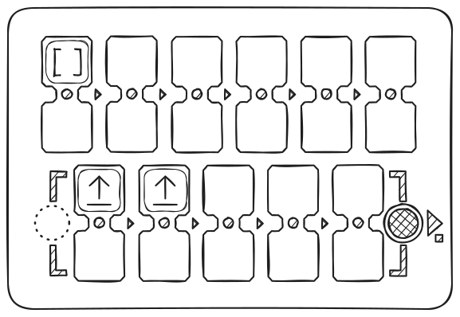

Далее создайте последовательность: **Вперёд - Вперёд - Вправо - Вперёд - Вперёд**.

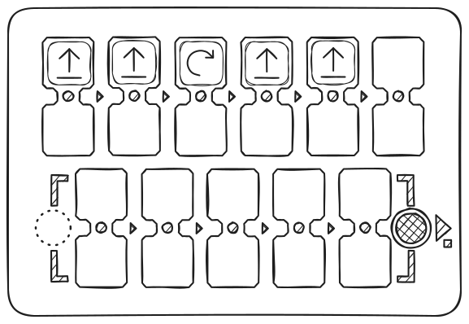

Попросите детей найти повторяющиеся части и «спрятать» их в функцию. Итоговая последовательность: в основной части - **Функция - Вправо - Функция**, в нижней - **Вперёд - Вперёд**.

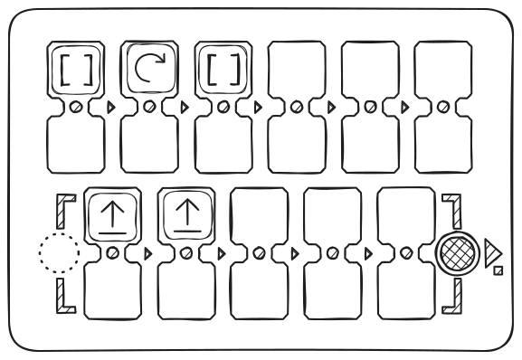

### Решение задач с функцией

Дайте ребёнку 3 фишки «**Вперёд**» и 2 «**Функция**».

Задача - проехать вперёд на 5 клеток.

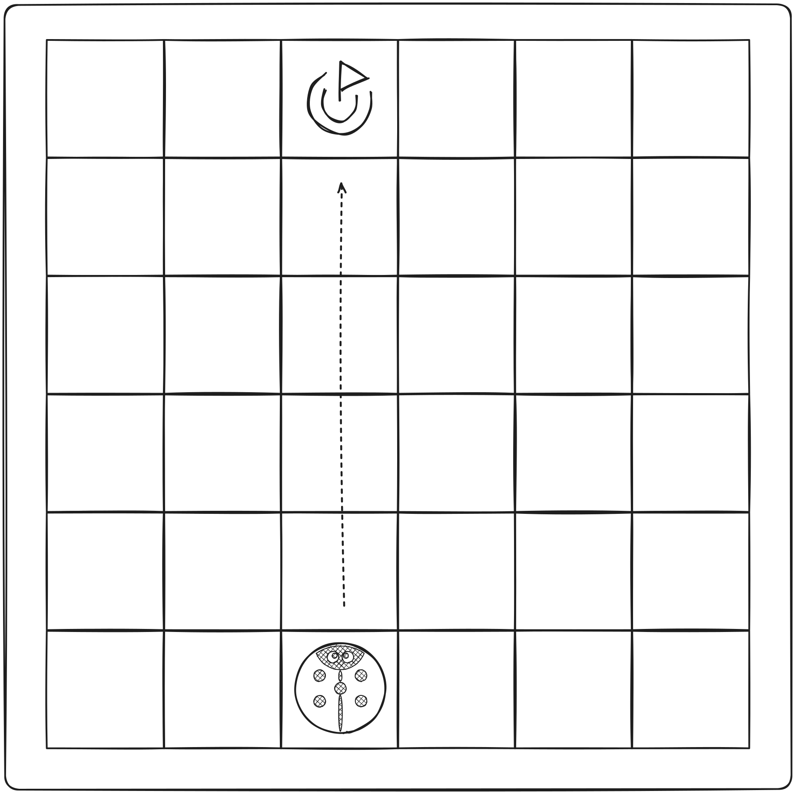

Пусть ребёнок поймёт, что нужно использовать функцию для многократного действия и решения этой задачи.

Если последовательность неправильна, просто верните робота на первоначальную позицию и попросите ребенка порассуждать о правильном решении задачи и попробовать новые варианты.

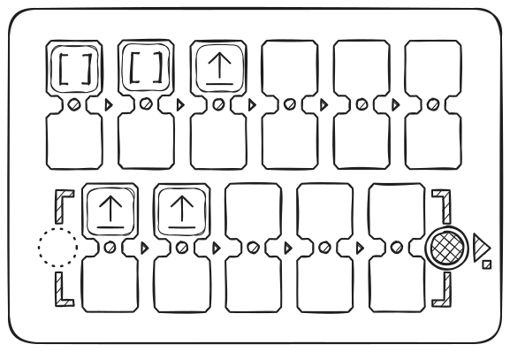

## 4 - Случайность

### Команда «Случайное направление»

Для введения понятия случайности возьмите 3 фишки направления: “**Вперёд**”, “**Влево**” и “**Вправо**”, поместите их в непрозрачную коробку или мешочек, перемешайте и попросите детей не глядя вытаскивать по 1 фишке и показывать её группе, затем возвращая её назад. Объясните детям что такое случайность из трёх состояний на этом примере.

Затем покажите детям фишку-команду “**Случайное направление**”, можно заметить что своим изображением-пиктограммой она повторяет все три фишки направлений.

Объясните что эта фишка делает почти тоже самое что они делали до этого вытаскивая случайные фишки из пакета: случайно выбирает 1 из 3-х команд для передачи роботу и затем двигает его на 1 логический шаг - клетку. То есть робот может переместиться на 1 клетку вперёд, вправо или влево.

Поместите фишку “**Случайная команда**” в верхнюю ячейку и выполните программу несколько раз - робот будет двигаться каждый раз по-разному.

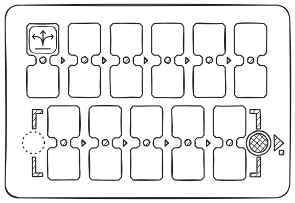

Поиграйте с детьми: пусть угадают, куда поедет робот, прежде чем выполнить команду.

Акцентируйте внимание на моменте, что это **случайность** и всегда угадать правильно направление нельзя.

Попробуйте сделать небольшую игру с использованием фишки “**Случайная команда**” вместе с детьми.

## 5 - Циклы (повторы команд)

### Знакомство с числовыми циклами

Покажите детям фишки значений, спросите знают ли они числа, видели ли игральный кубик для настольных игр, играли ли они в такие игры.

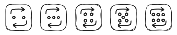

Поместите две фишки «Вперёд» в верхние ячейки и выполните - робот проедет две клетки.

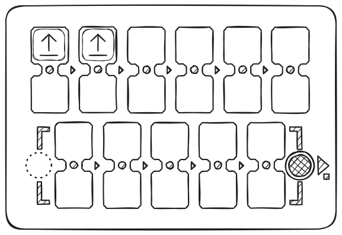

Теперь оставьте одну «Вперёд», а под неё поместите фишку «цикл 2». Результат будет тем же: действие повторится дважды.

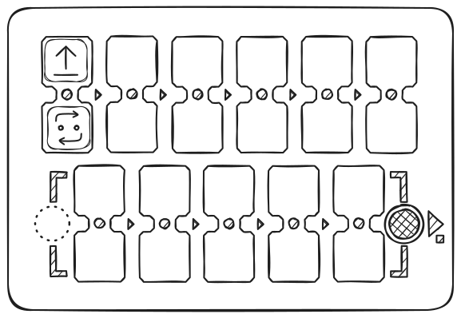

Установите 4 команды “**Вперёд**”, посмотрите на результат, а затем попросите детей с помощью фишек значений - **циклов** повторить движение робота на 4 клетки.

Возможны как простые варианты решения задачи с установкой фишки “**Вперёд**” и значения цикла 4, а также другие варианты: например “**Вперёд**” с числом цикла 3 и ещё одна команда “**Вперёд**”.

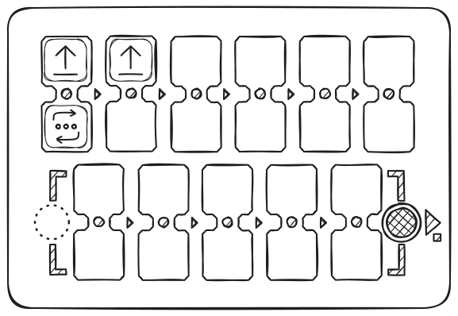

### Цикл вызова функции

Попробуйте с детьми применить Цикл с значениями к команде “Функция”: например заставив робота ходить зигзагом с помощью установленной команды “Функция” с значением цикла 5 и функциональной последовательности в нижней части пульта из команд “**Вперед**”, “**Вправо**”, “**Вперёд**”, “**Влево**”.

Вначале создайте с помощью функции программу для движения “по ступеньке” - "вперёд", "вправо", "вперед", "влево" и выполните её.

Затем добавьте к функции Цикл с числом 5, тем самым повторив функцию несколько раз, робот будет двигаться ступеньками вправо - вверх.

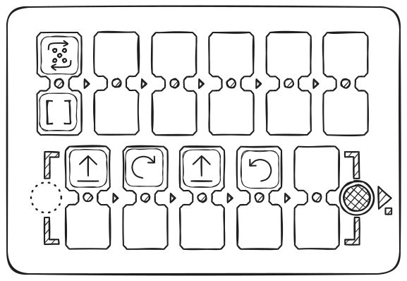

Робот поедет лесенкой по диагонали вправо и вверх, сделав по пути следования 5 ступеней.

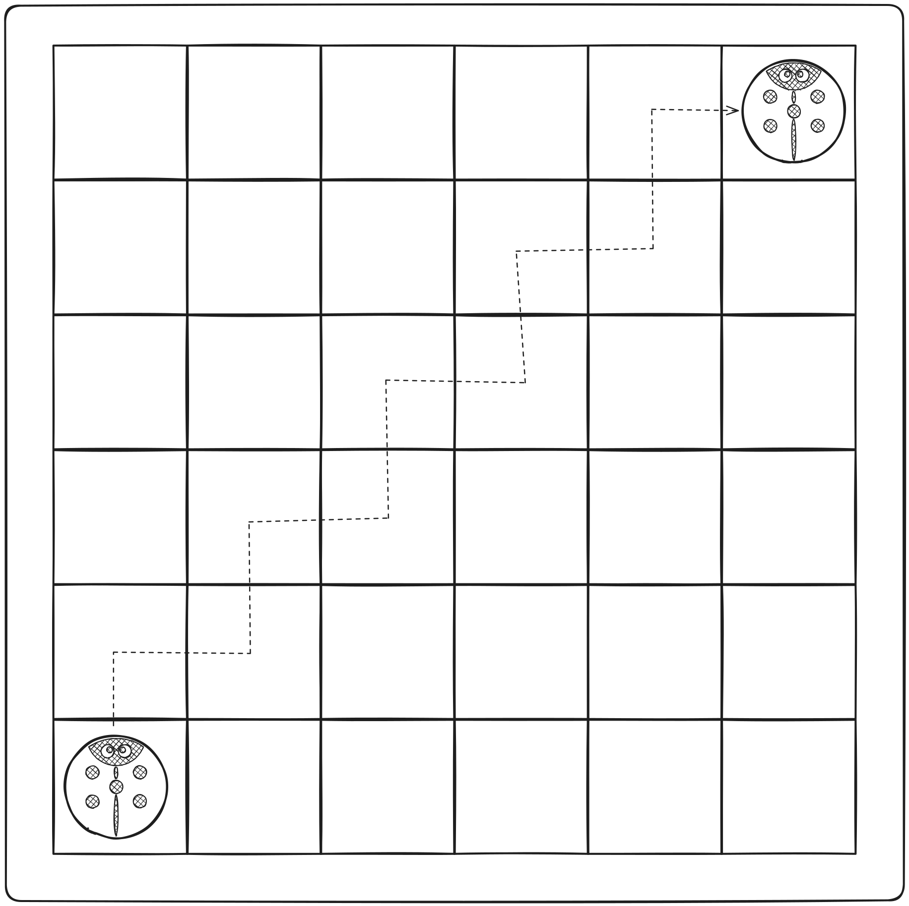

## 6 - Случайные числа

### Понятие случайного числа

Среди фишек есть «Случайное число циклов» (с изображением кубика). Она выбирает случайное значение от 1 до 6. Проведите игру с вытаскиванием фишек циклов из мешка.

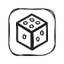

Для введения понятия случайного числа возьмите 4 фишки циклов: “**2**”, “**3**”, “**4**” и “**5**”, поместите их в непрозрачную коробку или мешочек, перемешайте и попросите детей не глядя вытаскивать по 1 фишке и показывать её, называя значения, затем возвращая её назад. Проведите игру, кто вытащит большее значение. Объясните детям что такое случайность из четырёх состояний на этом примере.

Затем покажите детям фишку-значение “**Случайное число циклов**”. Объясните что эта фишка делает почти тоже самое что они делали до этого, вытаскивая случайные фишки значений из пакета: случайно выбирает 1 из 6 чисел (от 1 до 6), как игровой кубик, для передачи роботу и повтора действий.

Поместите фишку “**Вперёд**” в верхнюю ячейку пульта, а фишку “**Случайное число циклов**” под ней. Попросите детей нажать кнопку “**Выполнить**”. Верните робота на первоначальное место. Повторите эту задачу несколько раз.

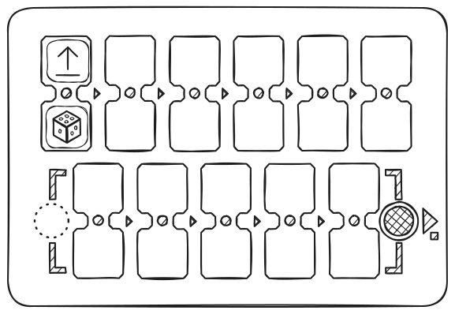

Поиграйте: чей робот проедет дальше.

Обратите внимание детей на то, что робот перемещается на случайное количество клеток: от 1 до 6. Акцентируйте внимание на моменте, что это случайность и заранее узнать как далеко проедет робот нельзя.

## 7 - Числа: расстояния и углы

### Знакомство с числами

Без установки числовых значений для команд (выше или ниже команды в двойной ячейке) робот использует параметры движения по умолчанию: без параметров робот движется вперед на 10 см и поворачивается на 90°. Эти значения можно изменить с помощью фишек значений.

Пример: Добавьте к команде **"Вперёд"** значение **200** и посмотрите, на какое расстояние проедет робот. Добавьте значение **180** к команде **"поворот"** и оцените изменения.

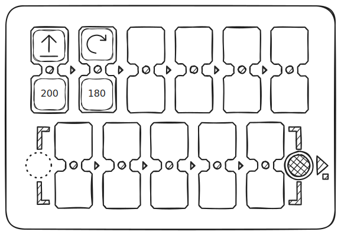

> **Важно:** Пульт сохраняет последнее значение, заданное для команд движения и поворота. Если команда используется без нового значения, последнее сохраненное значение применяется до тех пор, пока пульт не выключится. Установка нового значения изменяет параметр по умолчанию. Значения по умолчанию (100 мм и 90°) можно восстановить, задав их явно или перезапустив пульт.

Изменение параметров позволяет создавать более сложные траектории и сценарии движения. Смотрите примеры на [странице математических рисунков](math_drawings.md) .

## 8 – Арифметика

### Арифметические операции

Арифметические операции с числами позволяют динамически изменять значения в программе для команд движения (Вперед, Назад, Влево, Вправо), делая управление роботом более гибким.

При добавлении арифметической операции контроллер изменяет сохраненное число для команды движения и отправляет новое значение роботу.

Пример:

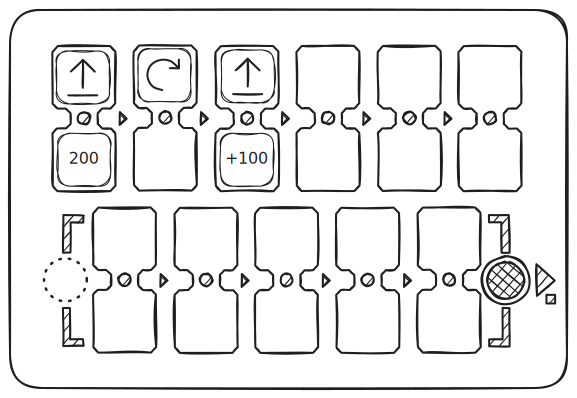

«Вперед 200» — робот перемещается на 20 см, «Вперед +100» — еще на 30 см. Общее расстояние: 50 см.

Использование таких операций в цикле позволяет создавать прогрессии.

> Если в результате арифметической операции число становится отрицательным, робот выполняет обратное действие: вместо движения вперед он движется назад; вместо поворота налево он поворачивает направо.

Доступно: сложение (+), вычитание (−), умножение (*), деление (/), корень (√), возведение в степень (^).

Примеры узоров показаны на [странице математических рисунков](math_drawings.md) .

---

## Играйте и учитесь вместе с детьми!

Вы знаете своих учеников лучше всех. PrimaSTEM — универсальный инструмент для игрового обучения. Используйте его для обучения программированию, логике и другим предметам. Все зависит от вашей фантазии!

p/s: Спасибо за использование PrimaSTEM и за проявленный интерес! Ждем ваших отзывов: [напишите нам](contacts.md) о вашем опыте и впечатлениях.
