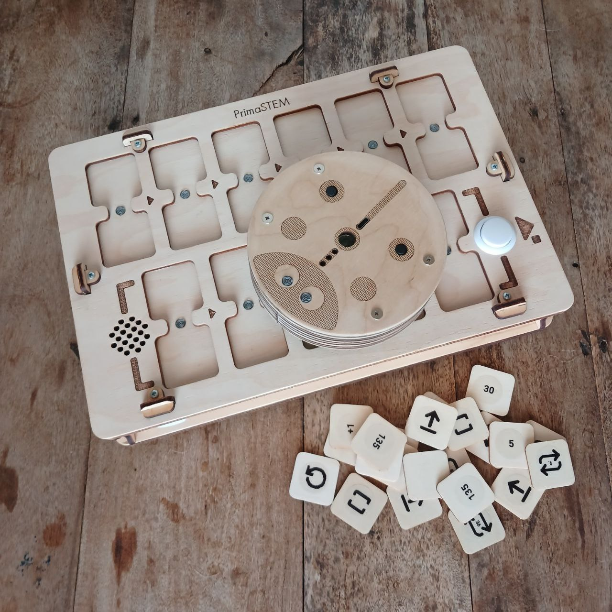
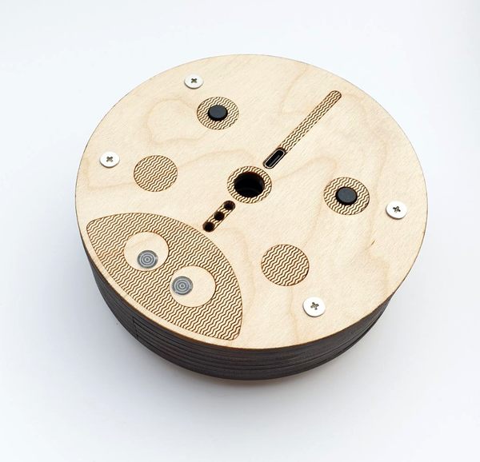
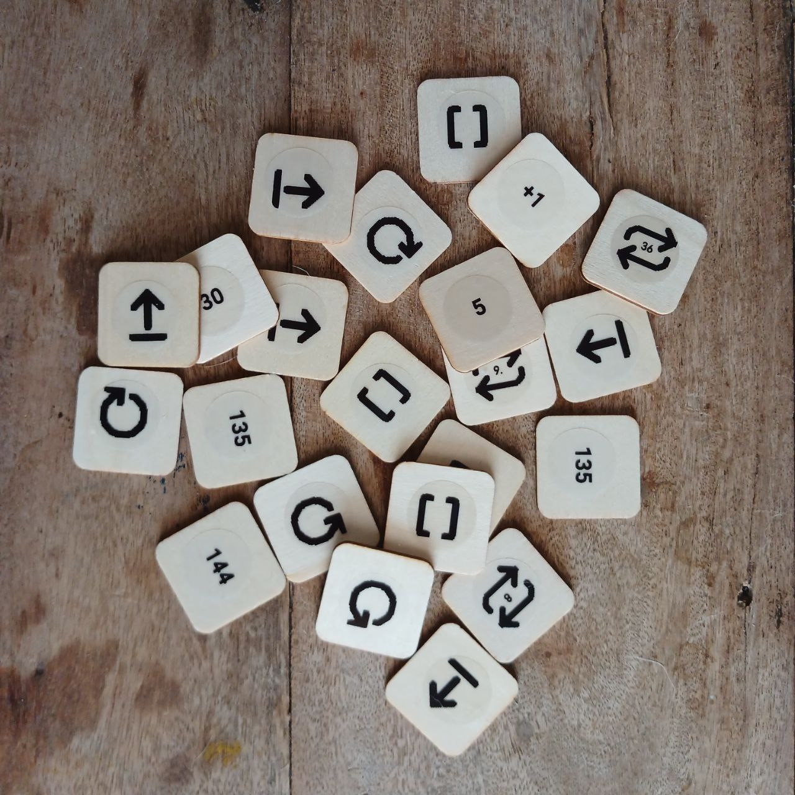

# Описание и инструкция по использованию

**PrimaSTEM** — комплекс для обучения детей от 4 до 12 лет основам логики, программирования и математики.

## Технические характеристики и комплектация

- Игровой робот
- Пульт управления роботом
- Фишки команд, значений, арифметических операций для создания программы
- Игровое поле (в зависимости от комплектации)

> Комплектация и внешний вид могут незначительно меняться. Уточните при покупке.

### Игровой робот

Размеры: D=125 мм, H=45 мм.

Робот оснащён кнопкой включения, светодиодами, динамиком, функциональной кнопкой и разъёмом USB-C для зарядки аккумулятора.

В центре робота можно установить маркер диаметром до 10 мм для рисования простых фигур во время движения.

Внешний вид может незначительно отличаться в зависимости от комплектации, основной функционал сохраняется.

### Пульт управления

Размеры: L=310 мм, W=210 мм, H=52 мм.

Пульт содержит 11 сдвоенных ячеек для установки фишек команд и значений: 6 — для основной программы (верхняя часть), 5 — для подпрограммы (нижняя часть).  
На пульте две кнопки: слева — включение, справа — “Выполнить / Остановить” для запуска и остановки программы.

После установки фишек команд и значений в ячейки нажмите “Выполнить”: робот выполнит программу. Активные команды подсвечиваются светодиодами между ячейками.

Если фишка установлена некорректно — пульт сигнализирует красным светодиодом, но программа продолжается (например, при установке фишки значения без команды).

Пульт оснащён разъёмом USB-C для зарядки и динамиком.

### Фишки - инструкции

Размеры: LxW(D)=30 мм.

В набор входят фишки для создания программы.  
Каждая фишка — это команда с чётким значением и инструкцией. Последовательность блоков определяет поведение робота.

Фишки делятся на **команды**, **значения** и **арифметические**.

#### Фишки команд

Основные блоки для составления программы управления:

- **Вперёд** — движение вперёд (10 см по умолчанию)
- **Вправо** — поворот на 90° по часовой стрелке
- **Влево** — поворот на 90° против часовой стрелки
- **Назад** — движение назад (10 см по умолчанию)
- **Функция** — выполнение подпрограммы из нижней части пульта
- **Случайное движение** — одно из действий для перемещения робота: Вперёд, Влево или Вправо (на стандартное расстояние)
- **Фишки повторов (циклов)** - Фишки с числами от 2 до 6 (по количеству точек) и пиктограммами повторов с числом внутри. Фишка с кубиком означает случайное число повторов от 1 до 6.

> Также используются фишки числовых значений и арифметики для расширения программирования: например, повтор команды или изменение угла/расстояния движения.

#### Фишки значений

Фишки углов и расстояний: 30°, 36°, 45°, а также кратные (60°, 72°, и др.).  
Углы в градусах, расстояния — в миллиметрах.  
По умолчанию — 90° и 100 мм (10 см).

#### Фишки арифметических операций

Изменяют параметры команд движения:

- Сложение (+)
- Вычитание (−)
- Умножение (*)
- Деление (/)
- Корень (√)
- Степень (^)

## Соединение пульта и робота

Рекомендуется сначала включить робота, затем пульт.

Поставьте робота на ровную поверхность до соединения: после связи светодиоды становятся белыми. Если связи нет — мигают красным.

Проверьте соединение: установите фишку “Вперёд” и нажмите “Выполнить”.

Если нет связи — перезапустите оба устройства или зарядите их. Возможна временная потеря связи рядом с источниками сильного электромагнитного поля (мобильный телефон, WiFi точка).

> **После обновления ПО устройств** может потребоваться их сопряжение: включите робота, затем пульт, нажмите и удерживайте кнопку “Выполнить” на пульте 10–15 секунд, до появления звукового сигнала.

## Как это работает?

Для программирования движения установите в ячейки пульта фишки команд (например, “Вперёд”, “Влево”, “Функция” и т.п.).  
Можно установить значения команд и количество повторов, а также значения углов, расстояний, арифметических операций.

Для совместной установки команды и значения (повтора) ячейки объединены “мостиками” с индикаторами.

  *Ниже показана программа, используещая в качестве примера цикл для повторения однотипного участка кода. Программа создаёт маршрут передвижения робота по квадрату:*

Команды устанавливаются в первую очередь в верхнюю часть пульта (6 ячеек) и выполняются слева направо. Игнорируются пустые ячейки или ошибки (например две команды в одном блоке или значение без команды).

Последовательность блоков определяет движение робота.

Нажмите “Выполнить” для запуска программы.

По умолчанию:  
- “Вперёд” — 10 см.
- “Влево/Вправо” — 90°.
- Циклы (повторы) повторяют команду несколько раз.
- “Функция” вызывает подпрограмму из нижней части пульта (5 ячеек).
- Можно вызвать подпрограмму циклом несколько раз, добавив фишку-повтор к “Функции” (пример показан выше).

**Важные функции:**

- **Прервать** выполнение программы можно, нажав “Выполнить” снова во время движения.
- Пульт запоминает последнее **установленное значение** (расстояние/угол) для команды движения до выключения: например, если “Вперёд” = "200", все следующие команды “Вперёд” выполняются с этим значением.
    - Это полезно при использовании карт с шагом, отличным от 10 см.
    - Значения после арифметики также сохраняются.
- Изменить “**расстояние по умолчанию**” можно служебной фишкой: например, для 12,5 см. установите фишку “Расстояние по умолчанию” с значением 125. Значение сохраняется после выключения.
- **После обновления ПО** может понадобиться калибровка гироскопа и расстояния движения:
    - a. Для калибровки гироскопа установите робота на горизонтальную поверхность, вставьте фишку “Калибровка” в пульт и нажмите “Выполнить”.
    - b. **Для калибровки расстояния движения** измерьте фактический путь по команде “Вперёд”, установите “Калибровку” и фишку с нужным значением, затем “Выполнить”. Можно записать значение на любую цифровую NFC-фишку с помощью мобильного телефона с NFC как текст в виде nXXX (например, n095 для 95 мм). После этого длина передвижения робота будет точной.
- Пульт и робот **автоматически выключаются** после 10 минут бездействия.
- Если робот не используется 1–3 минуты, он совершает небольшие движения, сигнализируя о работе и готовности.

Вы можете изменить или **создать свои фишки** - команды, цифровые значения или арифметические операции с помощью телефона с NFC и программы для чтения-записи меток, например "NFC Tools". Можно записать значение на чистую цифровую NFC метку - фишку с помощью мобильного телефона с NFC как простой  текст в виде 4 символов. Свяжитесь с нами для получения инструкций.

PrimaSTEM — это практичный инструмент для освоения программирования, развивающий творческое мышление и логику.

Подробная информация о функционале содержится в **Руководстве для учителя**.

## Важно!

> Комплект **не предназначен для детей младше 4 лет** и содержит мелкие детали — **риск удушья**! Используйте **только под присмотром** взрослых!

В устройстве Li-ion аккумуляторы. **Заряжайте только под присмотром** взрослых с помощью стандартного USB 5В и кабеля USB-C.

Зарядки пульта и робота (1 час) достаточно на 1–2 урока; полного заряда (2–3 часа) — на 3 урока по 30–45 минут. Со временем ёмкость аккумуляторов может снижаться, возможна их замена на новые 16340 Li-ion.

Если набор долго не используется, заряжайте аккумуляторы **раз в 3–4 месяца**. При глубоком разряде аккумуляторы могут выйти из строя и потребуют замены.

**Не вскрывайте устройство** самостоятельно — при поломке или необходимости замены аккумуляторов обратитесь к продавцу.

Храните и используйте комплект в сухом помещении при температуре +10…+30°C, влажность 45–60%. Избегайте прямых солнечных лучей, влаги, пыли.

Избегайте ударов и вибраций. Транспортируйте и храните устройство в оригинальной упаковке при температуре +5…+40°C, защищая от механических повреждений и влаги.